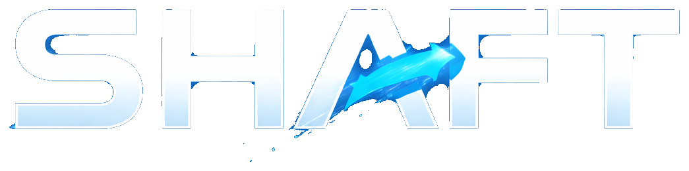

<p align="center">
  
</p>

# shaft（重构中）

Shaft 是一个 `HF-first` 的多模态训练与推理框架。当前主目标是把 `Qwen3VL + SFT` 主链做稳，同时保留面向 RLHF、更多模型族与推理后端的扩展骨架。

## 快速开始

```bash
uv venv --python 3.11 --prompt shaft
source .venv/bin/activate
uv pip install -e .
python scripts/train.py sft --config configs/train/train_sft_4b.yaml
```

按用途安装扩展依赖：

```bash
# HF 训练主依赖
uv pip install -e ".[train]"

# GPU 训练增强
uv pip install -e ".[train,gpu]"

# 可选 CUDA kernel 增强
uv pip install -e ".[train,gpu,gpu-kernels]"

# RLHF
uv pip install -e ".[train,rlhf]"

# 部署 / vLLM
uv pip install -e ".[serve]"
```

## 统一入口

### 训练

```bash
python scripts/train.py sft --config configs/train/train_sft_4b.yaml
python scripts/train.py rlhf --config configs/train/train_dpo_4b.yaml --algorithm dpo
python scripts/train.py rlhf --config configs/train/train_ppo_4b.yaml --algorithm ppo
python scripts/train.py rlhf --config configs/train/train_grpo_4b.yaml --algorithm grpo
```

### 推理

```bash
python scripts/infer.py --config configs/infer/pipeline_smoke.yaml --image /path/to/image.png
```

### 导出

```bash
python scripts/export.py inspect --path /path/to/checkpoint
python scripts/export.py validate --path /path/to/export --finetune-mode full --model-type qwen3vl
python scripts/export.py merge-peft \
  --model-type qwen3vl \
  --adapter-path /path/to/adapter \
  --base-model /path/to/base_model \
  --output-dir /path/to/merged_model
```

说明：

- `scripts/*.py` 只做薄包装入口。
- 真实 CLI 解析与命令调度在 `src/shaft/cli`。
- 当前训练入口按 `sft / rlhf` 分流，推理与导出分别走独立 CLI。

## 配置示例

### 命名数据集 catalog

```yaml
data:
  catalog_path: ../data/example.yaml
  catalog_names: [arrow_multitask]
```

### 内联数据源

```yaml
data:
  datasets:
    - dataset_name: arrow_multitask
      source_type: jsonl_sft
      train_paths: [data/train.jsonl]
      val_paths: [data/val.jsonl]
      weight: 1.0
      use_for_eval: true
```

说明：

- `catalog_path` 指向命名数据集 catalog YAML。
- `catalog_names` 选择本次实验启用的命名数据集；**只有写进这里的数据集才会被加载**。
- catalog 文件里的数据集不会因为 `catalog_path` 被设置就自动全部参与训练。
- `DatasetSourceConfig.dataset_name` 是数据层统一标识字段。
- `DatasetSourceConfig` 只描述配置输入；进入数据主链后会先解析成 `ShaftDatasetMeta`。
- `use_for_eval=false` 表示该数据集只参与训练，不参与验证集构建，也不要求提供 `val_paths`。
- 仓库内置的 [`configs/data/example.yaml`](configs/data/example.yaml) 当前只是示例文件，里面的路径默认不保证存在。
- 如果你不想维护 catalog，也可以直接在训练 YAML 里写 `data.datasets`。

## 当前能力

### 训练

- `SFT`
- `DPO`
- `PPO`（受限能力，非完整生产功能）
- `GRPO`（当前复用 `jsonl_sft` 作为 prompt-target 数据，并要求 `data.mix_refresh=static`）

### 推理

- 本地 HF 推理：`hf_local`
- vLLM OpenAI 兼容后端：`vllm_openai`
- 单阶段与多阶段推理编排
- stage 级 `codec`、重试、超时、像素预算覆盖

### 导出

- HF / PEFT 目录识别
- HF 兼容导出校验
- `merge-peft` 合并 adapter 为标准 HF full export

## 架构概览

- `src/shaft/config`：配置 schema、YAML 加载、catalog 展开、归一化校验
- `src/shaft/data`：数据源、增强、mixing、dataset、collator
- `src/shaft/model`：模型族元信息、HF 加载、PEFT 包装、processor/peft policy
- `src/shaft/template`：chat template 与 decode 约定
- `src/shaft/algorithms`：SFT/DPO/PPO/GRPO trainer 装配
- `src/shaft/pipeline`：`ShaftSFTPipeline` / `ShaftRLHFPipeline`
- `src/shaft/training`：trainer、optimizer、scheduler、loss、checkpoint 规则
- `src/shaft/infer`：`ShaftInferEngine`、`ShaftInferPipeline`、codec
- `src/shaft/export`：HF 兼容导出工具链
- `src/shaft/plugins`：registry、hook、interceptor
- `src/shaft/observability`：logging、context、events

## 文档

统一文档入口见：

- [docs/README.md](docs/README.md)

重点文档：

- [docs/architecture.md](docs/architecture.md)
- [docs/module_reference.md](docs/module_reference.md)
- [docs/config_reference.md](docs/config_reference.md)
- [docs/development_workflow.md](docs/development_workflow.md)
- [docs/extension_guide.md](docs/extension_guide.md)
- [docs/testing.md](docs/testing.md)
- [docs/infer.md](docs/infer.md)
- [docs/export.md](docs/export.md)
- [docs/webui.md](docs/webui.md)

## 测试

快速回归：

```bash
pytest -q
```

只跑 integration：

```bash
pytest -q -m integration
```

只跑 manual：

```bash
pytest -q -m manual
```

更多测试规范见 [docs/testing.md](docs/testing.md)。

## 当前说明

- 当前正式模型族实现以 `qwen3vl` 为主，`smoke_vlm` 只用于测试。
- 训练和保存遵循 HF / PEFT / TRL 标准能力。
- 旧实现已归档到 `old/`，新开发只在 `src/shaft`。
- 结构化任务离线评估子系统尚未完成。
- Web UI 当前已提供面向工程师/科研人员的 SFT 可视化控制台，真入口仍是 CLI。
- PPO 暂停项见 [docs/ppo_todo.md](docs/ppo_todo.md)。
