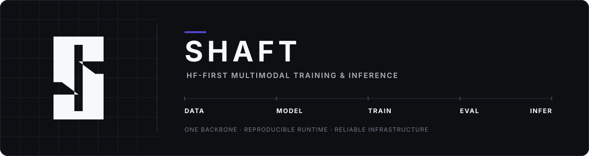

<div align="center">
  <picture>
    <source media="(prefers-color-scheme: dark)" srcset="assets/brand/shaft-mark-white.svg">
    <source media="(prefers-color-scheme: light)" srcset="assets/brand/shaft-mark.svg">
    
  </picture>
  <h1>Shaft</h1>
  <p><strong>HF-first multimodal training and inference infrastructure</strong></p>
  <p><sub>面向工程师与研究者 · Qwen 多模态 SFT 生产主线</sub></p>
</div>

<p align="center">
  
</p>

Shaft 是一个 `HF-first` 的多模态训练与推理框架。训练入口按 `SFT / RL / OPD` 三个并列域组织；当前
生产主线仍是 Qwen 多模态 SFT。DPO/GRPO 是实验能力，PPO 仅用于 debug smoke；OPD 按专项能力门禁使用。

## 快速开始

```bash
uv venv --python 3.11 --prompt shaft
source .venv/bin/activate
uv pip install -e .
python scripts/train.py sft --config configs/train/sft_4b.yaml
```

按用途安装扩展依赖：

```bash
# HF 训练主依赖
uv pip install -e ".[train]"

# GPU 训练增强
uv pip install -e ".[train,gpu]"

# 可选 CUDA kernel 增强
uv pip install -e ".[train,gpu,gpu-kernels]"

# RLHF（TRL 1.x；当前 lock 为 1.9.2）
uv pip install -e ".[train,rlhf]"

# 部署 / vLLM
uv pip install -e ".[serve]"
```

## 统一入口

### 训练

```bash
# 生产主线
python scripts/train.py sft --config configs/train/sft_4b.yaml

# 实验性 RL；不能仅凭命令可启动视为生产支持
python scripts/train.py rl --config configs/train/dpo_4b.yaml --algorithm dpo
python scripts/train.py rl --config configs/train/grpo_4b.yaml --algorithm grpo

# 专项 OPD 配置
python scripts/train.py opd --config /path/to/opd.yaml
```

DPO/GRPO 尚无完整真实 Qwen release gate，且当前不得使用 FSDP+PEFT periodic checkpoint/exact resume。
PPO 不作为普通训练入口展示：当前没有真实 reward-model 加载与可恢复训练合同，只保留显式 debug 路径。
所有未完成项统一见 [`docs/TODO.md`](docs/TODO.md)。

OPD 可组合 `hf_local / vllm` rollout 与 `hf_local / http` teacher。独立 teacher 服务入口：

```bash
python scripts/serve_opd_teacher.py --config /path/to/teacher.yaml --port 8100
```

具体配置、vLLM server 启动方式和验收边界见
[`docs/architecture.md`](docs/architecture.md)、[`docs/config_reference.md`](docs/config_reference.md) 与
[`docs/scripts.md`](docs/scripts.md)。

### 推理

```bash
python scripts/infer.py --config configs/infer/pipeline_smoke.yaml --image /path/to/image.png
# 多图按 --image 出现顺序送入模型
python scripts/infer.py --config configs/infer/pipeline_smoke.yaml \
  --image /path/to/first.png --image /path/to/second.png
```

### 导出

```bash
python scripts/export.py inspect --path /path/to/checkpoint
python scripts/export.py validate --path /path/to/export --finetune-mode full --model-type qwen3vl
python scripts/export.py merge-peft \
  --model-type qwen3vl \
  --adapter-path /path/to/adapter \
  --base-model /path/to/base_model \
  --output-dir /path/to/merged_model
```

`merge-peft` 默认校验 Shaft adapter checkpoint 中记录的训练 base-model identity。第三方/旧 adapter 缺少
该 provenance 时会 fail closed；人工确认 base 后可显式使用 `--allow-unverified-base-model true`，当前 base
仍会执行完整字节 SHA256 校验。

说明：

- `scripts/*.py` 只做薄包装入口。
- 真实 CLI 解析与命令调度在 `src/shaft/cli`。
- 当前训练入口只保留 `sft / rl / opd` 三个 training domain；RL 的唯一 CLI 是 `rl`。

## 配置示例

### 命名数据集 catalog

```yaml
data:
  media_snapshot_id: example-media-v1
  batching:
    grouping: none
    cardinality: fixed
    packing:
      mode: none
    layout: padded
  catalog_path: ../data/example.yaml
  catalog_names: [arrow_multitask]
```

### 内联数据源

```yaml
data:
  batching:
    grouping: none
    cardinality: fixed
    packing:
      mode: none
    layout: padded
  datasets:
    - dataset_name: arrow_multitask
      source_type: jsonl_sft
      train_paths: [data/train.jsonl]
      val_paths: [data/val.jsonl]
      weight: 1.0
      use_for_eval: true
```

说明：

- `catalog_path` 指向命名数据集 catalog YAML。
- `catalog_names` 选择本次实验启用的命名数据集；**只有写进这里的数据集才会被加载**。
- catalog 文件里的数据集不会因为 `catalog_path` 被设置就自动全部参与训练。
- `DatasetSourceConfig.dataset_name` 是数据层统一标识字段。
- `DatasetSourceConfig` 只描述配置输入；进入数据主链后会先解析成 `ShaftDatasetMeta`。
- `use_for_eval=false` 表示该数据集只参与训练，不参与验证集构建，也不要求提供 `val_paths`。
- 仓库内置的 [`configs/data/example.yaml`](configs/data/example.yaml) 当前只是示例文件，里面的路径默认不保证存在。
- 如果你不想维护 catalog，也可以直接在训练 YAML 里写 `data.datasets`。
- 每个训练 YAML 都必须显式声明 `data.batching.grouping`、`cardinality`、`packing.mode` 与
  `layout`。缺失字段不会静默回退。
- SFT/DPO JSONL 单图可写 `image_path`（兼容 `image`），多图写非空有序列表 `images`；三者只能出现一个。
  显式 `messages` 中的 `type: image` 数量必须与图片数一致。未提供 `messages` 时，框架按 `images` 顺序
  生成图片占位符；通用 `user_prompt` 默认是空字符串，不再隐式注入任务 prompt。

训练时长使用单一真源，step 是主路径：

```yaml
data:
  schedule:
    mixing: weighted
    shuffle: true
train:
  duration:
    unit: steps
    value: 10000
```

`weighted` 会把各数据源 `weight` 归一化为 sample draw 概率；epoch 模式仅用于有限时长兼容，写成
`duration: {unit: epochs, value: 1}`。

Qwen VL SFT 可启用有界、在线的成本感知批次：

```yaml
data:
  media_snapshot_id: example-media-v1
  batching:
    grouping: bounded_cost
    cardinality: token_budget
    packing:
      mode: none
    layout: padded
    buffer_size: 64
    cost_cache_size: 65536
    max_tokens_per_microbatch: 10000
    resource_budgets:
      vision_patches: 16384
train:
  per_device_train_batch_size: 2
  gradient_accumulation_steps: 4
```

`bounded_cost` 不在训练前物化完整 CostPlan，只在 `buffer_size` 个轻量 `SampleRef + cost` 上工作。
`train.per_device_train_batch_size` 是每卡 physical pack count 的唯一配置真源：`fixed` 时是精确值，
`token_budget` 时是上限 `B`。在该 `packing=none` 路径中一个 pack 就是一条样本；planner 根据真实 padded
token 与 vision 总预算为每个 rank 选择 `1..B` 个 pack，
并让同一 microstep 的 rank 成本尽量接近。mixing 的 draw multiset 不丢失、不复制，HF 继续负责固定 GA、
optimizer、scheduler 和 checkpoint。例如 `B=2`、8 rank、GA4 时，每个 optimizer step 处理 32–64 条
logical samples；loss 按该 optimizer frame 内跨 rank 的真实有效 token 归一化。

结构组学习率对 full、LoRA、DoRA、QLoRA 使用同一接口：

```yaml
train:
  learning_rate: 1.0e-5
  param_group_lrs:
    vision_tower: 3.0e-6
```

`ModelModuleGroups` 按规范化后的真实模型路径确定 `language_model / vision_tower / aligner / generator`；
PEFT 的 LoRA A/B、DoRA magnitude 与 `modules_to_save` 包装不会覆盖结构归属。显式配置但没有 trainable
参数命中的组会在 optimizer 创建前报错。

成本按 buffer 即时估算，图像只读 header，并使用容量受限的 LRU。多 rank 启动校验得到的首个 plan 会被
正式 sampler 直接复用；为了在任何 forward 前原子验证完整 GA frame，首个 forward 前的成本调用上界为
`buffer_size + (GA - 1) * world_size * per_device_train_batch_size`，仍与总 steps 无关。
`media_snapshot_id` 声明外部图片是不可变快照；改变媒体必须同时改变该 id。

checkpoint committed state 直接进入 HF `trainer_state.json` 的 stateful callback。SFT、DPO、GRPO 的 DDP/
native-HF 路径共用 `committed_manifest` 协议：所有 rank 必须具有完全相同、顺序一致的 `on_save` callback
拓扑，否则在执行 callback 前 fail closed；每个 callback 的 rank-local 结果再做 all-rank convergence。全部
callback 和模型/adapter、optimizer/scheduler、RNG 保存成功后，rank 0 原子发布
`shaft_checkpoint_commit.json`，之后才执行 checkpoint rotation。FSDP/DeepSpeed 显式走
`backend_native` 协议，由对应后端负责保存、发现、校验和 rotation，不安装该 commit wrapper，也不宣称具备
通用 manifest 的 torn/atomic 防护。planned SFT 保存的是模型已完成 optimizer step 的 buffer/cursor，而不是
DataLoader 预取推进的 live cursor；该状态作为 manifest extension 绑定 versioned batch contract、planner
spec 与 duration/GA/optimizer/scheduler contract。
`cost_cache_size` 只影响 host LRU，不阻止 exact resume。
SFT 若只需要阶段权重，可设置 `train.save_only_model: true`：每个 `checkpoint-*` 仍是标准 HF/PEFT
部署/初始化目录，但不包含 optimizer、scheduler、scaler、RNG 或分片后端训练态，也不能用于 resume。
full HF 权重默认按 `train.max_shard_size: 4GB` 分片，可按训练盘与下游加载环境调整。
FSDP/ZeRO-3 的完整权重门禁及配置约束见 [`docs/config_reference.md`](docs/config_reference.md)。
当前 planned batching 只开放 SFT + step duration，eval 保持普通 padded fixed batch。DDP 支持完整的已登记
planned 组合；FSDP/DeepSpeed 只开放 `bounded_cost + fixed + none + padded`。Qwen3VL 与 HF `qwen3_5`
dense/MoE（`qwen35vl`/`qwen36vl`/`qwen38vl`）的 image SFT 已接通
`grouping=length + cardinality=fixed + packing.mode=greedy + layout=varlen`：planner 在
有界窗口内按真实 processor 后长度分组，把多个完整 logical segment 装入固定数量的 physical packs；
CUDA 执行要求 FlashAttention 2、bf16/fp16 与 DDP；`qwen3_5` hybrid attention 还要求
flash-linear-attention 与 causal-conv1d。未验收的模型族/backend/topology 会在加载数据和权重前 fail closed。
`per_device_train_batch_size` 表示每卡 physical pack 数，不等于 pack 内 logical segment 数。当前 varlen
release/tiny gates 使用 BF16；FP16 只是运行时 allowlisted，尚无 varlen 专项验收。

训练精度由互斥的 `train.bf16` / `train.fp16` 选择；FP16 只允许 CUDA。两者都不负责隐式改写
`model.torch_dtype`；FP16 AMP full fine-tune 应以 FP32 参数加载，框架拒绝 `float16` 参数再叠加
GradScaler。当前 FP16 release gate 只覆盖 padded Qwen3VL-2B DDP；FSDP 接口已接通但仍需专项 CUDA canary，
DeepSpeed 示例仍是 BF16-only。精度切换也不允许 exact resume。

Qwen3.5/3.6 MoE 的 padded SFT 已接入模型拥有的 router-balancing objective：训练继续使用上游
batch-local auxiliary loss，`eval_loss` 只统计 token-normalized CE，dataset-global router balance 单独记为
`eval_aux/router_global_balance`。MoE LoRA 显式配置 `target_parameters: [auto]` 后，通过 PEFT 覆盖 fused routed
experts 与 router；该字段默认空，不会由普通 `target_modules: [auto]` 隐式启用。

Qwen3.5/3.6/3.8 的 MTP speculative head 当前不受支持：Shaft 不加载、训练、保存、合并或部署 `mtp.*`，
也不提供 MTP loss/speculative-serving contract。Shaft 产物仍完整支持标准 autoregressive target-model
推理；不得仅根据上游 config 中的 `mtp_num_hidden_layers` 判断 MTP 可用。

Qwen3.5/3.6/3.8 分别使用同名的非 thinking 默认模板；需要 CoT SFT 时选择对应的 `*_thinking` 模板，并在
SFT JSONL 中以 `target_reasoning_content`（或末尾 assistant 的 `reasoning_content`）保存推理正文、
`target_text`（或 assistant 的 `content`）保存最终答案。Qwen3.8 另提供 `xhigh`、`medium`、`low` 三档
reasoning effort；完整模板名和 fail-closed 数据合同见 [`docs/config_reference.md`](docs/config_reference.md)。

通常无需改 router coefficient；确需实验性覆写时使用下列 SFT-only 接口，未设置时仍读取模型
`router_aux_loss_coef`，完整语义见 `docs/config_reference.md`：

```yaml
algorithm:
  name: sft
  params:
    auxiliary_loss_weights:
      router_aux_loss: 0.002
```

要求 `peft>=0.18.1`、`lora_dropout=0` 且不能使用 DoRA/QLoRA。Qwen3.5/3.6 MoE 当前 tiny-upstream
release gate 已验证 DDP、FSDP LoRA 和 ZeRO-3 full 的 fresh/resume/export；Qwen3VL
`Qwen3-VL-30B-A3B-Instruct` 已进一步通过真实 BF16 FSDP LoRA 两步 fresh/checkpoint resume、router/expert/
vision update 和标准 PEFT reload 门禁，峰值约 38.7GiB allocated/40.8GiB reserved 每卡。该证据不等价于
两卡全参数 SFT，也不替代目标数据长程收敛验收。PEFT fused `target_parameters` 与 ZeRO-3 初始化目前由上游能力限制而明确拒绝，应使用 FSDP LoRA，
或改用 ZeRO-3 full finetune。预量化 FP8 artifact 仅供推理，训练必须使用未预量化 base checkpoint；发布权重
通常是 BF16，而 FP16 AMP full finetune 允许按其合同以 FP32 参数加载。
FSDP+PEFT 的 exact resume 以完整标准 `adapter_model.safetensors` 为模型状态真源，并要求
`state_dict_type=full_state_dict`、`load_best_model_at_end=false`；Transformers/Accelerate 当前生成的
adapter-only native FSDP 文件只含 rank-local DTensor，不能用于恢复 PEFT 模型参数。

训练默认生成 committed `shaft_training_efficiency.json`：统计实际 collate 后的 useful/materialized/
supervised tokens、logical-segment length 分布、vision patches、logical segments/physical packs、batch
acquire、batch prepare、host/device optimizer-frame time、critical-path p50/p95、训练窗口内 peak CUDA memory
与 DDP rank skew。它只在成功 optimizer boundary
提交，不会把 DataLoader prefetch 或
`[batch-plan-summary]` 误算成已执行吞吐。可用
`python scripts/compare_efficiency.py RUN_A RUN_B ...` 比较不同 batching/layout 的 A/B 结果；checkpoint
内的 per-rank snapshot 支持 resume 后继续完整累计。summary 内置类型化训练契约；比较器默认拒绝模型、
数据快照、logical draw stream、DP/GA、优化器或 step span 不一致的结果，只有明确诊断时才使用
`--allow-incompatible`；packing 导致 committed logical workload 不同但其它约束相同时，可用更窄的
`--allow-workload-variation` 做 capacity 对比；它仍锁定 optimizer update、microbatch 与 physical-pack 数，
不能把结果表述为等工作量 speedup。peak memory 从 HF
`on_train_begin` 建立窗口，resume 时取 checkpoint 历史与当前窗口最大值；历史缺失时明确输出 `n/a`。
snapshot set 使用 revoke、all-rank snapshot、rank-zero manifest 三阶段提交；每个
可失败的文件阶段都会先做固定 tensor 状态汇合，避免单 rank I/O 错误把其它 rank 留在 barrier。
比较器只接受采用当前 measurement contract 的 v3 summary；旧 v2 不自动迁移。
完整边界见
[`docs/training_batch_planning_design.md`](docs/training_batch_planning_design.md) 与
[`docs/config_reference.md`](docs/config_reference.md)。

Shaft 会在 dataset、base model 与 PEFT adapter 装配前初始化 `experiment.seed`。需要验证 CUDA bitwise
resume/fresh reproduction 时，在 `train` 下设置 `full_determinism: true`；三个及以上 DDP rank 还要为静态
SFT 参数图显式设置 `distributed.ddp.static_graph: true`，固定跨 checkpoint 重建时的 reducer bucket 生命周期。
两者通常都有吞吐或适用范围代价；动态图不得冒充 static graph。默认关闭时，非确定性 kernel 或 reducer
浮点归约产生的微小数值差异不等同于 BatchPlan / resume cursor 错位。SFT 训练过程中的 eval 会保存并恢复
主进程训练 RNG，避免 persistent eval workers 改变后续训练随机序列。

## 当前能力

### 训练

- `SFT`
- SFT/DPO 的 padded 路径支持单条样本内有序多图；multi-image varlen/sequence packing 仍 fail closed。
- SFT PromptSource 支持人工配置任意数量、任意命名的 task formulation（例如 A、B、A+B），在线按
  权重做可复现随机选择，并在 formulation 内继续轮换 prompt wording；框架不自动生成属性幂集或推断组合
  依赖。每个 formulation 的标准 SFT JSONL 和 `target_text` 必须离线物化并逐行对齐；`prompt_args` 只服务
  prompt renderer，运行时不拼装 target。PromptSource 自管 source 绑定和两层静态加权随机选择；概率只由
  pool 中的 `sampling_weight` 决定，不支持随训练进度变化的 curriculum。同一任务的不同数据 cohort 可复用
  同一个 pool，并用 `formulation_sources` 的键声明各自可选的 formulation 子集；DataCenter 不理解
  formulation 内部层级。未配置 PromptSource 时直接消费普通 materialized HF/LLaMA-Factory 风格数据。完整合同见
  [`docs/data.md`](docs/data.md)。
- `DPO`（实验能力；配置、数据、collator 与 TRL 装配合同已接通，但真实 Qwen release gate 尚未完成；
  FSDP+PEFT exact resume 当前不属于支持范围，即使通用配置预检未提前拒绝也不得使用）
- `PPO`（仅 debug smoke；当前 text-only、没有真实 reward-model 加载，不支持 full finetune、periodic
  checkpoint、best-checkpoint selection 或 resume）
- `GRPO`（实验能力；复用 `jsonl_sft` 作为 prompt-target 数据并接入 grouped sampler；真实 Qwen release
  gate 尚未完成，FSDP+PEFT exact resume 不受支持，vLLM sampled rollout 禁止 periodic save/resume）
- `OPD`（prompt-only fully on-policy direct-loss distillation；支持 `hf_local / vllm` rollout、
  `hf_local / http` teacher、full/chunk/top-k-tail objective，以及 DDP/FSDP/DeepSpeed checkpoint/export；
  发布模型与规模边界见专项架构文档）
- 评估输入可用 `eval.min_pixels/max_pixels` 设置默认像素预算，并通过
  `eval.datasets.<name>.min_pixels/max_pixels` 覆盖单个数据集；SFT 的 teacher-forced loss 与在线生成共享
  同一解析结果。processor 的训练/生成 padding 由模型 policy 统一选择，不需要在 pipeline 中重复配置。
  GRPO 当前只支持 online `eval_final_score`，启用 eval 时必须设置 `loss_metrics_enabled: false`。

### 推理

- 本地 HF 推理：`hf_local`
- vLLM OpenAI 兼容后端：`vllm_openai`
- `ShaftInferRequest.image_paths` 与可重复 `--image` 支持有序多图；旧 `image_path` 保留为单图兼容入口。
- 单阶段与多阶段推理编排
- 多阶段 prompt 使用与训练相同的受限 renderer 和显式 `arguments`；旧 Python `{name}` format 语法已移除。
- stage 级 `codec`、重试、超时、像素预算覆盖
- stage timeout 使用贯穿重试、backoff 和后端 I/O 的同一个绝对 deadline；pipeline 也接受 cooperative
  cancellation。无法安全抢占的本地 HF generate 会在开始工作前明确拒绝 control，不会遗留后台推理。
  详细能力边界见 [docs/infer.md](docs/infer.md)。
- 当前公共推理 API 是单样本、同步 stage 编排并要求至少一张图片；不提供原生 batch、streaming、async
  queue 或 Shaft 自有在线服务层。

### 导出

- HF / PEFT 目录识别
- HF 兼容导出校验
- `merge-peft` 合并 adapter 为标准 HF full export

## 架构概览

- `src/shaft/config`：配置 schema、YAML 加载、catalog 展开、归一化校验
- `src/shaft/data`：数据源、增强、mixing、dataset、collator
- `src/shaft/model`：模型族元信息、HF 加载、PEFT 包装、processor/inference/peft policy
- `src/shaft/template`：chat template 与 decode 约定
- `src/shaft/algorithms`：SFT 与既有 RL trainer 装配
- `src/shaft/rl`：DPO/PPO/GRPO runtime registry；算法差异不进入公共 RL pipeline
- `src/shaft/opd`：OPD prompt-only data、rollout/teacher execution registry、direct loss、trainer 与 resume policy
- `src/shaft/pipeline`：SFT / RL / OPD 三域 pipeline 与 training-domain registry
- `src/shaft/training`：trainer、optimizer、scheduler、loss、checkpoint 规则
- `src/shaft/infer`：`ShaftInferEngine`、`ShaftInferPipeline`、codec
- `src/shaft/export`：HF 兼容导出工具链
- `src/shaft/plugins`：registry、hook、interceptor
- `src/shaft/observability`：logging、context、events、统一 progress 状态与 terminal/plain/JSON sink；TTY
  使用高对比度自适应单行进度、标准 `s/it`/`it/s`、动态 spinner、ETA、loss、token throughput 和多参数组
  LR range；自动适配终端宽度与颜色能力，日志不会打断活动行

## 文档

统一文档入口见：

- [docs/README.md](docs/README.md)

重点文档：

- [docs/architecture.md](docs/architecture.md)
- [docs/module_reference.md](docs/module_reference.md)
- [docs/config_reference.md](docs/config_reference.md)
- [docs/data.md](docs/data.md)
- [docs/extension_guide.md](docs/extension_guide.md)
- [docs/testing.md](docs/testing.md)
- [docs/infer.md](docs/infer.md)
- [docs/export.md](docs/export.md)
- [docs/TODO.md](docs/TODO.md)

## 测试

快速回归：

```bash
uv run pytest -q
```

主链 smoke：

```bash
uv run pytest -q tests --suite smoke
```

只跑 integration：

```bash
uv run pytest -q tests --suite integration
```

只跑 manual：

```bash
uv run pytest -q -m manual
```

更多测试规范见 [docs/testing.md](docs/testing.md)。

## 当前说明

- 当前正式训练主链是 `qwen3vl`。Qwen3VL 30B-A3B 与 Qwen3.6-27B 已有短程真实权重证据，但不能外推为
  dense 32B、35B MoE、full-parameter 容量或长程收敛矩阵；`smoke_vlm` 只用于测试。
- 训练和保存遵循 HF / PEFT / TRL 标准能力。
- 旧实现已归档到 `old/`，新开发只在 `src/shaft`。
- 独立离线 eval bench 已从主线切除；当前只维护训练内在线 eval 与共享 codec/metrics。
- 仓库所有未完成项和验收缺口只维护在 [docs/TODO.md](docs/TODO.md)。
