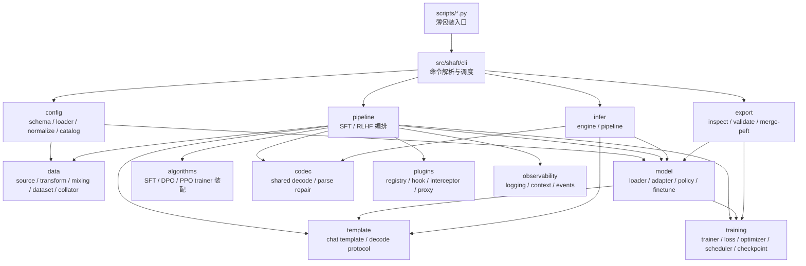
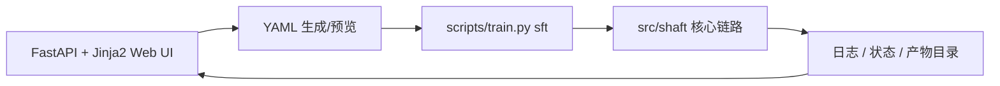

# Shaft 架构总览

本文档描述 `src/shaft` 的正式架构、模块边界和稳定接口，用于指导日常开发、架构评审、代码 review 与后续 agent 协作。

## 1. 目标与范围

### 1.1 当前目标

- 以 `Hugging Face` 生态为唯一主干。
- 围绕多模态模型训练与推理构建稳定框架。
- 优先打磨 `Qwen3VL / Qwen3.5-VL / Qwen3.6-VL + SFT` 主路径。
- 通过注册表和适配层支持后续模型族、算法和推理后端扩展。
- 保持训练、保存、续训、导出都兼容 HF / PEFT / TRL 标准能力。

### 1.2 当前非目标

- 不做多生态兼容层，不接入 ModelScope 等平行生态。
- 不设计自定义 checkpoint 格式。
- 不将任务级语义路由放入训练内核。
- 不把推理编排做成任务 DSL。
- 不把 PPO/RM 包装成“已完成的生产能力”。

## 2. HF-first 边界

Shaft 当前明确是 `HF-first` 框架，这个边界必须在所有设计、实现和文档中保持一致。

- 训练内核：`transformers.Trainer` 与 `trl`
- 参数高效微调：`peft`
- 权重布局：HF full export / PEFT adapter export
- 推理后端：
  - `hf_local`
  - `vllm_openai`

禁止：

1. 引入自定义模型保存格式。
2. 在训练主干中塞入非 HF 生态的基础抽象。
3. 为兼容外部平台而污染当前配置、数据、训练接口。

## 3. 架构分层

说明：

- 下图描述的是当前正式架构与近期已经确定的收敛方向。
- 其中共享 `codec` 层已经落地，当前由 `src/shaft/codec` 提供，`infer` 与在线 eval 共用。



## 4. 模块职责矩阵

| 模块 | 职责 | 关键稳定接口 | 明确禁止 |
| --- | --- | --- | --- |
| `config` | 配置 schema、YAML 加载、catalog 展开、严格校验 | `RuntimeConfig`、`load_config()`、`normalize_runtime_config()` | 训练循环、模型构建、JSONL 解析 |
| `data` | 数据元信息、数据源、记录结构、增强、mixing、dataset、collator | `ShaftDatasetMeta`、`ShaftDataCenter`、`BaseDataSource`、`build_data_source()` | optimizer/loss、训练阶段调度、任务级语义判断 |
| `model` | 模型族元信息、HF 加载、PEFT 包装、processor/peft policy、冻结执行计划 | `ModelMeta`、`ModelModuleGroups`、`ShaftModelAdapter`、`build_model_tokenizer_processor()` | 数据路径处理、训练循环、推理 stage 编排 |
| `template` | 消息规范化、chat template、decode 约定、训练 supervision plan | `TemplateMeta`、`Template`、`build_template()` | 图像处理、任务后处理、generation 参数决策 |
| `algorithms` | 构建 SFT/DPO/PPO/GRPO trainer 与算法专属辅助对象 | `SFTAlgorithm`、`DPOAlgorithm`、`PPOAlgorithm`、`GRPOAlgorithm` | 读取数据文件、控制 pipeline、硬编码模型族 |
| `pipeline` | 训练主链编排和阶段调度 | `ShaftSFTPipeline`、`ShaftRLHFPipeline`、`run_sft()`、`run_rlhf()` | 任务语义、数据格式解析、模型专属 patch |
| `training` | Trainer 包装、loss/optimizer/scheduler、checkpoint 规则 | `ShaftSFTTrainer`、`ShaftDPOTrainer`、`ShaftPPOTrainer`、`build_optimizer()`、`build_scheduler()` | 配置加载、数据读取、导出发布 |
| `codec` | 文本到规范结构的共享解码、JSON 修复与部分解析 | `decode_with_codec()`、`register_codec()` | 指标计算、业务编排、训练循环 |
| `infer` | 单阶段推理执行、多阶段上下文传递 | `InferEngineConfig`、`ShaftInferEngine`、`ShaftInferPipeline` | 训练逻辑、离线任务 DSL、私有 codec 体系 |
| `export` | HF 目录检查、PEFT merge、导出校验 | `inspect_hf_artifact()`、`validate_hf_artifact()`、`merge_peft_adapter()` | 自定义产物格式、发布平台适配 |
| `plugins` | hook / interceptor / 执行代理 | `Registry`、`HookManager`、`InterceptorManager`、`ExecutionProxy` | 替代核心业务流程 |
| `observability` | 日志、上下文、事件输出 | `configure_logging()`、`emit_event()` | checkpoint 决策、训练控制 |
| `cli` | 命令解析、无歧义 override、路由到 pipeline/infer/export | `main()`、`register_command()`、`run_from_args()` | 在 CLI 中堆叠业务逻辑 |

## 5. 训练主链


### 5.1 训练阶段关键接口

- 配置：`RuntimeConfig`
- 数据：`ShaftDataCenter`
- 数据元信息：`ShaftDatasetMeta`
- 模型：`build_model_tokenizer_processor()`
- SFT 编排：`ShaftSFTPipeline`
- RLHF 编排：`ShaftRLHFPipeline`
  - 当前支持：
    - `DPO`
    - `PPO`
    - `GRPO`
  - 其中 `GRPO` 复用 `jsonl_sft` 作为 prompt-target 数据契约，并通过共享 `codec` + 内置 reward registry 构建 reward functions
- HF 参数映射：`build_hf_training_args()`
  - 负责把 `train.distributed.strategy` 映射到 HF `TrainingArguments.fsdp/fsdp_config/deepspeed`
- checkpoint 规则：
  - `inspect_checkpoint_layout()`
  - `resolve_resume_checkpoint()`
  - `validate_resume_checkpoint()`
  - `validate_training_state_policy()`

### 5.2 训练主链边界

1. `pipeline` 只装配组件，不承载任务语义。
2. `algorithms` 只构建 trainer，不读取 JSONL。
3. `data` 只产出样本和 batch，不涉及 loss/optimizer。
4. `model` 只负责模型族差异，不介入数据源路径和训练调度。

SFT/DPO 的多模态监督采用单次 processor 契约：

1. `template` 只接收窄接口 `ShaftChatRenderer`，对完整消息执行一次渲染，并把历史 assistant 编译成
   canonical rendered-token 坐标中的监督 span。它不能取得多模态 processor 或图片。
2. `collator` 对完整 batch 只调用一次多模态 processor，并把全部原始输出封装为
   `ShaftProcessedBatch`；collator 不枚举某个模型的 `pixel_values/image_grid_thw/...` 字段。
3. `ShaftModelAdapter -> ProcessorPolicy` 是 processor 差异的唯一真源，统一负责 processor 调用参数、
   pixel budget、rendered-token 到 processed-token layout，以及 SFT/DPO 所需的模型输入复制/重排。
   每个非 sequence 字段必须显式声明为 sample-aligned、whole-batch media 或 static；未知字段不透传。
4. Qwen VL policy 使用 `mm_token_type_ids` 折叠图像 token expansion；identity policy 要求 processed
   tokens 与 rendered tokens 完全一致。任何无法证明的字段重排或 token 对齐都必须 fail fast。
5. `template` 只消费 `ShaftProcessedBatch` 与精确 layout 生成 labels/loss scale；DPO 的 chosen/rejected
   共享同一 prompt plan、layout 和视觉处理结果。

新模型族如果不能提供精确 token layout，必须在接入测试中显式失败并注册模型专用 processor policy；
新模板必须提供基于单次完整渲染的精确 assistant-span compiler。禁止近似对齐、通用 partial-render
fallback，也禁止按 partial message 重跑多模态 processor。

### 5.3 批次规划边界

- 训练选择真源是 `ShaftSamplePlan`；它只决定 logical sample，不承载长度分桶、rank 平衡或 packing。
- 成本感知训练的目标链路固定为：

  ```text
  SamplePlan -> CostPlan -> BatchPlan -> PackPlan
  ```

- mixing 决定训练什么；BatchPlan 只能在有界 window 内重排已选样本，不得丢弃、复制或按长度修改
  source 权重。
- optimizer batch 可以拆成多个成本同质的 global microstep；同一 microstep 的 DP ranks 应尽量处理
  相近成本，mixing 比例在 optimizer batch 或更长统计 horizon 收口。
- packing 只改变 local microbatch 的物理布局。segment 的 attention、position、labels/loss scale 和
  多模态 grid 必须隔离并对齐。
- 动态 microbatch 必须使用全局 loss numerator/denominator；不能等权平均不同大小的本地 batch mean。
- `ShaftSFTTrainer` 已基于实际 `labels/loss_scale` 落地 optimizer-batch global denominator，固定 batch 与
  cost-aware Phase 1 共同使用；动态 batch 只需扩展 draw/microbatch plan，不能另建一套 loss 语义。
- `CostPlan` 的持久化真源是 draw-indexed 的固定宽度 sidecar：global rank 0 在 cache miss 时调用 runtime
  estimator 并原子写入，所有 data rank 随后通过 `ShaftMMapCostPlanProvider` 只读映射。pipeline 只负责
  rank-zero build、attempt-scoped rendezvous、all-rank load acknowledgment 和 durable metadata 发布时序，
  不解释 cost 字段；run root 的 reference 只定位共享 manifest，不参与启动同步，也不复制成本数组。
- 固定 cardinality 的 geometry 只由 `ShaftFixedBatchPlanningSpec` 生成一次；resume preflight、planner、
  sampler 和 planning signature 必须消费同一个不可变 spec，不能各自在 pipeline/training/data 重算。
- context parallel 是 job 级静态拓扑，不作为单个长样本的动态调度手段。
- 该能力的完整目标契约、配置迁移与阶段验收见
  [training_batch_planning_design.md](training_batch_planning_design.md)。当前已实现 Phase 0/1 及共享 mmap
  CostPlan 收口：
  `Qwen3VL + SFT` 可按有界 planning window 构造精确 sample cost，并在保持每卡固定样本数的前提下，
  生成跨 DP rank 平衡的 `ShaftBatchPlan`。动态 cost-budget microbatch、`PackPlan` 和 context parallel
  尚未进入运行时。
- cost provider 不解释模型或监督细节：图像 resize 与 rendered/processed token layout 的估算真源是
  `ProcessorPolicy`，target 截断、EOS、causal shift 和 loss weight 的估算真源是 `Template`。新增模型或
  模板必须扩展对应 policy/interface，不能在 data planner 中复制一份逻辑。
- Phase 1 resume 通过 `ShaftBatchPlanningSignature` 绑定 data/cost/planner/topology，并随 checkpoint
  持久化；相同 horizon 可精确恢复，改变 horizon/topology 必须 fail fast。

### 5.4 分片训练边界

- 分片策略统一落在 `train.distributed`：
  - `ddp`: 默认 torchrun + DDP
  - `fsdp`: PyTorch/HF FSDP
  - `deepspeed`: DeepSpeed ZeRO
- `pipeline/training_args.py` 是分片策略进入 HF Trainer 的唯一入口。
- SFT / RLHF pipeline 必须先构建并持有 `TrainingArguments`，再加载模型。这样 DeepSpeed
  ZeRO-3 的 HF runtime config 能在 `from_pretrained` 前生效，避免大模型先按每 rank 完整模型加载。
- 当 `strategy` 不是 `deepspeed` 时，`pipeline/training_args.py` 会清理 HF/Accelerate 的
  DeepSpeed 全局状态，避免同一 Python 进程内先后运行不同训练策略时串配置。
- `train.gradient_checkpointing` 的实际运行时值由 `resolve_effective_gradient_checkpointing()` 统一解析。
  当 FSDP activation checkpointing 打开时，Trainer/model 侧 gradient checkpointing 会自动关闭，
  避免同一层被双重 checkpoint。
- 模型族只提供必要的结构默认值，例如 Qwen3VL 的 FSDP transformer layer class names。
- `data`、`template`、`codec` 和任务 prompt 不允许根据分片策略分叉。
- SFT 已接入 FSDP 与 DeepSpeed；DPO/PPO/GRPO 后续必须复用同一配置语义，不新增平行字段。

### 5.5 冻结边界

- 冻结规则统一落在 `model.finetune.freeze` 与 `src/shaft/model/freeze.py`。
- `src/shaft/model/finetune_plan.py` 负责把：
  - `model.finetune`
  - `ModelModuleGroups`
  - 模型实际参数/模块结构
  解析成单一的 `resolved finetune plan`
- `ModelModuleGroups` 负责声明模型族结构分组：
  - `language_model`
  - `vision_tower`
  - `aligner`
  - `generator`
  - 分组匹配采用最具体前缀优先，而不是简单宽前缀命中
- `full` 模式的冻结语义：
  - 先默认全部可训练
  - 再应用冻结规则
  - 最后应用 `trainable override`
- `lora / dora / qlora` 的冻结语义：
  - 仅作用于 `target_modules=["auto"] / ["all-linear"]` 的自动展开结果
  - 显式 `target_modules` 保持权威
  - `trainable override` 会额外导出为 `modules_to_save`
- 训练执行、adapter 导入兼容性校验、后续导出语义都应消费同一份 `resolved finetune plan`，避免多处重复推导

## 6. 推理主链


### 6.1 推理主链关键接口

- schema：
  - `InferEngineConfig`
  - `InferStageConfig`
  - `InferPipelineConfig`
- engine：
  - `ShaftInferEngine`
  - `ShaftInferRequest`
  - `ShaftInferResponse`
- pipeline：
  - `ShaftInferPipeline`
  - `ShaftInferStageResult`
- codec：
  - `decode_with_codec()`
  - `register_codec()`

### 6.2 推理边界

- stage 是编排单位，不是任务定义语言。
- codec 是文本输出的结构化解码器，不负责训练时数据规约。
- `backend_options` 是后端透传区，不应该变成模型专属大杂烩配置。

## 7. Eval Bench 子项目边界

`projects/eval_bench` 是 Shaft 仓库内的评测工作台子项目，用于管理离线 benchmark、评测运行、预测快照、指标、报告、可视化和后续排行榜。它不属于 `src/shaft` 训练/推理主链，也不维护独立依赖真源；依赖统一放在根目录 `pyproject.toml` 的 `eval-bench` extra 中。

边界约定：

- Eval Bench 是 dashboard-first 的内部系统：FastAPI 提供 API 和静态入口，React/Vite/TanStack/Radix 前端负责 benchmark、run、queue、comparison 等视图。
- Eval Bench 不复用当前 online eval 数据流；它从 `raw_data` 验证 split 复制一份 benchmark 到 `eval_bench_store/benchmarks/` 后再运行评测。
- Eval Bench 按七层架构维护，详细规则见 `docs/eval_bench_architecture.md`：
  - Presentation Layer：React 页面、workspace layout、dialog、table、viewer panel，只做展示和交互编排。
  - API Facade Layer：FastAPI route、request/response 转换、错误响应和日志。
  - Control and Lifecycle Layer：SQLite job/service registry、scheduler、resource lease、cancel request 和状态机。
  - Execution Layer：worker、runtime adapter、OpenAI/vLLM client、process group cleanup 和 prediction snapshot 落盘。
  - Evaluation Semantics Layer：prompt template、target label policy、metric profile、parser/profile 选择。
  - Artifact and Store Layer：benchmark copy、run manifest、prediction snapshot、report、comparison 和 trash。
  - Rendering and Asset Layer：image proxy、preview/tile、viewer geometry、overlay color/style。
- Eval Bench 使用 `eval_bench_store/db/eval_bench.sqlite` 记录持久化 job；第一版正式支持 manifest-driven `eval_job`。Job manifest 由 `runtime` 和 `eval` 两块组成，前端只提供模板初始值，用户可以修改白名单字段；提交前后端 preflight 会检查 benchmark/model/task/prompt，解析 vLLM runtime placement，展示 vLLM 命令。`runtime.args` 不做未知参数透传，新增 vLLM 启动参数必须先进入 schema、payload 和命令生成逻辑。
- `runtime.mode=ephemeral` 表示 job 自己启动一个短生命周期 vLLM OpenAI server，等待 ready 后执行 eval，结束或失败后关闭该进程，日志写入 `runs/<run_id>/logs/runtime.log`。`runtime.mode=existing_service` 表示 job 连接已有 endpoint，不负责启停服务。
- Eval Bench 使用同一 SQLite store 管理长期 model service registry。Services 页可以登记外部 vLLM endpoint，也可以登记本地 vLLM OpenAI server 的 CUDA、TP、port、max_model_len、GPU util、max_num_seqs 等启动参数；本地服务通过当前 `.venv` 的 Python 以 `python -m vllm.entrypoints.openai.api_server` 启动，日志写入 `eval_bench_store/services/<service_id>/service.log`，并提供 Start/Stop API。长期 vLLM 属于 Service，一次性 vLLM 属于 Job runtime，生命周期不能混用。
- Eval job 的用户可读评测身份是 `run_id`；`job_id` 只表示一次队列执行。评测中心和结果库都必须优先展示
  `run_id`，只有还没有落盘 run manifest 的 job 才回退到 `job_id`。
- `eval_semantics.py` 是 evaluator、prediction import 和 comparison 的评估语义入口；`label_policy.py`
  负责 target label scope 及来源，来源包括 `explicit`、`prompt_metadata`、`suite_default`、
  `task_default` 和 `unscoped`；`metric_profiles.py` 负责 metric profile registry，
  `job_lifecycle.py` 负责 job 状态和调度资源占用规则。新增任务、指标、label scope 或 job
  状态必须先更新这些中间层，再接 UI/API/worker。Job preflight 和 `import-predictions`
  都必须复用 `label_policy.py` 校验 target labels 是否存在于 benchmark label index。
- Banana v2.4 Eval Bench suite 同时维护 grounding detection slices 和 crop 级 `point_arrow` split；
  `point_arrow` 来自 `data/point_arrow/structured/val.jsonl`，默认 job 模板仍只暴露 detection 入口。
- `src/shaft/infer`、`src/shaft/codec`、`src/shaft/metrics` 继续作为推理、解析、指标能力真源。
- Eval Bench 负责把一次推理运行落成 raw-data-like prediction snapshot，并记录 `model_id`、模型路径、prompt ID/path/hash、prompt 文本快照、推理参数、job manifest、runtime/service 参数、创建时间、耗时、parser 信息等溯源元数据；这些字段是 run manifest 的一等快照，并在 dashboard 的 Run Inspector 中展示。
- `runs/<run_id>/note.json` 是可编辑 run note 真源；人类 UI 和 agent CLI/API 的覆盖写、追加写都必须复用 store
  并支持 `expected_updated_at` 乐观并发保护，不能手改 artifact 或复制第二套 note 状态。
- metric、preview、report、comparison 和样本级可视化只消费 benchmark、prediction snapshot 和 eval spec，不反向耦合训练内核或训练数据 catalog；预测结果和 test/GT 的对比统一走 benchmark copy + run prediction snapshot：benchmark copy 可以通过 `create-benchmark` 或 dashboard Benchmarks 页创建；`evaluate-run` 根据 run manifest 绑定的 benchmark split 读取 GT，再读取 `runs/<run_id>/predictions/`，按 metric profile 计算 TP/FP/FN、IoU 或 endpoint distance、per-label 指标和样本级诊断。外部预测目录通过 `import-predictions` 或 dashboard Runs 页的 `Import prediction snapshot` 导入为标准 run，它按 benchmark split 的相对路径、image path 或 basename 对齐 prediction JSON，导入后默认立即评估。当前已有 benchmark inspector 直接浏览 copied GT，dashboard 的 run 列表读取 `reports/summary.json` 的核心指标，run inspector 读取 `reports/metrics.json` 中的样本级 TP/FP/FN 诊断并结合 GT JSON、prediction snapshot 做交互式叠图检查。Run Inspector 以图像画布为主区域，支持 query chip 过滤、sample 序号直接跳转、`[`/`]` 快速切样本、图层显隐、对象 hover/click 高亮、真实/预测数量、对象级诊断、滚轮缩放和拖拽平移；配置和 prompt 默认折叠，per-label 精细指标留在 report、Rank Board 和 Compare，避免低频信息挤占视觉检查空间。Runs/Jobs/Services 页提供 run 归档/删除、job 取消/删除、service 删除等管理入口，删除默认进入 `eval_bench_store/trash/`。Compare 页读取 `compare-runs`/`/api/comparisons` 的持久化报告做新旧 run 的整体 delta、已保存 comparison 查询、top case 跳转和并排样本对比，并保留 endpoint distance 这类 profile 主指标的改善/退化语义。
- 持久化目录默认是 `eval_bench_store/`，不写入训练 checkpoint 目录 `outputs/`。

入口脚本是 `scripts/eval_bench.py`，只做薄包装：把 `projects/eval_bench` 加入 `sys.path` 并调用子项目 CLI。

## 8. 在线 Eval 边界

Shaft 当前已经具备基础在线 task metric 能力，边界如下：

- 只支持 **单阶段** 在线 eval
- 支持 **多数据集、多任务**
- 每个 `dataset_name` 只绑定一个 task / 一套 eval policy
- codec 为共享层，`infer` 与在线 eval 共用
- dataset-policy eval 统一支持：
  - `eval_final_score`
  - `eval_final_loss`

在线 eval 当前的关键层：

1. `codec`
2. `eval metric registry`
3. `dataset eval policy`
4. `dataset-policy aggregator`

说明：

- dataset-policy eval 会基于同一套 `eval.datasets` policy，同时聚合：
  - teacher-forced `eval_final_loss`
  - generation-based `eval_final_score`
- task metric 不会实时塞进 eval 进度条
- 每次 eval 完成后，使用日志统一打印：
  - per-dataset loss
  - per-dataset metrics / score
  - `eval_final_loss`
  - `eval_final_score`

详细设计见：

- [docs/online_eval_design.md](online_eval_design.md)

## 9. Web UI 边界

Shaft Web UI 是训练框架之上的可视化外壳，不属于 `src/shaft` 内核层的一部分。

### 9.1 定位

- 面向工程师与科研人员
- 第一版只覆盖 `SFT` 训练
- 目标是让 `YAML` 编辑、训练启动和日志查看更顺手
- 不作为第二套训练系统

### 9.2 当前实现方式

- 采用 `FastAPI + Jinja2 + 原生静态资源`
- 通过生成 `YAML` 后调用现有 `scripts/train.py sft`
- 训练真入口仍然是 CLI
- Web UI 只负责表单、预览、状态和日志

### 9.3 明确边界

1. 不在 Web UI 中复制训练内核逻辑。
2. 不在 Web UI 中引入新的配置语义。
3. 不在 Web UI 中维护一套独立 checkpoint 或数据语义。
4. 不从 Web UI 直接调用底层训练组件作为长期主入口。
5. 不在第一版里把推理、导出、RLHF 一并展开。

### 9.4 当前建议的关系图



## 10. 稳定接口与演进接口

### 10.1 当前建议视为稳定的接口

- `RuntimeConfig` 及其一级配置块
- `ShaftDataCenter`
- `ModelMeta` / `ShaftModelAdapter`
- `TemplateMeta` / `Template`
- `ShaftSFTPipeline` / `ShaftRLHFPipeline`
- `ShaftSFTTrainer` / `ShaftDPOTrainer` / `ShaftPPOTrainer`
- `InferEngineConfig` / `ShaftInferEngine` / `ShaftInferPipeline`
- `inspect_hf_artifact()` / `validate_hf_artifact()` / `merge_peft_adapter()`

### 10.2 当前不应在外部承诺长期稳定的接口

- PPO 运行时细节与限制条件
- interceptor 的 `point` 字符串全集
- 单个模型族的细粒度 `processor_kwargs`
- 临时 smoke model / smoke template 能力

## 11. 当前明确受限的能力

- PPO 仍是受限能力，不能视为完整生产功能。
- 当前正式 Qwen 多模态模型族包括 `qwen3vl` 与新一代兼容注册项 `qwen35vl`/`qwen36vl`；
  `smoke_vlm` 仅用于测试。
- 结构化任务评估已支持轻量在线 metric；离线 Eval Bench 已具备 benchmark copy、benchmark inspector、持久化 job、vLLM OpenAI worker、metric report、画布优先 run inspector、leaderboard、pairwise comparison 和基础任务管理能力。后续重点是继续扩展真实生产 run 的长期归档、更多任务 metric profile 和更丰富的批量筛查工具。
- 发布到 Hub 的工具链尚未开始。

## 12. 架构约束清单

### 12.1 允许

- 通过注册表扩展模型、模板、算法、数据源、codec、命令。
- 通过 `ModelMeta -> ShaftModelAdapter` 收敛模型差异。
- 通过 `ShaftDatasetMeta -> BaseDataSource -> ShaftDataCenter` 统一多数据源、元信息、增强和 mixing。
- train split 由不可变 source snapshot、`ShaftSamplePlan` 与 `ShaftSampleRef` 三层组成：
  - JSONL 首次规范化到 source snapshot 指纹化的 Arrow cache，worker 只读 mmap record store。
  - `concat` 表示覆盖式计划；`weighted` 表示按 dataset weight 的可复现有放回概率抽样。
  - plan 按位置计算 sample ref，不物化或复制全量 Python tuple index。
- `ShaftSampleRef` 显式携带 draw context。dataset 不保存 sampler，也不读取跨进程可变 epoch 状态。
- GRPO 的 grouped repeat 由 epoch-aware `ShaftGroupedSampleSampler` 输出 sample refs，避免 TRL 本地
  generator 在多 epoch resume 时回到 epoch 0 排列。
- step duration 会按 `steps × per-device batch × gradient accumulation × world size` 生成全局 sample
  budget；epoch 只作为 HF 有限时长兼容单位，不再控制 prompt 或 transform 刷新。
- 通过 `training/checkpointing.py` 统一 HF 兼容训练状态规则。
- 未来通过 dataset 级 eval policy 支持多数据集、多任务、单阶段在线 eval。

### 12.2 禁止

1. 在 `training` 中解析 JSONL 或图像路径。
2. 在 `data` 中写 loss、optimizer、scheduler。
3. 在 `pipeline` 中硬编码模型族模板细节。
4. 在 `template` 中实现任务后处理或数据规约。
5. 在 `infer` 中维护私有 codec 逻辑而不与共享 codec 收敛。
6. 在 `export` 中引入自定义模型目录格式。

## 13. 相关文档

- [docs/README.md](README.md)
- [docs/module_reference.md](module_reference.md)
- [docs/config_reference.md](config_reference.md)
- [docs/infer.md](infer.md)
- [docs/online_eval_design.md](online_eval_design.md)
- [docs/training_batch_planning_design.md](training_batch_planning_design.md)
- [docs/export.md](export.md)
- [docs/extension_guide.md](extension_guide.md)
- [docs/development_workflow.md](development_workflow.md)
- [docs/testing.md](testing.md)
- [docs/webui.md](webui.md)
