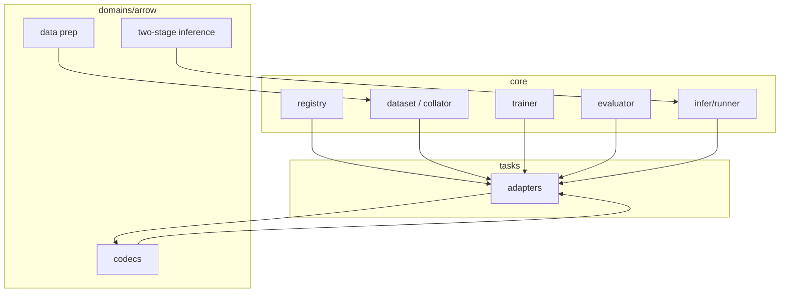
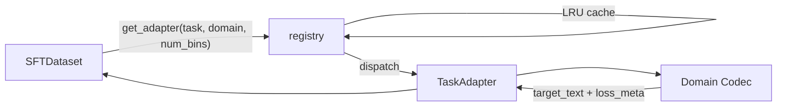
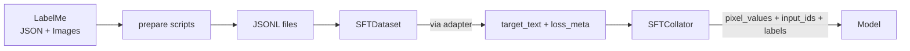
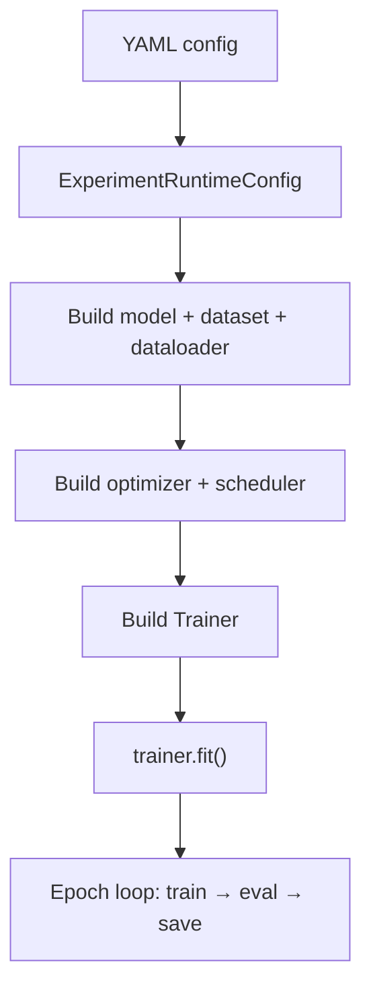
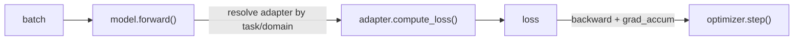
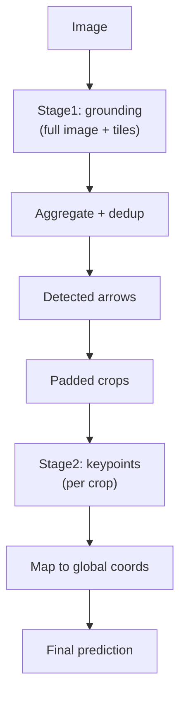

# Architecture

## Overview

`vlm_structgen` is a multimodal generative structure prediction framework built on Qwen3-VL, targeting visual grounding and structured JSON generation tasks. It currently implements three formal tasks under the `arrow` domain:

| Task | Phase | Output |
|---|---|---|
| `joint_structure` | one-stage | `label + bbox_2d + keypoints_2d` |
| `grounding` | two-stage / Stage1 | `label + bbox_2d` |
| `keypoint_sequence` | two-stage / Stage2 | `keypoints_2d` |

## Three-Layer Architecture



### Layer Responsibilities

| Layer | Responsibility |
|---|---|
| **core** | Generic training/inference/evaluation framework. Does NOT understand task/domain semantics; interacts via `TaskAdapter` protocol |
| **tasks** | Task-specific adapters implementing `TaskAdapter` -- GT construction, target encoding, loss computation, scoring |
| **domains** | Domain-specific logic -- codecs, schema, ordering, data preparation, two-stage inference |

**Core principle**: core doesn't understand task/domain, tasks don't understand domain internals, domains don't depend on core's training logic.

## Routing Mechanism

Every JSONL record must declare `task_type` and `domain_type`. The dataset never guesses.



### Supported Routes

| task_type | domain_type | Codec |
|---|---|---|
| `grounding` | `arrow` | `GroundingCodec` |
| `keypoint_sequence` | `arrow` | `KeypointSequenceCodec` |
| `joint_structure` | `arrow` | `ArrowCodec` |

## Data Flow



## Training Pipeline



### Training Step



## Inference Pipeline

### One-Stage


### Two-Stage



## Configuration System

```
ExperimentRuntimeConfig
├── experiment          # name, output_dir, seed
├── model               # model path, freeze settings, pixel budgets
├── tokenizer           # num_bins (1000)
├── task                # task_type, domain_type, route_options
├── prompt              # system_prompt, user_prompt
├── data                # train/val JSONL paths
├── finetune            # mode: lora / full
├── lora                # r, alpha, target modules
├── train               # epochs, batch_size, LR, scheduler
├── eval                # generation params, metric thresholds
├── logging             # wandb
└── checkpoint          # init_from, resume_from
```

### Key Design

- YAML is the single source of truth; CLI flags override specific values
- Unknown config keys are warned
- Model scale tag (`2b`/`4b`) auto-extracted from model path
- Inference config builds runtime config from checkpoint `meta.json`, then applies overrides

### Route Options

```yaml
task:
  route_options:
    grounding/arrow:
      bbox_token_loss_weight: 2.0
      label_token_loss_weight: 1.5
```

## Directory Structure

```
src/vlm_structgen/
├── core/                   # Generic framework
│   ├── config.py           # Configuration
│   ├── registry.py         # Routing (TaskAdapter + get_adapter)
│   ├── data/               # SFTDataset, SFTCollator
│   ├── modeling/           # Model builder + LoRA
│   ├── train/              # Trainer, optimizer
│   ├── eval/               # Evaluator
│   ├── infer/              # Inference runner
│   └── utils/              # IO, logging, distributed, checkpoint, generation
├── tasks/                  # Task adapters
│   ├── grounding/
│   ├── keypoint_sequence/
│   └── joint_structure/
└── domains/arrow/          # Domain logic
    ├── schema.py           # Data model
    ├── ordering.py         # Canonical ordering
    ├── task_support.py     # BaseArrowAdapter, matching
    ├── codecs/             # Serialization
    ├── data/               # Data preparation
    └── infer/              # Two-stage inference
```

## Key Design Decisions

### Structured Weighted Token Loss

Codec provides `loss_meta.field_char_spans` for field-level weighting. The trainer doesn't understand label/bbox/keypoints -- it only consumes the loss returned by the adapter.

### Canonical Ordering

Instance order is frozen during data preparation. Sort key: `(y1, x1, y2, x2, tail_y, tail_x, head_y, head_x, n_points)`.

### Single-Task Batch Constraint

Each batch must have a single `task_type/domain_type`. Mixed batches fail at `_resolve_batch_adapter()`.

### JSON Robustness

Codec handles markdown fence stripping, balanced JSON extraction, truncated array recovery, and lenient/strict parsing modes.
