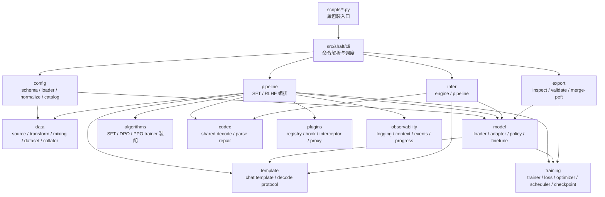

# Shaft 架构总览

本文档描述 `src/shaft` 的正式架构、模块边界和稳定接口，用于指导日常开发、架构评审、代码 review 与后续 agent 协作。

## 1. 目标与范围

### 1.1 当前目标

- 以 `Hugging Face` 生态为唯一主干。
- 围绕多模态模型训练与推理构建稳定框架。
- 优先打磨 `Qwen3VL / Qwen3.5-VL / Qwen3.6-VL + SFT` 主路径。
- 通过注册表和适配层支持后续模型族、算法和推理后端扩展。
- 保持训练、保存、续训、导出都兼容 HF / PEFT / TRL 标准能力。

### 1.2 当前非目标

- 不做多生态兼容层，不接入 ModelScope 等平行生态。
- 不设计自定义 checkpoint 格式。
- 不将任务级语义路由放入训练内核。
- 不把推理编排做成任务 DSL。
- 不把 PPO/RM 包装成“已完成的生产能力”。

## 2. HF-first 边界

Shaft 当前明确是 `HF-first` 框架，这个边界必须在所有设计、实现和文档中保持一致。

- 训练内核：`transformers.Trainer` 与 `trl`
- 参数高效微调：`peft`
- 权重布局：HF full export / PEFT adapter export
- 推理后端：
  - `hf_local`
  - `vllm_openai`

禁止：

1. 引入自定义模型保存格式。
2. 在训练主干中塞入非 HF 生态的基础抽象。
3. 为兼容外部平台而污染当前配置、数据、训练接口。

## 3. 架构分层

说明：

- 下图描述的是当前正式架构与近期已经确定的收敛方向。
- 其中共享 `codec` 层已经落地，当前由 `src/shaft/codec` 提供，`infer` 与在线 eval 共用。



## 4. 模块职责矩阵

| 模块 | 职责 | 关键稳定接口 | 明确禁止 |
| --- | --- | --- | --- |
| `config` | 配置 schema、YAML 加载、catalog 展开、严格校验 | `RuntimeConfig`、`load_config()`、`normalize_runtime_config()` | 训练循环、模型构建、JSONL 解析 |
| `data` | 数据元信息、数据源、记录结构、增强、mixing、dataset、collator | `ShaftDatasetMeta`、`ShaftDataCenter`、`BaseDataSource`、`build_data_source()` | optimizer/loss、训练阶段调度、任务级语义判断 |
| `model` | 模型族元信息、HF 加载、PEFT 包装、processor/peft policy、冻结执行计划 | `ModelMeta`、`ModelModuleGroups`、`ShaftModelAdapter`、`build_model_tokenizer_processor()` | 数据路径处理、训练循环、推理 stage 编排 |
| `template` | 消息规范化、chat template、decode 约定、训练 supervision plan | `TemplateMeta`、`Template`、`build_template()` | 图像处理、任务后处理、generation 参数决策 |
| `algorithms` | 构建 SFT/DPO/PPO/GRPO trainer 与算法专属辅助对象 | `SFTAlgorithm`、`DPOAlgorithm`、`PPOAlgorithm`、`GRPOAlgorithm` | 读取数据文件、控制 pipeline、硬编码模型族 |
| `pipeline` | 训练主链编排和阶段调度 | `ShaftSFTPipeline`、`ShaftRLHFPipeline`、`run_sft()`、`run_rlhf()` | 任务语义、数据格式解析、模型专属 patch |
| `training` | Trainer 包装、loss/optimizer/scheduler、checkpoint 规则 | `ShaftSFTTrainer`、`ShaftDPOTrainer`、`ShaftPPOTrainer`、`build_optimizer()`、`build_scheduler()` | 配置加载、数据读取、导出发布 |
| `codec` | 文本到规范结构的共享解码、JSON 修复与部分解析 | `decode_with_codec()`、`register_codec()` | 指标计算、业务编排、训练循环 |
| `infer` | 单阶段推理执行、多阶段上下文传递 | `InferEngineConfig`、`ShaftInferEngine`、`ShaftInferPipeline` | 训练逻辑、离线任务 DSL、私有 codec 体系 |
| `export` | HF 目录检查、PEFT merge、导出校验 | `inspect_hf_artifact()`、`validate_hf_artifact()`、`merge_peft_adapter()` | 自定义产物格式、发布平台适配 |
| `plugins` | hook / interceptor / 执行代理 | `Registry`、`HookManager`、`InterceptorManager`、`ExecutionProxy` | 替代核心业务流程 |
| `observability` | 日志、上下文、事件与进度状态/输出 | `configure_logging()`、`emit_event()`、`ShaftProgressManager` | checkpoint 决策、训练控制 |
| `cli` | 命令解析、无歧义 override、路由到 pipeline/infer/export | `main()`、`register_command()`、`run_from_args()` | 在 CLI 中堆叠业务逻辑 |

## 5. 训练主链


### 5.1 训练阶段关键接口

- 配置：`RuntimeConfig`
- 数据：`ShaftDataCenter`
- 数据元信息：`ShaftDatasetMeta`
- 模型：`build_model_tokenizer_processor()`
- SFT 编排：`ShaftSFTPipeline`
- RLHF 编排：`ShaftRLHFPipeline`
  - 当前支持：
    - `DPO`
    - `PPO`
    - `GRPO`
  - 其中 `GRPO` 复用 `jsonl_sft` 作为 prompt-target 数据契约，并通过共享 `codec` + 内置 reward registry 构建 reward functions
- HF 参数映射：`build_hf_training_args()`
  - 负责把 `train.distributed.strategy` 映射到 HF `TrainingArguments.fsdp/fsdp_config/deepspeed`
- checkpoint 规则：
  - `inspect_checkpoint_layout()`
  - `resolve_resume_checkpoint()`
  - `validate_resume_checkpoint()`
  - `validate_training_state_policy()`

### 5.2 训练主链边界

1. `pipeline` 只装配组件，不承载任务语义。
2. `algorithms` 只构建 trainer，不读取 JSONL。
3. `data` 只产出样本和 batch，不涉及 loss/optimizer。
4. `model` 只负责模型族差异，不介入数据源路径和训练调度。

SFT/DPO 的多模态监督采用单次 processor 契约：

1. `template` 只接收窄接口 `ShaftChatRenderer`，对完整消息执行一次渲染，并把历史 assistant 编译成
   canonical rendered-token 坐标中的监督 span。它不能取得多模态 processor 或图片。
2. `collator` 对完整 batch 只调用一次多模态 processor，并把全部原始输出封装为
   `ShaftProcessedBatch`；collator 不枚举某个模型的 `pixel_values/image_grid_thw/...` 字段。
3. `ShaftModelAdapter -> ProcessorPolicy` 是 processor 差异的唯一真源，统一负责 processor 调用参数、
   pixel budget、rendered-token 到 processed-token layout、版本化 cost-semantics signature，以及 SFT/DPO
   所需的模型输入复制/重排。
   每个非 sequence 字段必须显式声明为 sample-aligned、whole-batch media 或 static；未知字段不透传。
4. Qwen VL policy 使用 `mm_token_type_ids` 折叠图像 token expansion；identity policy 要求 processed
   tokens 与 rendered tokens 完全一致。任何无法证明的字段重排或 token 对齐都必须 fail fast。
5. `template` 只消费 `ShaftProcessedBatch` 与精确 layout 生成 labels/loss scale；DPO 的 chosen/rejected
   共享同一 prompt plan、layout 和视觉处理结果。

新模型族如果不能提供精确 token layout，必须在接入测试中显式失败并注册模型专用 processor policy；
新模板必须提供基于单次完整渲染的精确 assistant-span compiler。禁止近似对齐、通用 partial-render
fallback，也禁止按 partial message 重跑多模态 processor。

### 5.3 批次规划边界

- 数据配置按“选择什么、如何变换、如何组成 batch”分层：

  ```text
  data
  ├── sources / catalog
  ├── schedule
  │   ├── mixing
  │   └── shuffle
  ├── transforms
  │   └── prompt_sampling
  └── batching
      ├── grouping
      ├── cardinality
      ├── packing
      └── layout
  ```

  运行顺序是 `schedule -> transforms -> grouping/cardinality -> packing -> layout`。这些字段不存在相互
  覆盖的“优先级”；每层只解释自己的语义，不兼容组合由 normalize 在启动前拒绝。
- 训练选择真源分成两层：
  - `ShaftSampleSchedule` 是 horizon-independent 的 `draw_id -> SampleRef` 映射，绑定 source、mixing、
    shuffle 和 seed，不绑定训练总步数。
  - `ShaftSamplePlan` 是 fixed/GRPO 等有限训练路径的 `Schedule` view；bounded SFT 由 DataCenter 直接
    产出 `Schedule`，不再构造 duration-sized finite plan。
- 用户训练 YAML 必须显式声明 `data.batching.grouping`、`cardinality`、`packing.mode` 与 `layout`。
  当前执行面是 `none + fixed + none + padded`、`length + fixed + none + padded|varlen`、
  `length + fixed + greedy + varlen`，以及 `bounded_cost + fixed|token_budget + none + padded`。
  Qwen3VL image SFT 是首个 varlen 执行实现；其它模型族和未验收 backend/topology fail closed。
- 旧 `data.batching.strategy`、`cost_aware`、`dynamic_cost_aware`、fixed guard、full-horizon CostPlan/mmap 和 exact
  optimizer sample target 已删除；loader 对这些旧字段 fail fast，避免双轨运行时。
- bounded 主链固定为：

  ```text
  SampleSchedule -> on-demand CostProvider -> BoundedBufferPlanner -> HF BatchSampler
  ```

- `ShaftBatchContract` 是配置解析后的单一物理 batch 真源，绑定 grouping/cardinality/packing/layout、
  `per_device_train_batch_size`、DP world size 与 GA，并派生 local/global/optimizer physical-pack count range。
  pipeline、sampler、metadata 与 checkpoint spec 都必须由它构造，不能再次推导 batch cardinality。其
  canonical payload/fingerprint 进入所有训练 checkpoint，exact resume 会在模型加载前拒绝 batch contract
  漂移。`cost_cache_size` 仅控制 host LRU，是 audit/performance 参数，不进入 exact contract；调整缓存容量
  不会伪装成训练语义变化。
- `ShaftBatchPlanningSpec` 是 duration-independent 的不可变 sampler 契约，只绑定 schedule/cost
  fingerprint、DP world size、buffer、cardinality policy、per-device 上限、token/resource budgets、seed 与 planner
  版本。它不包含 max steps、GA、target samples 或完整训练 horizon。
- planner 的 live state 只有 next draw cursor、最多 `buffer_size` 个 `SampleRef + SampleCost`、global
  microstep 和实际累计成本。每个 global microstep：
  1. 惰性补满 buffer；
  2. 强制选择最老 entry，并寻找 W 个成本相近的 rank anchor；
  3. fixed 模式为每个 rank 恰好填满 `per_device_train_batch_size` 条；token-budget 模式在硬预算内选择
     1 到该上限；
  4. 优先最小化 projected rank load，再以 padding waste 做 tie-break；
  5. 贪心误入死路时执行有界 exact feasibility fallback；
  6. 删除已选 entry，未选 entry 保持 FIFO。
- `ShaftPlannedBatchSampler` 在一个 planning frame 内按 rank 累计 text+vision load 分配每个 microstep 的
  local batches；training callback 再负责 `global_step * GA -> global_microstep` 的 committed 映射。
- oldest-anchor 保证样本不会因长度长期饥饿；buffer 重排不改变 mixer draw multiset，不丢弃、不复制，也不
  按长度修改 source 权重。weighted bounded 模式要求 `shuffle=true`；旧 unshuffled weighted 映射依赖
  full horizon，因此明确拒绝。
- 每个 local batch 的样本数只由 `train.per_device_train_batch_size` 和显式 cardinality policy 解释，并同时
  受 processor 后 padded LLM token 与通用 resource budget 约束。没有第二个 sample-count 字段。单样本
  超限或模型成本不精确时在首次观察该 draw 时失败，不会先扫描完整训练期。
- cost provider 只缓存有界的 sample cost 与图像 header，不保存解码图像或 token tensor。模型图像成本和
  processed token layout 由 `ProcessorPolicy` 提供，监督截断/EOS/causal shift/loss weight 由 Template
  提供；data planner 不复制模型或模板语义。
- `data.media_snapshot_id` 是外部媒体的不可变 snapshot contract，并进入 cost fingerprint。多 rank 在
  startup 对首个 bounded plan 做 digest 一致性检查；provider/spec/resume 的本地错误先聚合再统一抛出。
- 全局 BatchSampler 的扁平顺序固定为
  `[optimizer step][gradient-accumulation microstep][rank]`。Accelerate 使用
  `split_batches=false, even_batches=false` 做唯一一次 rank 分片；每个 rank 的 batch 数相等，token-budget
  模式允许各 rank 样本数不同。eval 仍使用 fixed/even batches。
- `ShaftSFTTrainer` 始终根据 collate 后真实 `labels/loss_scale`，跨 GA 和 DP rank 计算 global loss
  denominator；planner cost 只用于容量和排序，不能替代真实 loss denominator。
- checkpoint 保存的是模型真正完成 optimizer step 后的 committed state。sampler 可以因 worker prefetch
  规划到未来，但 callback 只按 `global_step * GA` 提交对应 snapshot；resume 加载该 state 并设置
  `ignore_data_skip=true`，避免 HF 二次 skip。DataLoader worker 使用独立 generator，重建 persistent
  workers 不消耗模型/dropout RNG。
- planned spec/state 作为 `ShaftBatchPlanningCallback` 的 stateful payload 写入 HF
  `trainer_state.json`。HF rotation 会延后到所有 rank 的 RNG/训练状态保存成功、rank 0 原子发布 completion
  manifest 之后。自动恢复会跳过 manifest、per-rank RNG、optimizer/scheduler 或 callback state
  缺失/不一致的较新目录；duration/GA/optimizer/scheduler 改变必须使用 `init_from_checkpoint` 开新训练
  schedule。
  `shaft_batching_run_metadata.json` 记录用户可观察的 resolved 策略与预算。
- sequence packing 与 context parallel 是独立能力；bounded grouping 不伪装成 packing。当前已实现 bounded
  lookahead 上的 length grouping、whole-sample greedy packing，以及 Qwen3VL image-SFT varlen 执行链。
  varlen 的 plan/media 私有元数据由模型 `SequenceExecutionPolicy` 在 host 侧消费，构造 4-axis M-RoPE 并
  验证 concrete class/backend；其它模型族和未验收 topology fail closed。context parallel 仍后置。

### 5.4 分片训练边界

- 分片策略统一落在 `train.distributed`：
  - `ddp`: 默认 torchrun + DDP
  - `fsdp`: PyTorch/HF FSDP
  - `deepspeed`: DeepSpeed ZeRO
- `pipeline/training_args.py` 是分片策略进入 HF Trainer 的唯一入口。
- SFT / RLHF pipeline 必须先构建并持有 `TrainingArguments`，再加载模型。这样 DeepSpeed
  ZeRO-3 的 HF runtime config 能在 `from_pretrained` 前生效，避免大模型先按每 rank 完整模型加载。
- 当 `strategy` 不是 `deepspeed` 时，`pipeline/training_args.py` 会清理 HF/Accelerate 的
  DeepSpeed 全局状态，避免同一 Python 进程内先后运行不同训练策略时串配置。
- `train.gradient_checkpointing` 的实际运行时值由 `resolve_effective_gradient_checkpointing()` 统一解析。
  当 FSDP activation checkpointing 打开时，Trainer/model 侧 gradient checkpointing 会自动关闭，
  避免同一层被双重 checkpoint。
- 模型族只提供必要的结构默认值，例如 Qwen3VL 的 FSDP transformer layer class names。
- `data`、`template`、`codec` 和任务 prompt 不允许根据分片策略分叉。
- SFT 已接入 FSDP 与 DeepSpeed；DPO/PPO/GRPO 后续必须复用同一配置语义，不新增平行字段。

### 5.5 冻结边界

- 冻结规则统一落在 `model.finetune.freeze` 与 `src/shaft/model/freeze.py`。
- `src/shaft/model/finetune_plan.py` 负责把：
  - `model.finetune`
  - `ModelModuleGroups`
  - 模型实际参数/模块结构
  解析成单一的 `resolved finetune plan`
- `ModelModuleGroups` 负责声明模型族结构分组：
  - `language_model`
  - `vision_tower`
  - `aligner`
  - `generator`
  - 分组匹配采用最具体前缀优先，而不是简单宽前缀命中
- `full` 模式的冻结语义：
  - 先默认全部可训练
  - 再应用冻结规则
  - 最后应用 `trainable override`
- `lora / dora / qlora` 的冻结语义：
  - 仅作用于 `target_modules=["auto"] / ["all-linear"]` 的自动展开结果
  - 显式 `target_modules` 保持权威
  - `trainable override` 会额外导出为 `modules_to_save`
- 训练执行、adapter 导入兼容性校验、后续导出语义都应消费同一份 `resolved finetune plan`，避免多处重复推导

### 5.6 进度与终端输出边界

- `ShaftProgressManager` 是进度任务、父子关系、current/total、metric 和生命周期的唯一状态真源；terminal、
  plain、JSON 都只消费同一份不可变 snapshot。task mutation 在 manager 内线性化，commit revision
  按序发布，避免并发 `advance` 丢增量或旧 snapshot 覆盖新状态；close 先关闭 mutation 入口再收口任务。
- `ShaftTerminalProgressPresentation` 是单行视觉策略真源，负责小数百分比、高分辨率 bar、速率/ETA、指标
  优先级和 40–72 列降级；terminal sink 只负责节流、速率窗口、清行、重绘和 stream 生命周期。terminal
  复用同一 display-task/百分比选择函数，不在不同输出端重复推导 terminal failure。
- interactive 默认只由 global rank 0 输出结构化日志和进度。`logging.rank_zero_only=true` 会抑制所有非零
  rank 的结构化 log，而不是放行 WARNING 后与 rank-0 活动行竞争；rank-local 主链失败必须通过已有
  all-rank status envelope 传播，未捕获异常仍由 torchrun traceback 报告。显式 all-rank 调试会为文本/JSON
  加 rank，并把 file log 拆成 `.rank<N>` 文件，避免多进程竞争同一个文件。
- 训练行的固定信息优先级是：task、bar、current/total、小数百分比、速度、ETA、loss、LR。低于 1%
  显示两位百分比；未完成任务永不提前显示 `100%`，紧邻数量级边界的 compact current/total 也不得显示成
  相同值。慢 step 显示 `s/step`，低于 0.01 秒/step 时改为 `step/s`，正数亚秒 ETA 显示 `<1s`。
  只要 current > 0，bar 至少显示一个 activity head。窄终端从低优先级字段开始省略，不能直接截断
  current/total 或速度；严格 ASCII stream 会对整行降级，而不只是替换 bar。
- 进入嵌套 eval 时 train 的 rolling rate 暂停，恢复后不把 eval wall time 算进 train `s/step`；task 完成后
  立即回收对应 rate history。失败/取消阶段即使父任务仍运行也必须打印摘要，最终状态不得被父任务成功行掩盖。
- 多 optimizer param group 的当前 LR 显示为 compact min–max range；单组/等值时显示一个值。progress
  callback 不再把第 0 个 group 冒充整个 optimizer 的 LR。
- bounded cost provider 负责在主进程、rank 0 汇总一次大图 header warning；对应 train dataset worker 只
  局部抑制同一 `DecompressionBombWarning`，Pillow `DecompressionBombError` 和其它 decode 错误仍必须失败。
  header probe 捕获到的其它 warning 必须原样重放。这只治理重复输出，不消除超大 PNG 的真实 decode 成本。
- Transformers/HF Hub 自带进度条继续关闭；新增长任务必须发布统一 task，不得在 pipeline、trainer 或 data
  worker 平行维护 tqdm/Rich 状态。
- interactive terminal registry 当前按“每个 Python 进程一个 pipeline、一个共享 progress manager”工作；同一
  进程若并行运行多条 pipeline，必须显式共享 manager，或将额外 run 配成 plain/off，不能创建竞争的活动行。

## 6. 推理主链


### 6.1 推理主链关键接口

- schema：
  - `InferEngineConfig`
  - `InferStageConfig`
  - `InferPipelineConfig`
- engine：
  - `ShaftInferEngine`
  - `ShaftInferRequest`
  - `ShaftInferResponse`
- pipeline：
  - `ShaftInferPipeline`
  - `ShaftInferStageResult`
- codec：
  - `decode_with_codec()`
  - `register_codec()`

### 6.2 推理边界

- stage 是编排单位，不是任务定义语言。
- codec 是文本输出的结构化解码器，不负责训练时数据规约。
- `backend_options` 是后端透传区，不应该变成模型专属大杂烩配置。

## 7. Eval Bench 子项目边界

`projects/eval_bench` 是 Shaft 仓库内的评测工作台子项目，用于管理离线 benchmark、评测运行、预测快照、指标、报告、可视化和后续排行榜。它不属于 `src/shaft` 训练/推理主链，也不维护独立依赖真源；依赖统一放在根目录 `pyproject.toml` 的 `eval-bench` extra 中。

边界约定：

- Eval Bench 是 dashboard-first 的内部系统：FastAPI 提供 API 和静态入口，React/Vite/TanStack/Radix 前端负责 benchmark、run、queue、comparison 等视图。
- Eval Bench 不复用当前 online eval 数据流；它从 `raw_data` 验证 split 复制一份 benchmark 到 `eval_bench_store/benchmarks/` 后再运行评测。
- Eval Bench 按七层架构维护，详细规则见 `docs/eval_bench_architecture.md`：
  - Presentation Layer：React 页面、workspace layout、dialog、table、viewer panel，只做展示和交互编排。
  - API Facade Layer：FastAPI route、request/response 转换、错误响应和日志。
  - Control and Lifecycle Layer：SQLite job/service registry、scheduler、resource lease、cancel request 和状态机。
  - Execution Layer：worker、runtime adapter、OpenAI/vLLM client、process group cleanup 和 prediction snapshot 落盘。
  - Evaluation Semantics Layer：prompt template、target label policy、metric profile、parser/profile 选择。
  - Artifact and Store Layer：benchmark copy、run manifest、prediction snapshot、report、comparison 和 trash。
  - Rendering and Asset Layer：image proxy、preview/tile、viewer geometry、overlay color/style。
- Eval Bench 使用 `eval_bench_store/db/eval_bench.sqlite` 记录持久化 job；第一版正式支持 manifest-driven `eval_job`。Job manifest 由 `runtime` 和 `eval` 两块组成，前端只提供模板初始值，用户可以修改白名单字段；提交前后端 preflight 会检查 benchmark/model/task/prompt，解析 vLLM runtime placement，展示 vLLM 命令。`runtime.args` 不做未知参数透传，新增 vLLM 启动参数必须先进入 schema、payload 和命令生成逻辑。
- `runtime.mode=ephemeral` 表示 job 自己启动一个短生命周期 vLLM OpenAI server，等待 ready 后执行 eval，结束或失败后关闭该进程，日志写入 `runs/<run_id>/logs/runtime.log`。`runtime.mode=existing_service` 表示 job 连接已有 endpoint，不负责启停服务。
- Eval Bench 使用同一 SQLite store 管理长期 model service registry。Services 页可以登记外部 vLLM endpoint，也可以登记本地 vLLM OpenAI server 的 CUDA、TP、port、max_model_len、GPU util、max_num_seqs 等启动参数；本地服务通过当前 `.venv` 的 Python 以 `python -m vllm.entrypoints.openai.api_server` 启动，日志写入 `eval_bench_store/services/<service_id>/service.log`，并提供 Start/Stop API。长期 vLLM 属于 Service，一次性 vLLM 属于 Job runtime，生命周期不能混用。
- Eval job 的用户可读评测身份是 `run_id`；`job_id` 只表示一次队列执行。评测中心和结果库都必须优先展示
  `run_id`，只有还没有落盘 run manifest 的 job 才回退到 `job_id`。
- `eval_semantics.py` 是 evaluator、prediction import 和 comparison 的评估语义入口；`label_policy.py`
  负责 target label scope 及来源，来源包括 `explicit`、`prompt_metadata`、`suite_default`、
  `task_default` 和 `unscoped`；`metric_profiles.py` 负责 metric profile registry，
  `job_lifecycle.py` 负责 job 状态和调度资源占用规则。新增任务、指标、label scope 或 job
  状态必须先更新这些中间层，再接 UI/API/worker。Job preflight 和 `import-predictions`
  都必须复用 `label_policy.py` 校验 target labels 是否存在于 benchmark label index。
- Banana v2.4 Eval Bench suite 同时维护 grounding detection slices 和 crop 级 `point_arrow` split；
  `point_arrow` 来自 `data/point_arrow/structured/val.jsonl`，默认 job 模板仍只暴露 detection 入口。
- `src/shaft/infer`、`src/shaft/codec`、`src/shaft/metrics` 继续作为推理、解析、指标能力真源。
- Eval Bench 负责把一次推理运行落成 raw-data-like prediction snapshot，并记录 `model_id`、模型路径、prompt ID/path/hash、prompt 文本快照、推理参数、job manifest、runtime/service 参数、创建时间、耗时、parser 信息等溯源元数据；这些字段是 run manifest 的一等快照，并在 dashboard 的 Run Inspector 中展示。
- `runs/<run_id>/note.json` 是可编辑 run note 真源；人类 UI 和 agent CLI/API 的覆盖写、追加写都必须复用 store
  并支持 `expected_updated_at` 乐观并发保护，不能手改 artifact 或复制第二套 note 状态。
- metric、preview、report、comparison 和样本级可视化只消费 benchmark、prediction snapshot 和 eval spec，不反向耦合训练内核或训练数据 catalog；预测结果和 test/GT 的对比统一走 benchmark copy + run prediction snapshot：benchmark copy 可以通过 `create-benchmark` 或 dashboard Benchmarks 页创建；`evaluate-run` 根据 run manifest 绑定的 benchmark split 读取 GT，再读取 `runs/<run_id>/predictions/`，按 metric profile 计算 TP/FP/FN、IoU 或 endpoint distance、per-label 指标和样本级诊断。外部预测目录通过 `import-predictions` 或 dashboard Runs 页的 `Import prediction snapshot` 导入为标准 run，它按 benchmark split 的相对路径、image path 或 basename 对齐 prediction JSON，导入后默认立即评估。当前已有 benchmark inspector 直接浏览 copied GT，dashboard 的 run 列表读取 `reports/summary.json` 的核心指标，run inspector 读取 `reports/metrics.json` 中的样本级 TP/FP/FN 诊断并结合 GT JSON、prediction snapshot 做交互式叠图检查。Run Inspector 以图像画布为主区域，支持 query chip 过滤、sample 序号直接跳转、`[`/`]` 快速切样本、图层显隐、对象 hover/click 高亮、真实/预测数量、对象级诊断、滚轮缩放和拖拽平移；配置和 prompt 默认折叠，per-label 精细指标留在 report、Rank Board 和 Compare，避免低频信息挤占视觉检查空间。Runs/Jobs/Services 页提供 run 归档/删除、job 取消/删除、service 删除等管理入口，删除默认进入 `eval_bench_store/trash/`。Compare 页读取 `compare-runs`/`/api/comparisons` 的持久化报告做新旧 run 的整体 delta、已保存 comparison 查询、top case 跳转和并排样本对比，并保留 endpoint distance 这类 profile 主指标的改善/退化语义。
- 持久化目录默认是 `eval_bench_store/`，不写入训练 checkpoint 目录 `outputs/`。

入口脚本是 `scripts/eval_bench.py`，只做薄包装：把 `projects/eval_bench` 加入 `sys.path` 并调用子项目 CLI。

## 8. 在线 Eval 边界

Shaft 当前已经具备基础在线 task metric 能力，边界如下：

- 只支持 **单阶段** 在线 eval
- 支持 **多数据集、多任务**
- 每个 `dataset_name` 只绑定一个 task / 一套 eval policy
- codec 为共享层，`infer` 与在线 eval 共用
- dataset-policy eval 统一支持：
  - `eval_final_score`
  - `eval_final_loss`

在线 eval 当前的关键层：

1. `codec`
2. `eval metric registry`
3. `dataset eval policy`
4. `dataset-policy aggregator`

说明：

- dataset-policy eval 会基于同一套 `eval.datasets` policy，同时聚合：
  - teacher-forced `eval_final_loss`
  - generation-based `eval_final_score`
- task metric 不会实时塞进 eval 进度条
- 每次 eval 完成后，使用日志统一打印：
  - per-dataset loss
  - per-dataset metrics / score
  - `eval_final_loss`
  - `eval_final_score`

详细设计见：

- [docs/online_eval_design.md](online_eval_design.md)

## 9. 稳定接口与演进接口

### 9.1 当前建议视为稳定的接口

- `RuntimeConfig` 及其一级配置块
- `ShaftDataCenter`
- `ModelMeta` / `ShaftModelAdapter`
- `TemplateMeta` / `Template`
- `ShaftSFTPipeline` / `ShaftRLHFPipeline`
- `ShaftSFTTrainer` / `ShaftDPOTrainer` / `ShaftPPOTrainer`
- `InferEngineConfig` / `ShaftInferEngine` / `ShaftInferPipeline`
- `inspect_hf_artifact()` / `validate_hf_artifact()` / `merge_peft_adapter()`

### 9.2 当前不应在外部承诺长期稳定的接口

- PPO 运行时细节与限制条件
- interceptor 的 `point` 字符串全集
- 单个模型族的细粒度 `processor_kwargs`
- 临时 smoke model / smoke template 能力

## 10. 当前明确受限的能力

- PPO 仍是受限能力，不能视为完整生产功能。
- 当前正式 Qwen 多模态模型族包括 `qwen3vl` 与新一代兼容注册项 `qwen35vl`/`qwen36vl`；
  `smoke_vlm` 仅用于测试。
- 结构化任务评估已支持轻量在线 metric；离线 Eval Bench 已具备 benchmark copy、benchmark inspector、持久化 job、vLLM OpenAI worker、metric report、画布优先 run inspector、leaderboard、pairwise comparison 和基础任务管理能力。后续重点是继续扩展真实生产 run 的长期归档、更多任务 metric profile 和更丰富的批量筛查工具。
- 发布到 Hub 的工具链尚未开始。

## 11. 架构约束清单

### 11.1 允许

- 通过注册表扩展模型、模板、算法、数据源、codec、命令。
- 通过 `ModelMeta -> ShaftModelAdapter` 收敛模型差异。
- 通过 `ShaftDatasetMeta -> BaseDataSource -> ShaftDataCenter` 统一多数据源、元信息、增强和 mixing。
- train split 由不可变 source snapshot、`ShaftSampleSchedule`、有限 `ShaftSamplePlan` adapter 与
  `ShaftSampleRef` 组成：
  - JSONL 首次规范化到 source snapshot 指纹化的 Arrow cache，worker 只读 mmap record store。
  - `concat` 表示覆盖式计划；`weighted` 表示按 dataset weight 的可复现有放回概率抽样。
  - plan 按位置计算 sample ref，不物化或复制全量 Python tuple index。
- `ShaftSampleRef` 显式携带 draw context。dataset 不保存 sampler，也不读取跨进程可变 epoch 状态。
- GRPO 的 grouped repeat 由 epoch-aware `ShaftGroupedSampleSampler` 输出 sample refs，避免 TRL 本地
  generator 在多 epoch resume 时回到 epoch 0 排列。
- step duration 在 fixed batch 下按标准 global batch 公式生成有限 sample budget；bounded 模式只生成
  map-style Dataset 的最大 draw 上界，runtime 从 duration-independent schedule 惰性消费。epoch 只作为
  HF 有限时长兼容单位，不控制 prompt 或 transform 刷新。
- 通过 `training/checkpointing.py` 统一 HF 兼容训练状态规则。
- 未来通过 dataset 级 eval policy 支持多数据集、多任务、单阶段在线 eval。

### 11.2 禁止

1. 在 `training` 中解析 JSONL 或图像路径。
2. 在 `data` 中写 loss、optimizer、scheduler。
3. 在 `pipeline` 中硬编码模型族模板细节。
4. 在 `template` 中实现任务后处理或数据规约。
5. 在 `infer` 中维护私有 codec 逻辑而不与共享 codec 收敛。
6. 在 `export` 中引入自定义模型目录格式。

## 12. 相关文档

- [docs/README.md](README.md)
- [docs/module_reference.md](module_reference.md)
- [docs/config_reference.md](config_reference.md)
- [docs/infer.md](infer.md)
- [docs/online_eval_design.md](online_eval_design.md)
- [docs/training_batch_planning_design.md](training_batch_planning_design.md)
- [docs/export.md](export.md)
- [docs/extension_guide.md](extension_guide.md)
- [docs/development_workflow.md](development_workflow.md)
- [docs/testing.md](testing.md)
