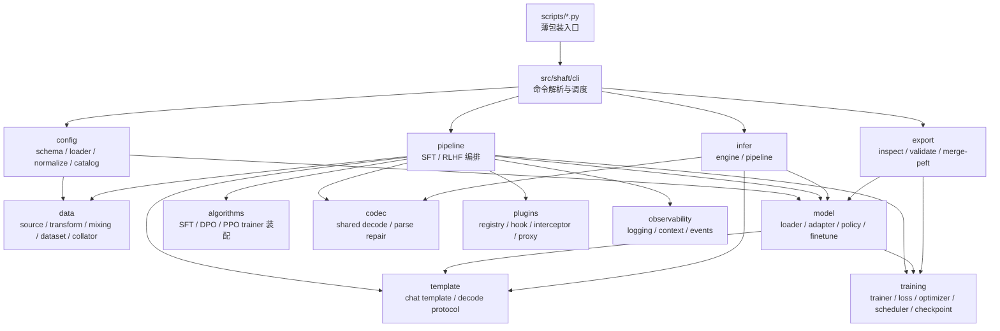
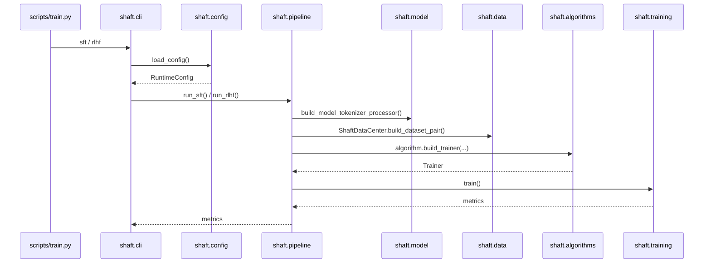
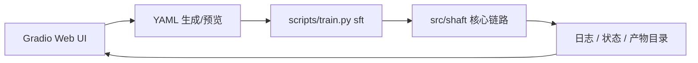

# Shaft 架构总览

本文档描述 `src/shaft` 的正式架构、模块边界和稳定接口，用于指导日常开发、架构评审、代码 review 与后续 agent 协作。

## 1. 目标与范围

### 1.1 当前目标

- 以 `Hugging Face` 生态为唯一主干。
- 围绕多模态模型训练与推理构建稳定框架。
- 优先打磨 `Qwen3VL + SFT` 主路径。
- 通过注册表和适配层支持后续模型族、算法和推理后端扩展。
- 保持训练、保存、续训、导出都兼容 HF / PEFT / TRL 标准能力。

### 1.2 当前非目标

- 不做多生态兼容层，不接入 ModelScope 等平行生态。
- 不设计自定义 checkpoint 格式。
- 不将任务级语义路由放入训练内核。
- 不把推理编排做成任务 DSL。
- 不把 PPO/RM 包装成“已完成的生产能力”。

## 2. HF-first 边界

Shaft 当前明确是 `HF-first` 框架，这个边界必须在所有设计、实现和文档中保持一致。

- 训练内核：`transformers.Trainer` 与 `trl`
- 参数高效微调：`peft`
- 权重布局：HF full export / PEFT adapter export
- 推理后端：
  - `hf_local`
  - `vllm_openai`

禁止：

1. 引入自定义模型保存格式。
2. 在训练主干中塞入非 HF 生态的基础抽象。
3. 为兼容外部平台而污染当前配置、数据、训练接口。

## 3. 架构分层

说明：

- 下图描述的是当前正式架构与近期已经确定的收敛方向。
- 其中共享 `codec` 层已经落地，当前由 `src/shaft/codec` 提供，`infer` 与在线 eval 共用。

## 4. 模块职责矩阵

| 模块 | 职责 | 关键稳定接口 | 明确禁止 |
| --- | --- | --- | --- |
| `config` | 配置 schema、YAML 加载、catalog 展开、严格校验 | `RuntimeConfig`、`load_config()`、`normalize_runtime_config()` | 训练循环、模型构建、JSONL 解析 |
| `data` | 数据元信息、数据源、记录结构、增强、mixing、dataset、collator | `ShaftDatasetMeta`、`ShaftDataCenter`、`BaseDataSource`、`build_data_source()` | optimizer/loss、训练阶段调度、任务级语义判断 |
| `model` | 模型族元信息、HF 加载、PEFT 包装、processor/peft policy | `ModelMeta`、`ShaftModelAdapter`、`build_model_tokenizer_processor()` | 数据路径处理、训练循环、推理 stage 编排 |
| `template` | 消息规范化、chat template、decode 约定 | `TemplateMeta`、`Template`、`build_template()` | 图像处理、任务后处理、generation 参数决策 |
| `algorithms` | 构建 SFT/DPO/PPO trainer 与算法专属辅助对象 | `SFTAlgorithm`、`DPOAlgorithm`、`PPOAlgorithm` | 读取数据文件、控制 pipeline、硬编码模型族 |
| `pipeline` | 训练主链编排和阶段调度 | `ShaftSFTPipeline`、`ShaftRLHFPipeline`、`run_sft()`、`run_rlhf()` | 任务语义、数据格式解析、模型专属 patch |
| `training` | Trainer 包装、loss/optimizer/scheduler、checkpoint 规则 | `ShaftSFTTrainer`、`ShaftDPOTrainer`、`ShaftPPOTrainer`、`build_optimizer()`、`build_scheduler()` | 配置加载、数据读取、导出发布 |
| `codec` | 文本到规范结构的共享解码、JSON 修复与部分解析 | `decode_with_codec()`、`register_codec()` | 指标计算、业务编排、训练循环 |
| `infer` | 单阶段推理执行、多阶段上下文传递 | `InferEngineConfig`、`ShaftInferEngine`、`ShaftInferPipeline` | 训练逻辑、离线任务 DSL、私有 codec 体系 |
| `export` | HF 目录检查、PEFT merge、导出校验 | `inspect_hf_artifact()`、`validate_hf_artifact()`、`merge_peft_adapter()` | 自定义产物格式、发布平台适配 |
| `plugins` | hook / interceptor / 执行代理 | `Registry`、`HookManager`、`InterceptorManager`、`ExecutionProxy` | 替代核心业务流程 |
| `observability` | 日志、上下文、事件输出 | `configure_logging()`、`emit_event()` | checkpoint 决策、训练控制 |
| `cli` | 命令解析、无歧义 override、路由到 pipeline/infer/export | `main()`、`register_command()`、`run_from_args()` | 在 CLI 中堆叠业务逻辑 |

## 5. 训练主链

### 5.1 训练阶段关键接口

- 配置：`RuntimeConfig`
- 数据：`ShaftDataCenter`
- 数据元信息：`ShaftDatasetMeta`
- 模型：`build_model_tokenizer_processor()`
- SFT 编排：`ShaftSFTPipeline`
- RLHF 编排：`ShaftRLHFPipeline`
- HF 参数映射：`build_hf_training_args()`
- checkpoint 规则：
  - `inspect_checkpoint_layout()`
  - `resolve_resume_checkpoint()`
  - `validate_resume_checkpoint()`
  - `validate_training_state_policy()`

### 5.2 训练主链边界

1. `pipeline` 只装配组件，不承载任务语义。
2. `algorithms` 只构建 trainer，不读取 JSONL。
3. `data` 只产出样本和 batch，不涉及 loss/optimizer。
4. `model` 只负责模型族差异，不介入数据源路径和训练调度。

## 6. 推理主链

### 6.1 推理主链关键接口

- schema：
  - `InferEngineConfig`
  - `InferStageConfig`
  - `InferPipelineConfig`
- engine：
  - `ShaftInferEngine`
  - `ShaftInferRequest`
  - `ShaftInferResponse`
- pipeline：
  - `ShaftInferPipeline`
  - `ShaftInferStageResult`
- codec：
  - `decode_with_codec()`
  - `register_codec()`

### 6.2 推理边界

- stage 是编排单位，不是任务定义语言。
- codec 是文本输出的结构化解码器，不负责训练时数据规约。
- `backend_options` 是后端透传区，不应该变成模型专属大杂烩配置。

## 7. 在线 Eval 边界

Shaft 当前已经具备基础在线 task metric 能力，边界如下：

- 只支持 **单阶段** 在线 eval
- 支持 **多数据集、多任务**
- 每个 `dataset_name` 只绑定一个 task / 一套 eval policy
- codec 为共享层，`infer` 与在线 eval 共用
- 最终只产出一个 `eval_final_score` 用于 best model 选择

在线 eval 当前的关键层：

1. `codec`
2. `eval metric registry`
3. `dataset eval policy`
4. `score aggregator`

说明：

- `eval_loss` 仍保留为训练内基础监控指标
- task metric 不会实时塞进 eval 进度条
- 每次 eval 完成后，使用日志统一打印 per-dataset metrics 与 `eval_final_score`

详细设计见：

- [docs/online_eval_design.md](online_eval_design.md)

## 8. Web UI 边界

Shaft Web UI 是训练框架之上的可视化外壳，不属于 `src/shaft` 内核层的一部分。

### 8.1 定位

- 面向工程师与科研人员
- 第一版只覆盖 `SFT` 训练
- 目标是让 `YAML` 编辑、训练启动和日志查看更顺手
- 不作为第二套训练系统

### 8.2 推荐实现方式

- 采用 `Gradio Blocks`
- 通过生成 `YAML` 后调用现有 `scripts/train.py sft`
- 训练真入口仍然是 CLI
- Web UI 只负责表单、预览、状态和日志

### 8.3 明确边界

1. 不在 Web UI 中复制训练内核逻辑。
2. 不在 Web UI 中引入新的配置语义。
3. 不在 Web UI 中维护一套独立 checkpoint 或数据语义。
4. 不从 Web UI 直接调用底层训练组件作为长期主入口。
5. 不在第一版里把推理、导出、RLHF 一并展开。

### 8.4 当前建议的关系图

## 9. 稳定接口与演进接口

### 9.1 当前建议视为稳定的接口

- `RuntimeConfig` 及其一级配置块
- `ShaftDataCenter`
- `ModelMeta` / `ShaftModelAdapter`
- `TemplateMeta` / `Template`
- `ShaftSFTPipeline` / `ShaftRLHFPipeline`
- `ShaftSFTTrainer` / `ShaftDPOTrainer` / `ShaftPPOTrainer`
- `InferEngineConfig` / `ShaftInferEngine` / `ShaftInferPipeline`
- `inspect_hf_artifact()` / `validate_hf_artifact()` / `merge_peft_adapter()`

### 9.2 当前不应在外部承诺长期稳定的接口

- PPO 运行时细节与限制条件
- interceptor 的 `point` 字符串全集
- 单个模型族的细粒度 `processor_kwargs`
- 临时 smoke model / smoke template 能力

## 10. 当前明确受限的能力

- PPO 仍是受限能力，不能视为完整生产功能。
- 当前只有 `qwen3vl` 是正式模型族实现，`smoke_vlm` 仅用于测试。
- 结构化任务评估已支持轻量在线 metric，但独立离线评估子系统仍未形成。
- 发布到 Hub 的工具链尚未开始。

## 11. 架构约束清单

### 11.1 允许

- 通过注册表扩展模型、模板、算法、数据源、codec、命令。
- 通过 `ModelMeta -> ShaftModelAdapter` 收敛模型差异。
- 通过 `ShaftDatasetMeta -> BaseDataSource -> ShaftDataCenter` 统一多数据源、元信息、增强和 mixing。
- 通过 `training/checkpointing.py` 统一 HF 兼容训练状态规则。
- 未来通过 dataset 级 eval policy 支持多数据集、多任务、单阶段在线 eval。

### 11.2 禁止

1. 在 `training` 中解析 JSONL 或图像路径。
2. 在 `data` 中写 loss、optimizer、scheduler。
3. 在 `pipeline` 中硬编码模型族模板细节。
4. 在 `template` 中实现任务后处理或数据规约。
5. 在 `infer` 中维护私有 codec 逻辑而不与共享 codec 收敛。
6. 在 `export` 中引入自定义模型目录格式。

## 12. 相关文档

- [docs/README.md](README.md)
- [docs/module_reference.md](module_reference.md)
- [docs/config_reference.md](config_reference.md)
- [docs/infer.md](infer.md)
- [docs/online_eval_design.md](online_eval_design.md)
- [docs/export.md](export.md)
- [docs/extension_guide.md](extension_guide.md)
- [docs/development_workflow.md](development_workflow.md)
- [docs/testing.md](testing.md)
- [docs/project_skill.md](project_skill.md)
- [docs/webui.md](webui.md)
