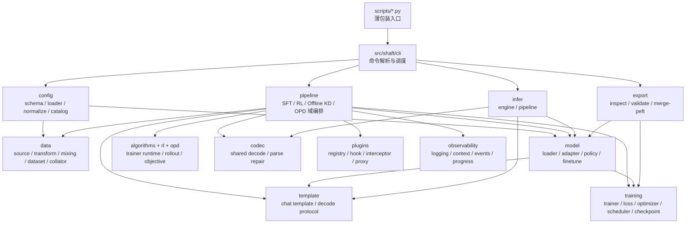
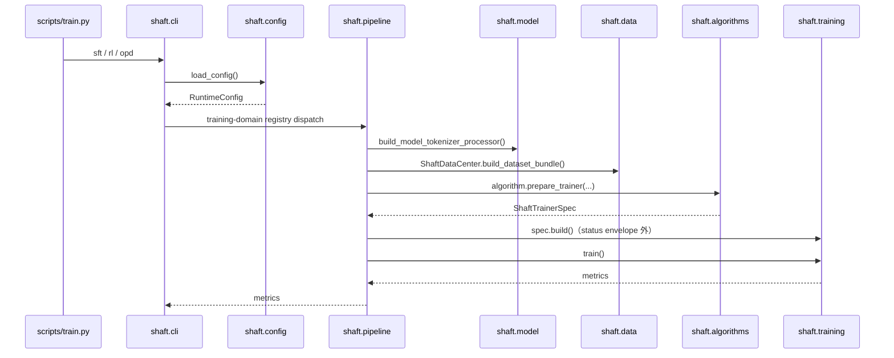
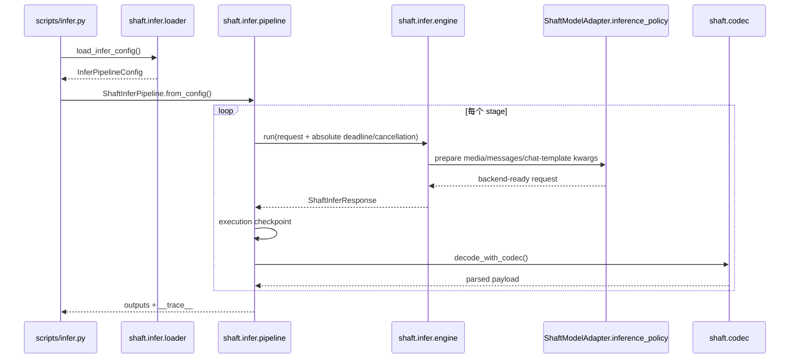

# Shaft 架构总览

本文档描述 `src/shaft` 的正式架构、模块边界和稳定接口，用于指导日常开发、架构评审、代码 review 与后续 agent 协作。

## 1. 目标与范围

### 1.1 当前目标

- 以 `Hugging Face` 生态为唯一主干。
- 围绕多模态模型训练与推理构建稳定框架。
- 优先打磨 `Qwen3VL / Qwen3.5-VL / Qwen3.6-VL + SFT` 主路径；MoE padded SFT 已接入，真实大权重
  生产验收与 varlen/packing 仍保持独立边界。
- 通过注册表和适配层支持后续模型族、算法和推理后端扩展。
- 保持训练、保存、续训、导出都兼容 HF / PEFT / TRL 标准能力。

### 1.2 当前非目标

- 不做多生态兼容层，不接入 ModelScope 等平行生态。
- 不设计自定义 checkpoint 格式。
- 不将任务级语义路由放入训练内核。
- 不把推理编排做成任务 DSL。
- 不把 PPO/RM 包装成“已完成的生产能力”。

## 2. HF-first 边界

Shaft 当前明确是 `HF-first` 框架，这个边界必须在所有设计、实现和文档中保持一致。

- 训练内核：`transformers.Trainer` 与 `trl`
- 参数高效微调：`peft`
- 权重布局：HF full export / PEFT adapter export
- 推理后端：
  - `hf_local`
  - `vllm_openai`

禁止：

1. 引入自定义模型保存格式。
2. 在训练主干中塞入非 HF 生态的基础抽象。
3. 为兼容外部平台而污染当前配置、数据、训练接口。

## 3. 架构分层

说明：

- 下图描述的是当前正式架构与近期已经确定的收敛方向。
- 其中共享 `codec` 层已经落地，当前由 `src/shaft/codec` 提供，`infer` 与在线 eval 共用。


```mermaid
flowchart TD
    Scripts["scripts/*.py<br/>薄包装入口"]
    CLI["src/shaft/cli<br/>命令解析与调度"]
    Config["config<br/>schema / loader / normalize / catalog"]
    Pipeline["pipeline<br/>SFT / RL / Offline KD / OPD 域编排"]
    Data["data<br/>source / transform / mixing / dataset / collator"]
    Model["model<br/>loader / adapter / policy / finetune"]
    Template["template<br/>chat template / decode protocol"]
    Algorithms["algorithms + rl + opd<br/>trainer runtime / rollout / objective"]
    Training["training<br/>trainer / loss / optimizer / scheduler / checkpoint"]
    Codec["codec<br/>shared decode / parse repair"]
    Infer["infer<br/>engine / pipeline"]
    Export["export<br/>inspect / validate / merge-peft"]
    Plugins["plugins<br/>registry / hook / interceptor / proxy"]
    Obs["observability<br/>logging / context / events / progress"]

    Scripts --> CLI
    CLI --> Config
    CLI --> Pipeline
    CLI --> Infer
    CLI --> Export

    Config --> Data
    Config --> Model
    Pipeline --> Data
    Pipeline --> Model
    Pipeline --> Template
    Pipeline --> Algorithms
    Pipeline --> Training
    Pipeline --> Codec
    Pipeline --> Plugins
    Pipeline --> Obs
    Model --> Template
    Model --> Training
    Infer --> Codec
    Infer --> Model
    Infer --> Template
    Export --> Model
    Export --> Training
```

## 4. 模块职责矩阵

| 模块 | 职责 | 关键稳定接口 | 明确禁止 |
| --- | --- | --- | --- |
| `config` | 配置 schema、YAML 加载、catalog 展开、严格校验 | `RuntimeConfig`、`load_config()`、`normalize_runtime_config()` | 训练循环、模型构建、JSONL 解析 |
| `data` | 数据元信息、数据源、记录结构、增强、mixing、dataset、collator | `ShaftDatasetMeta`、`ShaftDataCenter`、`BaseDataSource`、`build_data_source()` | optimizer/loss、训练阶段调度、任务级语义判断 |
| `model` | 模型族元信息、HF 加载、PEFT 包装、processor/inference/peft policy、冻结执行计划 | `ModelMeta`、`ModelModuleGroups`、`ShaftModelAdapter`、`build_model_tokenizer_processor()` | 数据路径处理、训练循环、推理 stage 编排 |
| `template` | 消息规范化、chat template、decode 约定、训练 supervision plan | `TemplateMeta`、`Template`、`build_template()` | 图像处理、任务后处理、generation 参数决策 |
| `algorithms` / `rl` / `offline_kd` / `opd` | SFT trainer spec、DPO/PPO/GRPO runtime、离线分布蒸馏，以及独立 OPD rollout/teacher runtime | `RLRuntime`、`ShaftOfflineKDTrainer`、`ShaftOPDTrainer` | 中央 CLI 路由、复制公共模型加载/optimizer/export 机制 |
| `pipeline` | training-domain registry 与四个域的阶段编排 | `ShaftSFTPipeline`、`ShaftRLPipeline`、`ShaftOfflineKDPipeline`、`ShaftOPDPipeline` | 数据格式解析、模型专属 patch、把离线 KD 隐式塞入 SFT extra |
| `training` | Trainer 公共机制、optimizer/scheduler、checkpoint 与可注册 resume policy | `ShaftSFTTrainer`、`register_training_resume_policy()`、`build_optimizer()`、`build_scheduler()` | 读取 `opd.*` 数据语义、配置加载、导出发布 |
| `codec` | 文本到规范结构的共享解码、JSON 修复与部分解析 | `decode_with_codec()`、`register_codec()` | 指标计算、业务编排、训练循环 |
| `infer` | 单阶段推理执行、多阶段上下文传递 | `InferEngineConfig`、`ShaftInferEngine`、`ShaftInferPipeline` | 训练逻辑、离线任务 DSL、私有 codec 体系 |
| `export` | HF 目录检查、PEFT merge、导出校验 | `inspect_hf_artifact()`、`validate_hf_artifact()`、`merge_peft_adapter()` | 自定义产物格式、发布平台适配 |
| `plugins` | hook / interceptor / 执行代理 | `Registry`、`HookManager`、`InterceptorManager`、`ExecutionProxy` | 替代核心业务流程 |
| `observability` | 日志、上下文、事件与进度状态/输出 | `configure_logging()`、`emit_event()`、`ShaftProgressManager` | checkpoint 决策、训练控制 |
| `cli` | 命令解析、无歧义 override、路由到 pipeline/infer/export | `main()`、`register_command()`、`run_from_args()` | 在 CLI 中堆叠业务逻辑 |

## 5. 训练主链


```mermaid
sequenceDiagram
    participant Script as scripts/train.py
    participant CLI as shaft.cli
    participant Config as shaft.config
    participant Pipeline as shaft.pipeline
    participant Model as shaft.model
    participant Data as shaft.data
    participant Algo as shaft.algorithms
    participant Trainer as shaft.training

    Script->>CLI: sft / rl / opd
    CLI->>Config: load_config()
    Config-->>CLI: RuntimeConfig
    CLI->>Pipeline: training-domain registry dispatch
    Pipeline->>Model: build_model_tokenizer_processor()
    Pipeline->>Data: ShaftDataCenter.build_dataset_bundle()
    Pipeline->>Algo: algorithm.prepare_trainer(...)
    Algo-->>Pipeline: ShaftTrainerSpec
    Pipeline->>Trainer: spec.build()（status envelope 外）
    Pipeline->>Trainer: train()
    Trainer-->>Pipeline: metrics
    Pipeline-->>CLI: metrics
```

### 5.1 训练阶段关键接口

- 配置：`RuntimeConfig`
- 数据：`ShaftDataCenter`
- 数据元信息：`ShaftDatasetMeta`
- 模型：`build_model_tokenizer_processor()`
- SFT 编排：`ShaftSFTPipeline`
- RL 编排：`ShaftRLPipeline`（DPO/PPO/GRPO 差异由 `src/shaft/rl` runtime registry 持有；唯一入口为
  `run_rl`）
  - 当前支持：
    - `DPO`
    - `PPO`
    - `GRPO`
  - 其中 `GRPO` 复用 `jsonl_sft` 作为 prompt-target 数据契约，并通过共享 `codec` + 内置 reward registry 构建 reward functions
- OPD 编排：`ShaftOPDPipeline`
  - 独立 `jsonl_opd` prompt-only 输入、HF/vLLM student rollout、本地/HTTP 冻结 teacher 与
    completion-token direct loss。
  - rollout backend 与 teacher provider 由 OPD 域内 registry 解析；execution plan 在模型加载前检查
    exact-resume capability，trainer 只消费统一 runtime contract。
  - template prompt-plan 负责严格前缀截断；model policy 负责 rollout sequence fields 与可选 tail-logits
    forward contract；trainer 负责 optimizer-window 全局 token normalization。
  - 独立 OPD input ABI 绑定完整 token ID、special ID、输出 vocab、processor/input schema，并验证 teacher
    `forward` 能消费 student 生成的 scoring tensor；model alias 与原始 chat template 不属于这条兼容身份。
  - objective registry 持有 full-vocab/chunk/top-k-tail 语义；OPD telemetry 独立记录 rollout、score、
    objective、optimizer 与 CUDA event，不复用 SFT supervised-token schema。
  - DDP/FSDP/DeepSpeed 复用 HF/Accelerate checkpoint/export；不导入 TRL experimental OPD/GKD trainer，
    也不进入 RL runtime；unsupported layout 在 normalize 阶段 fail closed。
- HF 参数映射：`build_hf_training_args()`
  - 负责把 `train.distributed.strategy` 映射到 HF `TrainingArguments.fsdp/fsdp_config/deepspeed`
- checkpoint 规则：
  - `inspect_checkpoint_layout()`
  - `commit_training_checkpoint()`
  - `commit_model_only_checkpoint()`
  - `resolve_resume_checkpoint()`
  - `validate_model_only_checkpoint()`
  - `validate_training_checkpoint_commit()`
  - `validate_resume_checkpoint()`
  - `validate_training_state_policy()`

### 5.2 训练主链边界

1. `pipeline` 只装配组件，不承载任务语义。
2. `algorithms` 只构建 trainer，不读取 JSONL。
3. `data` 只产出样本和 batch，不涉及 loss/optimizer。
4. `model` 只负责模型族差异，不介入数据源路径和训练调度。

SFT/DPO 的多模态监督采用单次 processor 契约：

1. `template` 只接收窄接口 `ShaftChatRenderer`，对完整消息执行一次渲染，并把历史 assistant 编译成
   canonical rendered-token 坐标中的监督 span。它不能取得多模态 processor 或图片。
2. `collator` 对完整 batch 只调用一次多模态 processor，并把全部原始输出封装为
   `ShaftProcessedBatch`；collator 不枚举某个模型的 `pixel_values/image_grid_thw/...` 字段。
3. `ShaftModelAdapter -> ProcessorPolicy` 是 processor 差异的唯一真源，统一负责 processor 调用参数、
   pixel budget、rendered-token 到 processed-token layout、版本化 cost-semantics signature，以及 SFT/DPO
   所需的模型输入复制/重排。GRPO 绕过 SFT collator 时，pipeline 也只能把 policy 的
   `prepare_rollout_image()` 作为通用 callable 注入 dataset；data 层不能导入某个模型族的 resize utility。
   每个非 sequence 字段必须显式声明为 sample-aligned、whole-batch media 或 static；未知字段不透传。
4. processor 输出的附加 token-aligned 字段由 policy 注册为 `ShaftProcessorSequenceField`，统一声明字段名、
   token 轴、padding 值和 continuation 扩展值。`ShaftProcessedBatch` 保存本次实际出现的 resolved contract；
   template row 只返回保留的 processed-prefix indices，SFT/DPO/OPD collator 通过同一合同完成截断、target/
   rollout 扩展、padding 或 varlen 拼接，通用层不认识任何模型字段名。缺少 continuation 规则、字段只在部分
   合同出现或 collator 丢字段时均 fail fast。
5. Qwen VL policy 使用 `mm_token_type_ids` 折叠图像 token expansion，并把 media token run 写入
   `ShaftProcessorTokenLayout.protected_processed_spans`；identity policy 要求 processed tokens 与 rendered
   tokens 完全一致。template 只看受保护 span，不读取 Qwen token type。任何无法证明的字段重排或 token
   对齐都必须 fail fast。
6. `template` 只消费 `ShaftProcessedBatch` 与精确 layout 生成 labels/loss scale；DPO 的 chosen/rejected
   共享同一 prompt plan、layout 和视觉处理结果。
7. `ProcessorInputPolicy` 显式声明 training/right 与 generation/left padding；caller 只声明 input mode，
   不再传递裸 `padding_side`。`EvalInputPolicy` 在 config 层按 dataset override、eval default、data fallback
   的优先级解析 pixel budget；teacher-forced loss 与 online generation 共享同一个 resolved policy。

新模型族如果不能提供精确 token layout，必须在接入测试中显式失败并注册模型专用 processor policy；
新模板必须提供基于单次完整渲染的精确 assistant-span compiler。禁止近似对齐、通用 partial-render
fallback，也禁止按 partial message 重跑多模态 processor。

### 5.3 批次规划边界

- 数据配置按“选择什么、如何变换、如何组成 batch”分层：

  ```text
  data
  ├── sources / catalog
  ├── schedule
  │   ├── mixing
  │   └── shuffle
  ├── prompt_sources
  │   └── shared pool / dataset eligibility subset / offline targets / weighted selection
  └── batching
      ├── grouping
      ├── cardinality
      ├── packing
      └── layout
  ```

  运行顺序是 `schedule -> dataset transforms -> PromptSource -> grouping/cardinality -> packing -> layout`。
  这些字段不存在相互覆盖的“优先级”；每层只解释自己的语义，不兼容组合由 normalize 在启动前拒绝。
- 训练选择真源分成两层：
  - `ShaftSampleSchedule` 是 horizon-independent 的 `draw_id -> SampleRef` 映射，绑定 source、mixing、
    shuffle 和 seed，不绑定训练总步数。
  - `ShaftSamplePlan` 是 fixed/GRPO 等有限训练路径的 `Schedule` view；bounded SFT 由 DataCenter 直接
    产出 `Schedule`，不再构造 duration-sized finite plan。
- 用户训练 YAML 必须显式声明 `data.batching.grouping`、`cardinality`、`packing.mode` 与 `layout`。
  当前执行面是 `none + fixed + none + padded`、`length + fixed + none + padded|varlen`、
  `length + fixed + greedy + varlen`，以及 `bounded_cost + fixed|token_budget + none + padded`。
  Qwen3VL 与 HF `qwen3_5` dense/MoE（Qwen3.5/Qwen3.6/Qwen3.8 alias）image SFT 已实现各自的
  varlen execution policy；
  其它模型族和未验收 backend/topology fail closed。
- 数据与推理的单样本 media 真源都是有序 `image_paths`：JSONL 用 `images` 表达多图，运行时按顺序传给
  placeholder 和 processor。单数 `image_path/image` 只是单图兼容面。padded SFT/DPO 支持多图；varlen
  sequence packing 仍只支持单图并 fail closed。
- SFT 的当前轮 CoT 真源是可选 `target_reasoning_content`，最终答案仍是 `target_text`；历史 assistant
  reasoning 留在 `messages[*].reasoning_content`。template 层把二者编译成模型产品对应的 continuation，
  data/collator/pipeline 不解析 `<think>` 语义。产品 chat-template kwargs 存在 `TemplateMeta`，本地渲染与
  OpenAI-compatible 推理共用，不维护平行开关。
- 旧 `data.batching.strategy`、`cost_aware`、`dynamic_cost_aware`、fixed guard、full-horizon CostPlan/mmap 和 exact
  optimizer sample target 已删除；loader 对这些旧字段 fail fast，避免双轨运行时。
- bounded 主链固定为：

  ```text
  SampleSchedule -> on-demand CostProvider -> BoundedBufferPlanner -> HF BatchSampler
  ```

- `ShaftBatchContract` 是配置解析后的单一物理 batch 真源，绑定 grouping/cardinality/packing/layout、
  `per_device_train_batch_size`、DP world size 与 GA，并派生 local/global/optimizer physical-pack count range。
  pipeline、sampler、metadata 与 checkpoint spec 都必须由它构造，不能再次推导 batch cardinality。其
  canonical payload/fingerprint 进入所有训练 checkpoint，exact resume 会在模型加载前拒绝 batch contract
  漂移。`cost_cache_size` 仅控制 host LRU，是 audit/performance 参数，不进入 exact contract；调整缓存容量
  不会伪装成训练语义变化。
- SFT checkpoint 还通过 `ShaftSFTReportingStateCallback` 保存每个 data rank 尚未 flush 的 HF loss 窗口、
  `total_loss_scalar/globalstep_last_logged` 和 model-owned auxiliary loss 累积量。恢复时在 HF 初始化并清空
  reporting state 之后原位还原，因此 `save_steps` 落在 `logging_steps` 区间中间时，后续 `loss`、
  `aux/*`、`log_history` 与 `on_log` 事件仍和不中断轨迹一致。pending loss 在恢复后的首个
  `training_step` backward 完成后注入 reporting tensor，保持 GA>1 的 FP32 加法顺序；NaN/Inf filter、no-op
  resume 和 rank-local pending skew 也使用同一状态机。snapshot 的 schema、step、world size、
  rank 完整性及 auxiliary term 集合均严格校验；缺少该 callback state 的旧 checkpoint 不能按当前协议做
  exact resume，只能作为 `init_from_checkpoint` 权重来源开始新 schedule。
- 最终 `train_loss` 仍表示本次进程实际执行的恢复窗口，不把 checkpoint 前历史重复计入；每 rank snapshot
  先形成全局 resume baseline，训练结束再归约 rank-local remainder。run-root `trainer_state.json` 只是终态
  可观察摘要，保存时移除 reporting callback state；只有 committed/backend-native checkpoint 可用于 resume。
- `ShaftBatchPlanningSpec` 是 duration-independent 的不可变 sampler 契约，只绑定 schedule/cost
  fingerprint、DP world size、buffer、cardinality policy、per-device 上限、token/resource budgets、seed 与 planner
  版本。它不包含 max steps、GA、target samples 或完整训练 horizon。
- planner 的 live state 只有 next draw cursor、最多 `buffer_size` 个 `SampleRef + SampleCost`、global
  microstep 和实际累计成本。每个 global microstep：
  1. 惰性补满 buffer；
  2. 强制选择最老 entry，并寻找 W 个成本相近的 rank anchor；
  3. fixed 模式为每个 rank 恰好填满 `per_device_train_batch_size` 条；token-budget 模式在硬预算内选择
     1 到该上限；
  4. 优先最小化 projected rank load，再以 padding waste 做 tie-break；
  5. 贪心误入死路时执行有界 exact feasibility fallback；
  6. 删除已选 entry，未选 entry 保持 FIFO。
- `ShaftPlannedBatchSampler` 在一个 planning frame 内按 rank 累计 text+vision load 分配每个 microstep 的
  local batches；DDP 将 global flattened stream 交给 Accelerate 做唯一一次 rank 分片，FSDP/DeepSpeed
  直接消费 sampler 产出的 rank-local stream，禁止后端二次切分或补齐。training callback 再负责
  `global_step * GA -> global_microstep` 的 committed 映射。
- oldest-anchor 保证样本不会因长度长期饥饿；buffer 重排不改变 mixer draw multiset，不丢弃、不复制，也不
  按长度修改 source 权重。weighted bounded 模式当前要求 `shuffle=true`；unshuffled v3 已改成跨 cycle
  连续的 exact-ticket 低差异 stream，但 planned schedule API 尚未开放该执行路径，因此仍明确拒绝，不能把
  fixed adapter 的正确性等同于 bounded 支持。
- 每个 local batch 的样本数只由 `train.per_device_train_batch_size` 和显式 cardinality policy 解释，并同时
  受 processor 后 padded LLM token 与通用 resource budget 约束。没有第二个 sample-count 字段。单样本
  超限或模型成本不精确时在首次观察该 draw 时失败，不会先扫描完整训练期。
- cost provider 只缓存有界的 sample cost 与图像 header，不保存解码图像或 token tensor。模型图像成本和
  processed token layout 由 `ProcessorPolicy` 提供，监督截断/EOS/causal shift/loss weight 由 Template
  提供；data planner 不复制模型或模板语义。
- `data.media_snapshot_id` 是外部媒体的不可变 snapshot contract，并进入 cost fingerprint。多 rank 在
  startup 对首个 bounded plan 做 digest 一致性检查；provider/spec/resume 的本地错误先聚合再统一抛出。
- canonical global plan 的顺序固定为
  `[optimizer step][gradient-accumulation microstep][rank]`。DDP 仍由 Accelerate 在
  `split_batches=false, even_batches=false` 下做唯一一次 rank 分片；FSDP/DeepSpeed 首版 fixed planned
  路径让 sampler 直接选取当前 rank，Trainer 不再调用 Accelerate DataLoader sharding。每个 rank 的
  microstep 数严格一致，draw 不重叠、不丢失、不补副本。eval 仍使用 fixed/even batches。
- `ShaftSFTTrainer` 始终根据 collate 后真实 `labels/loss_scale`，跨 GA 和 DP rank 计算 global loss
  denominator；planner cost 只用于容量和排序，不能替代真实 loss denominator。
- checkpoint 保存的是模型真正完成 optimizer step 后的 committed state。sampler 可以因 worker prefetch
  规划到未来，但 callback 只按 `global_step * GA` 提交对应 snapshot；resume 加载该 state 并设置
  `ignore_data_skip=true`，避免 HF 二次 skip。DataLoader worker 使用独立 generator，重建 persistent
  workers 不消耗模型/dropout RNG。
- periodic save 的内容语义只由 `train.save_only_model` 派生，不新增平行配置源。默认值 `false` 保存 exact-resume
  所需的完整训练态；SFT 设置为 `true` 时只发布标准 HF/PEFT 模型态，保留少量审计 metadata，但拒绝
  optimizer/scheduler/scaler/RNG 和 backend-native training state。该目录带有
  `shaft_model_only_checkpoint.json` 提交 marker，可用于部署或 `init_from_checkpoint`，不能用于
  `resume_from_checkpoint`。FSDP 必须生成 full state dict，ZeRO-3 必须在保存时 gather 完整权重；无法证明
  可加载性的组合在模型加载前 fail closed。
- full HF 权重的分片上限只由 `train.max_shard_size` 提供，默认 `4GB`。训练配置层负责格式规范化与正值校验，
  `ShaftModelSaveMixin` 在 Trainer 的标准 `save_model -> save_pretrained` 路径注入该值；periodic checkpoint、
  final `best`、单卡和分布式 full-state 保存不各自推导第二份分片策略。PEFT adapter 保持原生格式。
- checkpoint storage protocol 由 distributed strategy 显式路由。SFT、DPO、GRPO 的 DDP/native-HF 路径
  使用 `committed_manifest`：`ShaftCheckpointCommitMixin` 在覆盖同名 checkpoint 前撤销旧
  `shaft_checkpoint_commit.json` 并暂缓 HF rotation；模型/adapter、Trainer、optimizer、scheduler 与 RNG
  保存后，先验证各 rank 的 telemetry/plugin `on_save` callback 拓扑完全相同且顺序一致，再在每个 callback
  后做 all-rank convergence；全部成功才进入独立 commit phase，由 rank 0 原子发布 manifest 并执行
  rotation。rank-zero progress 也在所有 rank 安装同类 callback，非零 rank 只执行无 sink 的 no-op 路径。
  direct-path 和 run-root resume 共用同一
  validator，run-root 跳过未提交或 artifact 缺失、尺寸变化、SHA-256 digest 漂移的 torn/tampered
  checkpoint。FSDP/DeepSpeed 使用 `backend_native`；普通 fixed 路径仍交回后端保存和恢复，planned SFT
  则增加 prepared -> committed generation wrapper。后端写完 shard、所有 rank/callback 收敛后，rank 0
  原子发布 `shaft_backend_checkpoint_commit.json`，将 backend generation 与 planning binding、step、world
  size、Trainer/scheduler/RNG 小状态内容身份和完整 shard 路径/非零尺寸集合绑定，再执行 rotation。
  run-root 只选择 marker 与 native artifact 同时有效的最新 generation；pending、损坏、陈旧或 planning
  generation 不一致均 fail closed。PPO 仍不支持 resume，且
  `save_strategy` 必须为 `no`；最终 `best` 导出与 root final state 不受影响。
- 恢复启动把选中的 checkpoint 固定为一个 `ResolvedResumeCheckpoint` generation token。run root 只从新到旧
  扫描到首个有效 generation；preflight、planned state 与 Trainer 入口复用同一 content identity，不重复
  hash 大 shard。train 前以小 marker + stat guard 捕获窗口内改写，并用 generation fingerprint 做全 rank
  consensus；路径名和 step 相同不代表内容相同。
- planned spec/state 作为 `ShaftBatchPlanningCallback` 的 stateful payload 写入 HF
  `trainer_state.json`，并作为通用 commit manifest 的 `batch_planning` extension 绑定 planner、batch、
  committed cursor 与 resume-contract fingerprint，不再维护独立 completion 文件。旧
  `shaft_batch_planning_complete.json` 不是新协议的提交点，只能通过 `init_from_checkpoint` 继承权重并开启
  新 schedule。duration/GA/optimizer/scheduler 改变同样必须使用 `init_from_checkpoint`。
  `shaft_batching_run_metadata.json` 记录用户可观察的 resolved 策略与预算。
- sequence packing 与 context parallel 是独立能力；bounded grouping 不伪装成 packing。当前已实现 bounded
  lookahead 上的 length grouping、whole-sample greedy packing，以及 Qwen3VL / Qwen3.5 / Qwen3.6 dense/MoE image-SFT
  varlen 执行链。varlen 的 plan/media 私有元数据由模型 `SequenceExecutionPolicy` 在 host 侧消费：Qwen3VL
  使用 reset 4-axis M-RoPE，Qwen3.5/3.6 dense/MoE hybrid policy 额外提供 linear-attention/causal-conv
  boundaries。MoE 的 varlen 证据目前仅来自 tiny upstream full-finetune gate，不外推到真实 35B 或 LoRA。
  上述 varlen 路径当前只接受单图；多图 padded 路径不复用 packing media contract。concrete class、
  kernel/backend 与 runtime shim 都由模型层验证；其它模型族和未验收 topology fail closed。
  context parallel 仍后置。
- `ResolvedModelPlan` 是 pipeline、builder 与 sequence contract 共用的唯一模型决议。它先读取本地 HF
  `config.json`，必要时按 `revision/cache_dir/local_files_only` 从 HF cache/Hub 取得 config，形成
  `ResolvedModelDescriptor` 后再解析 variant profile；catalog basename 只是已知模型的离线 hint。
  descriptor 与 basename 冲突时以前者为准；未知或同时命中多个 profile 时 fail closed。full checkpoint
  先成为 effective artifact 再解析 descriptor，PEFT adapter 则保留 base artifact 作为模型事实真源。
  dense/MoE 等影响 sharding/execution 的事实不能从产品名猜测。新模型族继续通过独立的
  `ProcessorPolicy / SequenceExecutionPolicy / ShardingPolicy` 扩展，pipeline/trainer 不增加模型名分支。
- checkpointable 本地 HF artifact 使用两阶段内容校验：plan 构造时对 config、weight shard 和启用的本地
  remote-code 文件做一次完整 SHA-256，形成内容 identity；进入 HF loader 前只捕获并核对文件清单、大小、
  mtime/ctime/device/inode 的短生命周期 load guard，loader 返回后立即再做一次完整 SHA-256 并与 plan
  identity 比较。常态不再在 loader 前重复全量 hash；同尺寸/同 mtime 改写仍由 post-load SHA 捕获，加载
  窗口内可观察的替换由 guard 捕获。分布式启动时，每个 torchrun node 的 `LOCAL_RANK=0` 在 baseline 与
  post-load closure 各完整 hash 一次；各 node leader 对 fingerprint 和 manifest 做全局 consensus。同节点
  非 leader 只有在完整 stat manifest 与 leader 一致时才复用 digest，独立 mount/stat identity 的 rank 会
  自行完整 hash 并再次比对。共享本地 artifact 的额外读取量因此约为每 node
  `2 × artifact bytes`（不含 HF loader 自身读取）；独立挂载最坏情况安全退回每 rank 两次。该优化依赖标准
  torchrun 子进程共享 mount namespace，不外推到同节点多容器隔离挂载。
  这里不使用 stat-only 持久缓存；每次启动仍保留 baseline 与 post-load closure。若以后要进一步降到一次，
  必须先引入可信只读 snapshot，或让 loader 在读取权重时同时产出经过验证的内容 digest，不能靠时间戳跳过。
  HF shard index 同样是 identity 边界：`weight_map` 的每个 tensor key/shard value 必须是非空规范字符串，
  JSON 顶层必须是 object 且不能有重复 key；shard 必须位于模型目录内。绝对路径、`..`、反斜杠歧义路径和
  经 symlink 逃逸目录都会在 hash 前拒绝。
  同一 containment 规则也覆盖非 indexed weight、config 和启用 `trust_remote_code` 后的本地 Python 文件。
  remote-code package directory symlink 因 `rglob`/import traversal 无法形成无歧义 file manifest，统一拒绝。
- PEFT init 与 merge 共享 model 层 exact loader：`ResolvedAdapterInit` 绑定 canonical config、base variant 与
  weight manifest；耗时 base build 后再次验证 artifact，再将实际权重一次读入内存，对同一 byte payload 做
  length/SHA256 校验和反序列化。export 不直接调用宽松 PEFT path loader，也不制造与实际 adapter topology
  相反的训练 plan。
- planner 统计与执行统计是两个真源。`[batch-plan-summary]` 只描述可能领先的 producer；collator 生成
  processor 后实际 `_shaft_batch_stats`，`ShaftTrainingEfficiencyMonitor` 只在成功 optimizer boundary 提交。
  周期日志、W&B 与 `shaft_training_efficiency.json` 共用同一聚合结果；Trainer 在覆盖 checkpoint 前先发布
  本次 telemetry generation 的 `pending/revoked` transaction，per-rank snapshot 再通过 revoke、rank
  snapshots、manifest 三阶段分布式提交，最后原子切换为 `committed`。每个 fallible I/O 阶段先汇合状态再
  继续；resume 只有在 checkpoint transaction、manifest 与所有 rank snapshot 的 generation、span/contract
  全部一致时才恢复，否则所有 rank 一致降级为 partial history。
  CUDA event 必须覆盖每个 committed optimizer frame 且各 rank 一致。类型化
  `ShaftTrainingEfficiencyContract` 绑定模型 plan、数据/source、schedule、software/hardware、topology 与训练
  超参，并把 batch/sequence fingerprints 单列为 A/B 实验轴。

### 5.4 分片训练边界

- 分片策略统一落在 `train.distributed`：
  - `ddp`: 默认 torchrun + DDP
  - `fsdp`: PyTorch/HF FSDP
  - `deepspeed`: DeepSpeed ZeRO
- `pipeline/training_args.py` 是分片策略进入 HF Trainer 的唯一入口。
- SFT / RL / OPD pipeline 必须先构建并持有 `TrainingArguments`，再加载模型。这样 DeepSpeed
  ZeRO-3 的 HF runtime config 能在 `from_pretrained` 前生效，避免大模型先按每 rank 完整模型加载。
- 当 `strategy` 不是 `deepspeed` 时，`pipeline/training_args.py` 会清理 HF/Accelerate 的
  DeepSpeed 全局状态，避免同一 Python 进程内先后运行不同训练策略时串配置。
- `train.gradient_checkpointing` 的实际运行时值由 `resolve_effective_gradient_checkpointing()` 统一解析。
  当 FSDP activation checkpointing 打开时，Trainer/model 侧 gradient checkpointing 会自动关闭，
  避免同一层被双重 checkpoint。
- 模型族只提供必要的结构默认值，例如 Qwen3VL 的 FSDP transformer layer class names。
- `data`、`template`、`codec` 和任务 prompt 不允许根据分片策略分叉。
- SFT 已接入 FSDP 与 DeepSpeed；DPO/PPO/GRPO 后续必须复用同一配置语义，不新增平行字段。
- PEFT fused `target_parameters` 属于模型/PEFT policy，而不是分片后端特例：Qwen3.5/3.6 MoE 用它覆盖
  routed experts 与 router。当前 tiny-upstream 验证矩阵是 DDP/FSDP LoRA、DeepSpeed ZeRO-3 full；ZeRO-3 在模型构造时
  把参数分区为 empty shard，而 PEFT 0.18.1 的 parameter wrapper 不能在该状态下注入，因此
  `ZeRO-3 + target_parameters` 在加载权重前 fail closed。禁止在 pipeline 猴子补丁第三方 wrapper。
- Qwen3.5/3.6 的 FSDP activation checkpoint wrapper 当前不满足 hybrid/MoE 重计算合同，模型 policy 要求
  `distributed.fsdp.activation_checkpointing=false`，需要重计算时使用 model-side gradient checkpointing。

### 5.4.1 模型拥有的训练 objective

- SFT 的 next-token CE 仍由 `training/loss.py` 统一计算；模型差异只能通过
  `TrainingObjectivePolicy` 暴露 forward 输入、训练 auxiliary term 和可加和的 eval statistics。
- model policy 拥有 auxiliary term 的 raw value、默认 coefficient 和由
  `TrainingObjectivePolicy.auxiliary_loss_names()` 声明的稳定 canonical name；
  `algorithm.params.auxiliary_loss_weights` 只提供稀有的 run-level coefficient override。Trainer 统一解析
  `w_effective = override[name]`（显式配置时），否则使用 policy 默认值，不在 pipeline 或模型配置中维护
  第二份 coefficient。
- Qwen3.5/3.6 MoE 训练使用 Transformers 上游 batch-local router auxiliary loss，并在一个 optimizer
  frame 内按 rank/microbatch 等权平均；loss 与 `aux/*_weighted` 始终使用同一个 effective coefficient，
  它不能被伪装成 token-weighted additive loss。
- eval 不把 batch-local router aux 混入 `eval_loss`。policy 输出 batch-first additive expert counts、router
  probability sums 与有效 routed-token 数，Trainer 用 `gather_for_metrics` 去除 distributed sampler 尾部副本后，
  再生成 dataset-global `eval_aux/router_global_balance`。`ShaftEvalAuxiliaryStatistic.coefficient_key` 必须显式
  关联训练 term，raw metric 在 model finalizer 完成后才由 Trainer 生成加权诊断；禁止按 eval metric 名推断
  关联，也禁止 override 改写 raw metric。因此指标不随 eval batch 切分改变，`eval_loss` 仍是 CE-only。

### 5.4.2 Offline KD 执行合同

Offline KD 是独立 training domain：completion 与 teacher distribution 在训练前固定，训练运行时不加载
teacher，也不执行 student rollout。`jsonl_offline_kd` 只保存标准监督样本和
`distillation_ref={artifact_id, shard, row}`；分布保存在版本化 safetensors 分片，manifest 绑定自动计算的
teacher artifact identity、完整 `ShaftOPDInputABI`、显式 input contract、存储分布投影和每个分片的 SHA-256。
运行时 divergence 不属于 artifact identity：dense logits 可复用于任意受支持的 temperature/divergence；
`topk_tail` 只绑定生成时的 temperature 与 K。

- `dense_logits` 保存每个 completion position 的完整词表 logits，提供精确 full-vocabulary
  `forward_kl/reverse_kl/jsd`。FP16 下单个样本的近似体积是
  `completion_tokens × vocab_size × 2 bytes`；15 万词表、256 token 约 73 MiB，10 万样本约 7.0 TiB。
- `topk_tail` 保存 top-k token ID/log probability 与剩余词表的精确总 tail mass。loss 在 K+1 个概率桶上
  计算，是 coarse-grained divergence，不得宣称为 full-vocabulary 精确 KL。tail 不能省略或当成零概率。
- collator 逐样本验证 artifact identity、shard checksum、tokenizer/processor/input ABI，并将当前 template、
  truncation 与 EOS policy 得到的完整 input/completion token IDs 与 artifact 逐 token 比较；任何漂移直接失败。
- trainer 计算 `ce_weight * CE + kd_weight * temperature^2 * divergence`。Offline KD 的分布数学实现位于
  `training/distribution_loss.py`；本域不修改 OPD 或其他训练算法的运行时。
- `offline_kd/producer.py` 接受固定 target 的 `jsonl_sft`，通过现有 DataCenter 把 weighted mixing、shuffle 和
  PromptSource 选择物化为唯一 canonical `train.jsonl`；在线图像 transform 因无法由不可变路径重放而拒绝。
  producer 可选 HF 或 vLLM scorer，并按 batch 生成分布。writer 在 `shard_rows` 或 `shard_max_bytes` 达阈值时
  把 CPU tensor 写成 safetensors；`--resume` 使用稳定 staging 与已 fsync 的 build state 续写，完成后原子
  rename。CLI 强制显式 denylist，不能默认忽略 eval exclusion。不能把 logits 内嵌到 JSONL 或
  `SFTRecord.extra`。
- vLLM 使用 teacher-forced `prompt_logprobs` 和 `raw_logprobs`。producer 先通过模型 adapter 的
  `prepare_rollout_image()` 执行一次 Shaft smart resize；同一个 resized PIL object 随后同时交给本地 processor
  与 vLLM，本地 processor 不再接收 pixel budget，vLLM request 也不携带 `min_pixels/max_pixels`。
  vLLM prompt 从 template 的 structured rendered token plan 构造，每张图恰好保留一个未展开 placeholder；禁止
  从 processor 展开后的 image-token run 猜测并折叠。vLLM 返回的展开 prompt IDs 必须逐 token 严格等于 Shaft
  collated `input_ids`。T=1 的 `topk_tail` 只请求 K 个 logprobs 并从归一化概率计算精确 tail mass；dense 或
  T!=1 的 top-k 必须请求完整 vocabulary 才能重投影，准确但 I/O/内存代价高。HF 与 vLLM 使用不同 kernel，
  要求概率语义一致和容差内数值对齐，不承诺 bitwise 相同。
- 训练只支持固定 cardinality、padded、unpacked、无 eval。artifact reader 流式校验文件 SHA，使用
  safetensors row slice 读取所需分布，并只缓存有限个 shard index；真实发布模型的多 GPU throughput、
  HF/vLLM parity 和训练 fresh/resume 仍需专项 release gate。

Offline KD 与 OPD 支持两阶段 curriculum：先完成 `offline_kd`，再在新的 OPD 配置中用
`train.init_from_checkpoint` 加载标准 HF/PEFT 权重并启动新 schedule。跨算法切换不是 exact resume，禁止使用
`resume_from_checkpoint` 冒充。单一步骤内混合 CE、离线 KD 与在线 OPD 还需要统一 batch scheduler、双数据源
cursor、rollout/teacher execution composition、联合 denominator/telemetry 与新的 resume contract；当前不支持，
现有独立 execution domain 已保留后续组合的边界。

### 5.4.3 OPD 执行合同

OPD 是独立训练域，不是 RL trainer 的分支。pipeline 只装配 resolved plan，具体实现由三个 registry
分别解析：

```text
ShaftOPDPipeline
├── rollout backend       hf_local | vllm
├── teacher provider      hf_local | http
├── objective             full_vocab | topk_tail
├── OPD telemetry
└── HF/Accelerate backend ddp | fsdp | deepspeed
```

- `OPDRolloutRequest` 同时保存 tokenizer-only、媒体占位符未展开的
  `generation_prompt_token_ids`，以及本地 processor 展开后的 `prompt_token_ids`。vLLM 接收前者和有序原始
  媒体，返回的展开 prompt 必须逐 token 等于后者；禁止通过 decode/re-tokenize 修补漂移。
- `OPDTeacherScoreRequest` 只携带 forward tensor、completion mask 和稳定请求身份。provider 统一返回
  `OPDTeacherDistribution`：要么是 dense logits，要么是 top-k token/log-prob 与精确 tail mass。trainer
  不读取 HTTP、HF output 或 vLLM 私有类型。
- `http` teacher 通过 `/v1/identity` 发布 protocol、不可变 artifact fingerprint 与
  `ShaftOPDInputABI`，通过 `/v1/score` 交换有界 safetensors body。local/HTTP 共用同一 ABI validator 与
  resume fingerprint：完整 token→ID、special token ID、实际 logits vocabulary 和 processor/input schema
  必须相等，teacher `forward` 必须接收 student 可能产生的全部字段。产品 alias 或 raw chat template 不参与
  输入 ABI；teacher artifact 身份仍单独校验。密钥只从环境变量读取；独立服务入口是
  `scripts/serve_opd_teacher.py`。
- `vllm` rollout 包装 TRL `VLLMGeneration`。backend 必须在 distributed wrapper 施加前绑定 canonical
  student；每个 optimizer model version 恰好同步一次权重。同一 GA window 不重复同步，optimizer 更新后
  不得复用旧 completion。普通 OpenAI-compatible server 没有训练权重同步合同，不能冒充 on-policy backend。
- `full_vocab` 支持 `forward_kl/reverse_kl/jsd`；`token_chunk_size` 只沿 completion-token 轴分块，不能改变
  全局 numerator/denominator。`topk_tail` 把 teacher top-k 与剩余 vocabulary 组成 K+1 个概率 bucket，tail
  mass 必须参与 loss；`K == vocab_size` 时应与 full-vocab 等价。
- OPD telemetry 独立记录 prompt/completion token、vision patches、rollout/teacher/objective/backward/
  optimizer wall time、CUDA event device time、HTTP bytes 与 distribution 元素数。wall 与 device timing
  是不同口径；frame 只在 optimizer attempt 结束后 commit，异常窗口直接丢弃。
- DDP 使用 committed manifest；FSDP/DeepSpeed 使用 backend-native checkpoint。resume contract 分别绑定
  teacher artifact identity 与 `teacher_student_input_abi_fingerprint`，并继续绑定 execution
  implementation/version、request-seed 算法、distribution/objective、telemetry protocol 和训练 topology。
  当前没有跨 step rollout buffer；未来若引入，cursor/state 必须一并持久化。
- 当前 OPD 只开放 `grouping=none + cardinality=fixed + packing=none + layout=padded`，不支持 eval、packing
  或 varlen。已有门禁证明协议、DDP/FSDP/DeepSpeed fresh/resume/export 与真实 Qwen vLLM 主链；现有证据不
  覆盖独立 Qwen HTTP teacher GPU 部署、发布 Qwen sharded 容量和大词表内存/吞吐。

### 5.5 冻结边界

- 冻结规则统一落在 `model.finetune.freeze` 与 `src/shaft/model/freeze.py`。
- `src/shaft/model/finetune_plan.py` 负责把：
  - `model.finetune`
  - `ModelModuleGroups`
  - 模型实际参数/模块结构
  解析成单一的 `resolved finetune plan`
- `ModelModuleGroups` 负责声明模型族结构分组：
  - `language_model`
  - `vision_tower`
  - `aligner`
  - `generator`
  - 分组匹配采用最具体前缀优先，而不是简单宽前缀命中
- `full` 模式的冻结语义：
  - 先默认全部可训练
  - 再应用冻结规则
  - 最后应用 `trainable override`
- `lora / dora / qlora` 的冻结语义：
  - 仅作用于 `target_modules=["auto"] / ["all-linear"]` 的自动展开结果
  - 显式 `target_modules` 保持权威
  - `target_parameters` 用于没有独立 `nn.Linear` 子模块的 2-D/3-D fused 参数；`auto` 只能由模型 policy
    展开，解析结果与 adapter signature 一起进入 resume/export 兼容性校验
  - parameter-target LoRA 要求 dropout 为 0，不支持 DoRA；Qwen3.5/3.6 MoE 也明确拒绝 QLoRA
  - `trainable override` 会额外导出为 `modules_to_save`
- 训练执行消费唯一 `resolved finetune plan`；adapter 导入与 merge/export 消费唯一
  `ResolvedModelPlan / ResolvedAdapterInit` 并共享 exact state loader，避免多处重复推导或宽松加载

### 5.6 Optimizer 结构分组边界

- `resolved finetune plan` 负责确定模型装配、freeze、PEFT signature 与最终 `requires_grad`；optimizer
  不再接收 finetune plan 或按 finetune mode 分支。
- `ModelModuleGroups` 是 `language_model / vision_tower / aligner / generator` 名称、模型前缀和最长边界
  前缀解析的唯一真源。config、freeze 与 optimizer 共用该合同。
- optimizer 对每个 trainable parameter 执行：精确 canonicalize 运行时包装路径 → 解析结构组 → 应用
  `param_group_lrs[group]` 或全局 LR → 按 decay 拆组。LoRA/DoRA/QLoRA 不改变这条链。
- 正式模型不允许 `default` fallback。只有完全没有结构元数据、且没有请求差分 LR 的外部/测试模型可以
  使用单一 `default` 组。
- exact-resume contract 已升级；旧结构组语义的 optimizer/scheduler state 不能 resume。旧权重仍可用于
  inference，或通过 `init_from_checkpoint` 启动新 optimizer/scheduler 轨迹。

### 5.7 进度与终端输出边界

- `ShaftProgressManager` 是进度任务、父子关系、current/total、metric 和生命周期的唯一状态真源；terminal、
  plain、JSON 都只消费同一份不可变 snapshot。task mutation 在 manager 内线性化，commit revision
  按序发布，避免并发 `advance` 丢增量或旧 snapshot 覆盖新状态；close 先关闭 mutation 入口再收口任务。
- `ShaftTerminalProgressPresentation` 是单行视觉策略真源，负责精确百分比、高对比度 `━╸─`/ASCII bar、
  spinner、标准 `s/it`/`it/s`、ETA、颜色角色和 metric 优先级；terminal sink 只负责节流、速率窗口、
  indeterminate ticker、terminal resize、ANSI erase-line、重绘和 stream 生命周期。ticker 只重绘最近的
  immutable snapshot，不产生第二份 task 状态；terminal 复用同一 display-task/百分比选择函数。
- interactive 默认只由 global rank 0 输出结构化日志和进度。`logging.rank_zero_only=true` 会抑制所有非零
  rank 的结构化 log，而不是放行 WARNING 后与 rank-0 活动行竞争；rank-local 主链失败必须通过已有
  all-rank status envelope 传播，未捕获异常仍由 torchrun traceback 报告。显式 all-rank 调试会为文本/JSON
  加 rank，并把 file log 拆成 `.rank<N>` 文件，避免多进程竞争同一个文件。
- 训练行的固定信息优先级是：task、百分比、bar、current/total、速度、ETA、loss、token throughput、
  grad norm、LR。低于 1%
  显示两位百分比；未完成任务永不提前显示 `100%`，紧邻数量级边界的 compact current/total 也不得显示成
  相同值。慢 iteration 显示 `s/it`，快 iteration 显示 `it/s`，正数亚秒 ETA 显示 `<1s`。
  只要 current > 0，bar 至少显示一个 activity head。窄终端从低优先级字段开始省略，不能直接截断
  current/total 或速度；小于 40 列时按完整字段逐项降级，不能截出半个 count。真实 terminal resize 会立即
  重排活动行，常见 emoji grapheme 不会被切开；严格 ASCII 会降级 glyph，`NO_COLOR`/`CLICOLOR=0` 只关闭
  颜色，`TERM=dumb` 和重定向输出再关闭 ANSI terminal control。
- 进入嵌套 eval 时 train 的 rolling rate 暂停，恢复后不把 eval wall time 算进 train `s/it`；task 完成后
  立即回收对应 rate history。失败/取消阶段即使父任务仍运行也必须打印摘要，最终状态不得被父任务成功行掩盖。
- `progress_safe_write()` 按目标 stream 路由到对应 terminal sink；未显式提供 stream 的结构化日志使用最近注册
  的 sink，嵌套 manager 关闭后恢复前一个 sink，不能用单个全局指针劫持其它输出流。
- 多 optimizer param group 的当前 LR 显示为 compact min–max range；单组/等值时显示一个值。progress
  callback 不再把第 0 个 group 冒充整个 optimizer 的 LR。
- bounded cost provider 负责在主进程、rank 0 汇总一次大图 header warning；对应 train dataset worker 只
  局部抑制同一 `DecompressionBombWarning`，Pillow `DecompressionBombError` 和其它 decode 错误仍必须失败。
  header probe 捕获到的其它 warning 必须原样重放。这只治理重复输出，不消除超大 PNG 的真实 decode 成本。
- Transformers/HF Hub 自带进度条继续关闭；新增长任务必须发布统一 task，不得在 pipeline、trainer 或 data
  worker 平行维护 tqdm/Rich 状态。
- interactive terminal registry 当前按“每个 Python 进程一个 pipeline、一个共享 progress manager”工作；同一
  进程若并行运行多条 pipeline，必须显式共享 manager，或将额外 run 配成 plain/off，不能创建竞争的活动行。

## 6. 推理主链


```mermaid
sequenceDiagram
    participant Script as scripts/infer.py
    participant Loader as shaft.infer.loader
    participant Pipeline as shaft.infer.pipeline
    participant Engine as shaft.infer.engine
    participant Policy as ShaftModelAdapter.inference_policy
    participant Codec as shaft.codec

    Script->>Loader: load_infer_config()
    Loader-->>Script: InferPipelineConfig
    Script->>Pipeline: ShaftInferPipeline.from_config()
    loop 每个 stage
        Pipeline->>Engine: run(request + absolute deadline/cancellation)
        Engine->>Policy: prepare media/messages/chat-template kwargs
        Policy-->>Engine: backend-ready request
        Engine-->>Pipeline: ShaftInferResponse
        Pipeline->>Pipeline: execution checkpoint
        Pipeline->>Codec: decode_with_codec()
        Codec-->>Pipeline: parsed payload
    end
    Pipeline-->>Script: outputs + __trace__
```

### 6.1 推理主链关键接口

- schema：
  - `InferEngineConfig`
  - `InferStageConfig`
  - `InferPipelineConfig`
- engine：
  - `ShaftInferEngine`
  - `ShaftInferRequest`
  - `ShaftInferResponse`
  - `ShaftInferExecutionControl`
- pipeline：
  - `ShaftInferPipeline`
  - `ShaftInferStageResult`

模型专属推理准备属于 `model.inference_policy`，不属于通用 engine。stage timeout 是共享 absolute
deadline；vLLM HTTP 消费剩余预算，本地 HF generate 无安全抢占能力时在开始工作前 fail closed。
- codec：
  - `decode_with_codec()`
  - `register_codec()`

### 6.2 推理边界

- stage 是编排单位，不是任务定义语言。
- codec 是文本输出的结构化解码器，不负责训练时数据规约。
- `backend_options` 是后端透传区，不应该变成模型专属大杂烩配置。


## 7. 在线 Eval 边界

Shaft 当前已经具备基础在线 task metric 能力，边界如下：

- 只支持 **单阶段** 在线 eval
- 支持 **多数据集、多任务**
- 每个 `dataset_name` 只绑定一个 task / 一套 eval policy
- codec 为共享层，`infer` 与在线 eval 共用
- SFT dataset-policy eval 同时支持 `eval_final_score` 与 `eval_final_loss`；GRPO 当前只支持 online
  `eval_final_score`

在线 eval 当前的关键层：

1. `codec`
2. `eval metric registry`
3. `dataset eval policy`
4. `dataset-policy aggregator`

说明：

- SFT dataset-policy eval 会基于同一套 `eval.datasets` policy，同时聚合：
  - teacher-forced `eval_final_loss`
  - generation-based `eval_final_score`
- 两条评估链还共享同一个 resolved `EvalInputPolicy`：loss 使用 training/right processor mode，generation
  使用 generation/left mode，但 pixel budget 的默认值和 per-dataset override 完全一致。
- `ShaftGRPOTrainer` 尚未提供可靠的 loss eval / `eval_final_loss` 聚合；GRPO 启用 eval 时 config normalize
  要求 `loss_metrics_enabled=false`，现有能力只走 online `eval_final_score`。
- task metric 不会实时塞进 eval 进度条
- 每次 eval 完成后，使用日志统一打印当前算法实际启用的字段（GRPO 不包含 loss 类字段）：
  - per-dataset loss
  - per-dataset metrics / score
  - `eval_final_loss`
  - `eval_final_score`

详细设计见：

- [docs/online_eval_design.md](online_eval_design.md)

## 8. 稳定接口与演进接口

### 8.1 当前建议视为稳定的接口

这里的“稳定”只描述 API/配置形状，不表示每个算法、模型规模和 distributed topology 都已完成生产验收。

- `RuntimeConfig` 及其一级配置块
- `ShaftDataCenter`
- `ModelMeta` / `ShaftModelAdapter`
- `TemplateMeta` / `Template`
- `ShaftSFTPipeline` / `ShaftRLPipeline` / `ShaftOPDPipeline`
- `ShaftSFTTrainer` / `ShaftDPOTrainer` / `ShaftGRPOTrainer` / `ShaftOPDTrainer`
- `InferEngineConfig` / `ShaftInferEngine` / `ShaftInferPipeline`
- `inspect_hf_artifact()` / `validate_hf_artifact()` / `merge_peft_adapter()`

### 8.2 当前不应在外部承诺长期稳定的接口

- PPO trainer/runtime 及其限制条件
- DPO/GRPO 的未验收 distributed、checkpoint 与 rollout 组合
- interceptor 的 `point` 字符串全集
- 单个模型族的细粒度 `processor_kwargs`
- 临时 smoke model / smoke template 能力

## 9. 当前明确受限的能力

- DPO/GRPO 仍是实验能力；配置、数据和 trainer 装配通过不等于真实 Qwen release gate。FSDP+PEFT exact
  resume 当前只对 SFT 验收，DPO/GRPO 不属于支持范围；通用配置预检尚可能接受该组合，因此调用方不得使用。
- PPO 仅用于 debug smoke：当前 text-only、没有真实 reward-model 加载，不支持 full finetune、periodic
  checkpoint、best-checkpoint selection 或 resume。
- OPD 是专项能力，不支持 eval、packing 或 varlen；已有真实门禁不能外推到未验收的发布模型容量和远端
  teacher 部署。
- 当前正式 Qwen 多模态训练主线是 `qwen3vl`。`qwen36vl` dense 已有 Qwen3.6-27B 短程真实权重训练记录；
  `qwen38vl` 已作为复用 HF `qwen3_5` 合同的显式 dense 产品 alias 接通，但 Qwen3.8-27B 的目标八卡
  full-SFT canary 尚未完成。`qwen35vl` 与新一代 MoE 的完整后端矩阵仍是 experimental，主要证据来自
  tiny upstream gate。
  `smoke_vlm` 仅用于测试。
- Qwen3.5/3.6 MoE padded SFT 的接口和 tiny upstream release gate 已完成；真实 35B 权重的显存、吞吐、
  长程数值稳定性和目标集收敛尚未验证，不能从 tiny gate 推导生产容量。
- 结构化任务评估当前支持轻量在线 metric；完整离线评测工作台不属于当前主线能力。
- 公共推理 API 当前是单样本、同步 stage 编排且要求图片输入，不提供原生 batch、streaming、async queue 或
  Shaft 自有在线服务层。
- 发布到 Hub 的工具链尚未开始。

所有未来工作只维护在 [TODO.md](TODO.md)，本节只描述当前边界。

## 10. 架构约束清单

### 10.1 允许

- 通过注册表扩展模型、模板、算法、数据源、codec、命令。
- 通过 `ModelMeta -> ShaftModelAdapter` 收敛模型差异。
- 通过 `ShaftDatasetMeta -> BaseDataSource -> ShaftDataCenter` 统一多数据源、元信息、增强和 mixing。
- train split 由不可变 source snapshot、`ShaftSampleSchedule`、有限 `ShaftSamplePlan` adapter 与
  `ShaftSampleRef` 组成：
  - JSONL 首次规范化到 source snapshot 指纹化的 Arrow cache。分布式冷启动时，DataCenter 先把每个独立
    JSONL/formulation store 建模为一个 cache task，再按 source bytes 做 largest-first local-rank 分片；同一
    节点的 ranks 并行完成各自任务后，全部通过无排他锁的只读 mmap 打开已发布 Arrow。builder 仍使用文件锁
    与原子替换，保证共享或本地 cache 目录下都只有完整产物可见。`num_workers` 只属于后续 DataLoader，
    不参与这一步。
  - SFT `prompt_args` 是 normalized record 的正式 JSON 字段，但只服务 prompt renderer。PromptSource 的
    formulation 模式为每个 formulation 绑定一份逐行对齐、单 `target_text` 的标准 SFT source；target 的业务
    构造全部离线完成。同一 task 的多个 dataset cohort 可以指向同一 pool，各自以
    `formulation_sources` 键集合声明可选子集。PromptSource 独立负责 source/pool 合同、选择与审计，
    DataCenter 只调用其记录准备接口，最终下游仍只消费普通
    `system_prompt/user_prompt/target_text`。
  - `concat` 表示覆盖式计划；`weighted + shuffle=true` 表示固定配额的可复现 stratified source stream，
    每个 source 内部独立置换并在耗尽前无放回。
  - plan 按位置计算 sample ref，不物化或复制全量 Python tuple index。
- `ShaftSampleRef` 的 context 只携带 `draw_id / plan_cycle / transform_seed`；dataset 不保存 sampler，也不读取
  跨进程可变 epoch 状态。PromptSource 直接用 logical draw identity 做静态加权随机选择。
- GRPO 的 grouped repeat 由 epoch-aware `ShaftGroupedSampleSampler` 输出 sample refs，避免 TRL 本地
  generator 在多 epoch resume 时回到 epoch 0 排列。
- step duration 在 fixed batch 下按标准 global batch 公式生成有限 sample budget；bounded 模式只生成
  map-style Dataset 的最大 draw 上界，runtime 从 duration-independent schedule 惰性消费。epoch 只作为
  HF 有限时长兼容单位，不控制 PromptSource 权重或 transform 刷新。
- 通过 `training/checkpointing.py` 统一 HF 兼容训练状态规则。
- 未来通过 dataset 级 eval policy 支持多数据集、多任务、单阶段在线 eval。

### 10.2 禁止

1. 在 `training` 中解析 JSONL 或图像路径。
2. 在 `data` 中写 loss、optimizer、scheduler。
3. 在 `pipeline` 中硬编码模型族模板细节。
4. 在 `template` 中实现任务后处理或数据规约。
5. 在 `infer` 中维护私有 codec 逻辑而不与共享 codec 收敛。
6. 在 `export` 中引入自定义模型目录格式。

## 11. 相关文档

- [docs/README.md](README.md)
- [docs/module_reference.md](module_reference.md)
- [docs/config_reference.md](config_reference.md)
- [docs/data.md](data.md)
- [docs/infer.md](infer.md)
- [docs/online_eval_design.md](online_eval_design.md)
- [docs/training_batch_planning_design.md](training_batch_planning_design.md)
- [docs/export.md](export.md)
- [docs/extension_guide.md](extension_guide.md)
- [docs/testing.md](testing.md)
