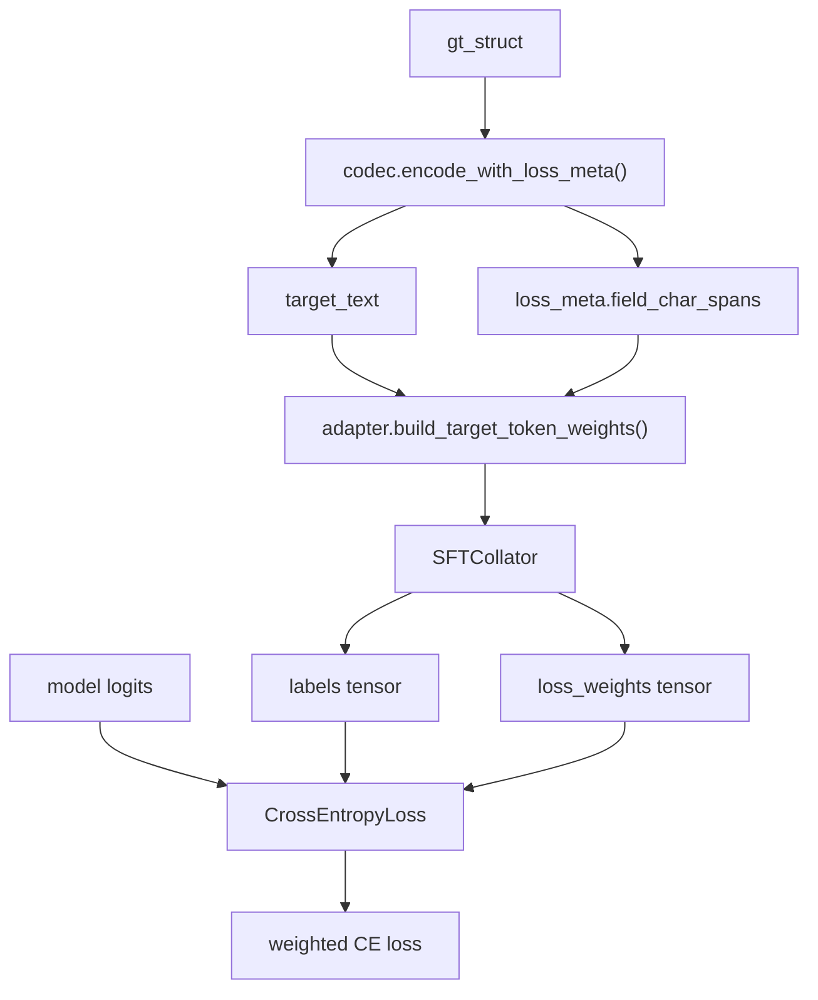

# Codec & Weighted Loss Mechanism

## Overview

The codec is the core component of the domain layer, responsible for:

1. **Quantization**: Mapping pixel coordinates to integer bins in `[0, num_bins-1]` (default `[0, 999]`)
2. **Serialization**: Encoding structured data into compact JSON strings (used as model training targets)
3. **Deserialization**: Parsing model-generated text back into structured data
4. **loss_meta construction**: Tracking character spans for each semantic field in the JSON string, used for weighted token loss
5. **Validation**: Checking structural correctness of data

## Quantization

### Formula

```python
# Quantize: pixel → bin
def _quantize(value, size):
    clipped = max(0.0, min(value, size - 1))
    return round(clipped / (size - 1) * (num_bins - 1))

# Dequantize: bin → pixel
def _dequantize(value, size):
    return value / (num_bins - 1) * (size - 1)
```

### Properties

- Input pixel coordinates are clipped to `[0, size-1]`
- Output is an integer in `[0, num_bins-1]`
- Dequantization is a linear mapping with rounding error
- With `num_bins = 1000`, quantization error is < 1px for a 1000px image

## Three Codecs

| Codec | File | Task | Output Format | loss_meta Fields |
|---|---|---|---|---|
| `ArrowCodec` | `codecs/structure.py` | `joint_structure` | `[{"label":"...","bbox_2d":[...],"keypoints_2d":[[...]]}]` | None (no weighted loss) |
| `GroundingCodec` | `codecs/grounding.py` | `grounding` | `[{"label":"...","bbox_2d":[...]}]` | `label`, `bbox_2d` |
| `KeypointSequenceCodec` | `codecs/keypoint_sequence.py` | `keypoint_sequence` | `{"keypoints_2d":[[x,y],...]}` | `coordinates` |

## field_char_spans Mechanism

`field_char_spans` is the core data structure for weighted token loss. It records the **character start and end positions** of each semantic field in the JSON string.

### Example: GroundingCodec

For the following GT:

```json
[{"label":"single_arrow","bbox_2d":[100,200,300,400]}]
```

`encode_with_loss_meta()` returns:

```python
target_text = '[{"label":"single_arrow","bbox_2d":[100,200,300,400]}]'

loss_meta = {
    "field_char_spans": {
        "label": [[11, 23]],        # "single_arrow" starts at char 11, ends at 23
        "bbox_2d": [
            [34, 37],               # "100"
            [38, 41],               # "200"
            [42, 45],               # "300"
            [46, 49],               # "400"
        ],
    }
}
```

### Example: KeypointSequenceCodec

For the following GT:

```json
{"keypoints_2d":[[100,200],[300,400]]}
```

`encode_with_loss_meta()` returns:

```python
target_text = '{"keypoints_2d":[[100,200],[300,400]]}'

loss_meta = {
    "field_char_spans": {
        "coordinates": [
            [18, 21],   # "100"
            [22, 25],   # "200"
            [27, 30],   # "300"
            [31, 34],   # "400"
        ],
    }
}
```

## Weighted Token Loss Flow



### Step-by-Step

1. **Codec serialization**: `encode_with_loss_meta()` builds the JSON string while recording character spans for each field
2. **Dataset phase**: the dataset rebuilds `target_text` and `loss_meta` from structured GT via the task adapter / codec, then passes them through the collator to batch meta
3. **Task adapter phase**: the task adapter maps character spans to per-target token weights:
   - For each sample, the `target_text` is tokenized
   - Based on `field_char_spans`, tokens corresponding to label/bbox/coordinates are identified
   - These tokens are assigned the configured weight (e.g., `bbox_token_loss_weight: 2.0`)
   - All other tokens get weight 1.0
4. **Collator alignment phase**: `SFTCollator` appends the training EOS token when needed and builds a `loss_weights` tensor aligned with `labels`
   - token-weight construction happens before loss computation
   - any token-count mismatch between adapter output and collator tokenization raises an error
5. **Loss computation**: `core.train.weighted_loss.compute_weighted_token_ce_loss()` only consumes `labels`, `logits`, and `loss_weights`

### Default Weights

| Task | Field | Default Weight |
|---|---|---|
| `grounding` | `label` | 1.5 |
| `grounding` | `bbox_2d` | 2.0 |
| `keypoint_sequence` | `coordinates` | 1.5 |
| `joint_structure` | N/A | N/A (uses default model loss) |

## JSON Parsing Robustness

Model-generated text may be imperfect. The codec provides multiple layers of fault tolerance:

### 1. Markdown Fence Stripping

```python
# Model might output:
# ```json
# [{"label":"single_arrow",...}]
# ```

# Codec strips the fence via JSON_FENCE_PATTERN
```

### 2. Balanced JSON Extraction

`extract_balanced_json_with_delimiters()` extracts a complete JSON structure from mixed text by tracking bracket depth and string state.

### 3. Truncated Array Recovery

`recover_truncated_json_array()` handles truncated JSON arrays:

```
# Model might output (truncated):
[{"label":"single_arrow","bbox_2d":[100,200,300,400]},{"label":"double

# Recovery extracts completed items:
[{"label":"single_arrow","bbox_2d":[100,200,300,400]}]
```

### 4. Lenient vs Strict Parsing

| Mode | Behavior |
|---|---|
| **Lenient** (`strict=False`) | Attempts multiple parsing strategies, tolerant of truncation/format errors, used for evaluation and reporting |
| **Strict** (`strict=True`) | Requires complete valid JSON, coordinates must be integers, used for final validation |

## Adding a New Codec

To add a new codec for a new task:

1. Create `domains/<domain>/codecs/<new_codec>.py`
2. Implement:
   - `__init__(self, num_bins)` -- store num_bins
   - `encode(gt_struct, image_width, image_height)` → `str`
   - `encode_with_loss_meta(gt_struct, image_width, image_height)` → `(str, loss_meta)`
   - `decode(text, image_width, image_height, strict)` → `dict`
   - `decode_with_meta(text, image_width, image_height, strict)` → `(dict, meta)`
   - `validate_struct(gt_struct, strict)` → `ValidationReport`
3. Inherit from `ArrowCodec` if the new codec shares quantization/JSON parsing logic
4. The `loss_meta` dict must contain `field_char_spans` with field names as keys and `[[start, end], ...]` as values
5. Wire the codec into the task adapter's `build_training_target()` and `compute_loss()`
