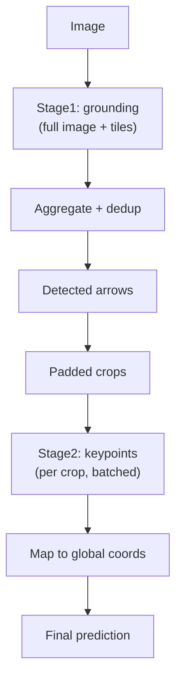

# Inference Pipeline

## One-Stage Inference


### Key Steps

1. **Load**: Build model from checkpoint, load weights, resolve adapter
2. **Generate**: `model.generate()` with configurable params (greedy by default)
3. **Parse**: Two-pass decoding:
   - **Lenient** (`strict=False`) -- strips markdown fences, recovers truncated JSON
   - **Strict** (`strict=True`) -- requires complete valid JSON with integer coordinates

### Report

```json
{
  "generation": { "generated_tokens": 256, "closed_json_payload": true, "stop_reason": "eos_or_unknown" },
  "lenient": { "ok": true, "prediction": {...} },
  "strict": { "ok": true, "prediction": {...} }
}
```

### JSON Robustness

- **Markdown fence stripping**: Removes `` ```json `` wrappers
- **Balanced JSON extraction**: Tracks bracket depth and string state to find complete JSON
- **Truncated array recovery**: Parses completed items from incomplete output

---

## Two-Stage Inference



### Stage1: Mixed Proposals

Runs grounding on the full image plus optional multi-scale tile crops. All detections are mapped to global coordinates and deduplicated by bbox IoU (default threshold 0.65).

### Stage2: Keypoint Sequence

For each detected arrow:

1. Build padded crop (expand bbox by `padding_ratio`, default 0.3)
2. Run keypoint model on the crop
3. Map keypoints back to global coordinates

### Usage

```python
# One-stage
runner = load_inference_runner(checkpoint_path="...", config_path="...")
raw_text, report = runner.predict(image)

# Two-stage
runner = load_two_stage_inference_runner(
    config_path="configs/infer/infer_two_stage.yaml",
    stage1_checkpoint_path="...",
    stage2_checkpoint_path="...",
)
result = runner.predict(image)
```

### Inference Config Loading

Inference builds runtime config from the checkpoint's `meta.json`, then applies inference config overrides. This ensures the same task/domain/model settings as training.
