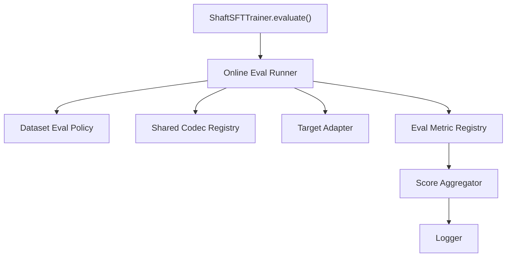
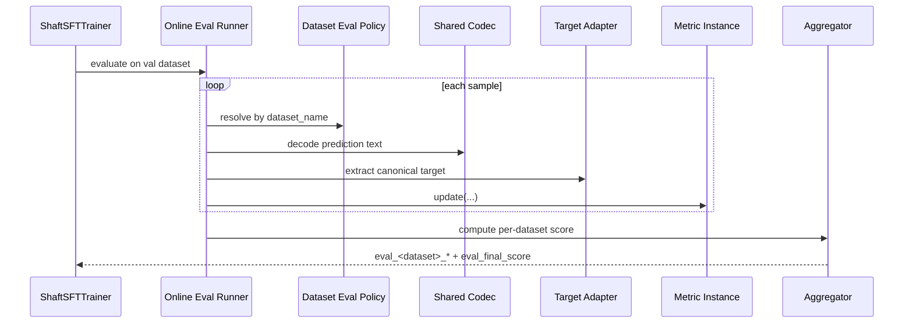
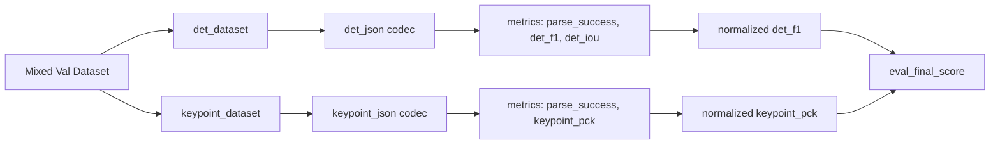

# Shaft 在线 Eval 架构设计（单阶段 / 多数据集 / 多任务）

本文档描述当前已经落地的在线 eval 架构边界与扩展约束。当前设计只覆盖：

- 单阶段在线 eval
- 多数据集
- 多任务
- 每个数据集只绑定一个任务
- 训练内轻量评估

本文档 **不描述** 多阶段任务评估、重型 benchmark 集成、或独立离线评测框架。

## 1. 设计目标

- 在 `HF Trainer` 训练主链内支持轻量在线 task metric。
- 支持多个验证数据集同时参与在线评估。
- 每个数据集可以声明不同的 codec、metrics、primary metric 和权重。
- 通过一个统一的 `final_score` 做 best model 选择。
- 复用一套共享 codec，不在 `infer` 和 `eval` 中维护两套解析逻辑。

## 2. 设计边界

### 2.1 当前纳入范围

- 单阶段生成结果评估
- 文本到结构化结果的共享 codec
- dataset 级 eval policy
- metric registry
- dataset score 归一化与最终聚合
- 训练结束后打印 per-dataset metrics 和 `final_score`

### 2.2 当前明确不做

- 多阶段 eval
- 复杂任务级编排
- `EvalScope / OpenCompass / VLMEvalKit` 集成
- 独立 `src/shaft/eval` 重型子系统
- 将复杂离线评估直接塞入 trainer 内核

## 3. 关键约束

### 3.1 单 dataset 单 task

- 一个 `dataset_name` 只能绑定一个在线 eval policy。
- 如果同一底层数据需要评两个任务，必须拆成两个 dataset entry。
- 不允许一个 dataset 在同一次在线 eval 中切换多种输出格式。
- `data.datasets[*].use_for_eval=false` 的数据集不会进入在线 eval，也不要求配置 dataset eval policy。

### 3.2 轻量在线 eval

在线 eval 只适用于：

1. 不依赖外部服务
2. 不依赖多阶段业务编排
3. 开销与普通 `Trainer.evaluate()` 同量级

否则一律降级为离线 eval。

### 3.3 共享 codec

- codec 是共享层能力，不应只存在于 `infer` 模块。
- `infer` 和在线 eval 都使用同一套 codec registry。
- codec 只负责“文本 -> 规范结构”的解析，不负责打分、不负责业务编排。

## 4. 核心分层



### 4.1 Shared Codec Registry

当前实现位于：

- `src/shaft/codec/registry.py`
- `src/shaft/codec/base.py`
- `src/shaft/codec/json.py`

职责：

- `prediction text -> canonical parsed payload`
- 保留 `raw_text`
- 尽量修复可解析 JSON
- 区分完整解析与部分解析

建议输出结构：

```python
@dataclass
class ShaftCodecResult:
    raw_text: str
    parsed: Any | None
    valid: bool
    partial: bool
    error_type: str | None
    error: str | None
```

说明：

- `valid=True` 表示成功得到可用结构
- `partial=True` 表示通过修复/截断恢复到“部分可用”结构
- `error_type` 用于日志与排障

### 4.2 Target Adapter

目标侧不强制要求必须再走文本 codec。

原因：

- 很多结构化任务的 GT 更自然地存在于样本的原生 annotation 中
- 如果先结构化保存、再序列化成文本、再走 codec 解析回来，是无意义绕路

因此 target 侧建议使用 `target_adapter`：

- 从 sample 的 `target_text`、`extra.annotation` 或其他规范字段中取 GT
- 必要时可再调用 codec

### 4.3 Eval Metric Registry

评估指标通过 registry 注册，但 metric 需要支持参数化。

示意：

```yaml
metrics:
  - name: det_f1
    params:
      iou_threshold: 0.5
  - name: parse_success
```

metric 类职责：

- `update(prediction, target, sample_meta)`
- `compute()`
- `reset()`

metric 不负责：

- 文本解析
- 数据集路由
- 最终总分聚合

### 4.4 Dataset Eval Policy

这是在线 eval 的核心配置层。

每个数据集必须声明：

- `prediction_codec`
- `target_adapter`
- `metrics`
- `primary_metric`
- `weight`
- `normalizer`

约束：

1. 一个 dataset 只能有一个 `primary_metric`
2. `primary_metric` 必须包含在 `metrics` 中
3. 每个 dataset 的 primary score 必须归一化到 `[0, 1]`

### 4.5 Score Aggregator

最终统一输出：

- per-dataset metrics
- per-dataset normalized score
- `eval_final_score`

聚合规则：

```text
dataset_score = normalize(primary_metric_value)
final_score = sum(weight_i * dataset_score_i) / sum(weight_i)
```

第一版建议只支持两种 normalizer：

- `identity`
  适用于天然在 `[0, 1]` 的指标
- `range`
  适用于误差类指标，需要显式提供 `min_value` 和 `max_value`

## 5. 运行流程



## 6. 多数据集 / 多任务 / 单阶段实例

### 6.1 例子

假设验证集中有两个数据集：

- `det_dataset`
  - 任务：结构化检测
  - codec：`det_json`
  - metrics：`parse_success`、`det_f1@0.5`、`det_iou`
  - primary metric：`det_f1@0.5`
  - weight：`0.6`

- `keypoint_dataset`
  - 任务：关键点检测
  - codec：`keypoint_json`
  - metrics：`parse_success`、`keypoint_pck@0.1`
  - primary metric：`keypoint_pck@0.1`
  - weight：`0.4`

如果还有一个只参与训练的数据集，例如：

- `aux_train_only_dataset`
  - `use_for_eval: false`
  - 会参与训练 mixing
  - 不会进入验证集
  - 不会要求配置在线 eval policy

### 6.2 关系图



## 7. parse 失败的计分规则

这个规则必须在实现前定死，否则不同实现会导致 best model 漂移。

建议默认规则：

- `parse_success` 单独统计
- task metric 以 **全样本** 为分母
- parse 失败样本的 task score 直接记 `0`

结果：

- `parse_success` 是诊断指标
- `primary_metric` 直接体现“解析 + 任务效果”的综合质量

## 8. DDP 与聚合稳定性

在线 eval 实现不能依赖 batch 顺序。

必须依赖稳定键：

- `dataset_name`
- `sample_id`

原因：

- 多卡下一个 dataset 的样本会分散到不同 rank
- local batch 顺序不是全局稳定顺序

因此，在线 eval runner 必须基于 sample meta 做稳定聚合。

## 9. 日志与进度条约束

### 9.1 进度条

eval 进度条上不显示 task metrics。

允许两种方式：

- 只显示 `eval_loss`
- 或完全不显示 task metric，只保留最简 eval 进度

### 9.2 日志

每次在线 eval 结束后，直接打印：

1. 每个 dataset 的全部指标
2. 每个 dataset 的 normalized score 与 weight
3. `eval_final_score`
4. `metric_for_best_model`
5. 是否刷新 best model

示例：

```text
[eval] dataset=det_dataset parse_success=0.98 det_f1=0.81 det_iou=0.74 normalized_score=0.81 weight=0.60
[eval] dataset=keypoint_dataset parse_success=0.99 keypoint_pck=0.76 normalized_score=0.76 weight=0.40
[eval] final_score=0.79 metric_for_best_model=eval_final_score best_model_updated=true
```

说明：

- per-dataset 指标只进入本地 logger，不进入 `report_to`。
- `report_to` 与 Trainer 回调链只接收 `eval_loss` 与 `eval_final_score`，避免 wandb 指标集合随任务集合变化而漂移。

## 10. 当前支持的配置形态

```yaml
eval:
  enabled: true
  eval_strategy: epoch
  per_device_eval_batch_size: 2
  metric_for_best_model: eval_final_score
  greater_is_better: true
  online_metrics_enabled: true
  datasets:
    det_dataset:
      prediction_codec: det_json
      target_adapter: det_annotation
      metrics:
        - name: parse_success
        - name: det_f1
          params:
            iou_threshold: 0.5
        - name: det_iou
      primary_metric: det_f1
      normalizer:
        type: identity
      weight: 0.6

    keypoint_dataset:
      prediction_codec: keypoint_json
      target_adapter: keypoint_annotation
      metrics:
        - name: parse_success
        - name: keypoint_pck
          params:
            threshold: 0.1
      primary_metric: keypoint_pck
      normalizer:
        type: identity
      weight: 0.4
```

## 11. 当前实现状态

截至当前版本：

- 共享 codec 层已经独立为 `src/shaft/codec`
- 在线 eval metric registry 已实现，当前内置 `parse_success` 与 `exact_match`
- dataset eval policy 已接入 `EvalConfig.datasets`
- `prediction_codec` / `target_adapter` / `metric` 已在配置加载阶段做注册校验
- 启用在线 eval 时，best-model 选择统一使用 `eval_final_score`
- 启用在线 eval 时，`report_to` 只上报 `eval_loss` 与 `eval_final_score`
- 若某个 dataset 本次没有样本，会 warning 并跳过，不参与 `final_score`
- 当前只支持 SFT 的单阶段在线 eval

当前仍未做的部分：

- 多阶段在线 eval
- 重型离线 benchmark 集成
- 更丰富的结构化任务 metric 内置库
