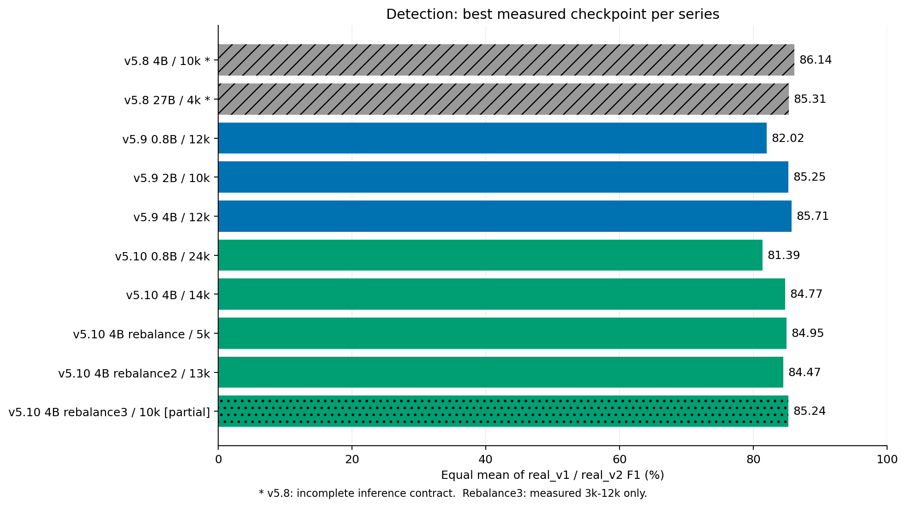

# 训练评测总览

更新：2026-09-17。覆盖 v5.8、v5.9、v5.10；关键数值独立保存在 [结果对照](RESULTS.md)，不依赖原始日志、预测或权重文件。

## 先看结论

- **Detection：v5.10 原版没有超过 v5.9。** 4B 两测试集 F1 均值从85.71降到84.77；rebalance为84.95，rebalance2为84.47，rebalance3已测部分为85.24。
- **子属性：v5.10 0.8B 18k是目前原版0.8B的最佳候选。** GT-BBox weighted E2E为78.49，超过格式修正后的v5.9 0.8B（72.85）和27B（75.66）。这不意味着detection也超过27B。
- **提高LR有效，但不是越高越好。** 首轮0.8B固定12k预算，6e-5优于3e-5、1.5e-5；high9k的detection均值83.57，优于原版0.8B的81.39。更高LR上探尚未完成。
- **最终部署不能只看GT框属性。** 原版18k适合作为子属性候选，首轮high9k适合作为detection候选；尚不能根据存在字段缺陷的旧全流程分数选统一部署权重。

横轴是两集F1等权均值。灰色斜纹为推理合同不完整的v5.8历史参考；rebalance3只覆盖已测3k–12k，不是完整训练的最终best。

## 三个版本的变化

| 版本 | 数据与训练变化 | 结果判断 |
| --- | --- | --- |
| v5.8 | V9合成shape/line，加真实grounding、line points等任务；4B配置主LR2e-5、目标12k | detection历史参考较强，但推理参数记录不完整 |
| v5.9 | grounding加入审核后的论文增量；其余主要延续V9；0.8B/2B/4B配置主LR3e-5、12k | 作为detection主要历史基线 |
| v5.10 | V10合成数据，新增883张真实完整shape属性源；原版0.8B/4B主LR3e-5、目标24k | 属性明显改善，detection没有同步改善 |
| rebalance系列 | 4B、16k、每1k保存；detection样本权重由13.33%提高到24% | 主LR依次3e-5 / 2e-5 / 6e-5，仍未超过v5.9 best |

以上历史参数为现存配置快照，不代表每次旧运行都完全相同。v5.10_runtime只是v5.10的数据与prompt绑定配置，不是另一版模型。
v5.10实际运行的shape总权重39.33%、真实shape源3.33%；权重占比不是token占比。当前v5.9 catalog总权重19与旧运行记录18不同，不能用现存文件反推所有历史配比。

## 学习率消融记录

首轮0.8B：三组主LR为1.5e-5、3e-5、6e-5，vision为各自一半，aligner与主LR一致。
固定项：原始Qwen3.5-0.8B开始full SFT；每组4卡，微批4×累积4，全局batch64；seed465；12k步；cosine、warmup1200；BF16、FA2、梯度检查点；训练0.5M–2M、max_length8000；每1k保存。正式v5.10配比，不含近期预标注增量。

三组均完成。high在7k–12k的每个已评checkpoint上，两集detection均优于baseline；末1k loss为0.2030，对比baseline0.2195、low0.2458。裁剪前norm分别2.8896、3.5270、4.1467，不能把大于1误解为裁剪失效。
决策：以6e-5为有效起点，进一步测试6e-5/1e-4/1.5e-4/2e-4；不在中途改LR破坏对照。上探截至9月17日16:08每组只归档1k–5k detection及3k E2E，尚无最终结论。

## 对下一轮训练有用的经验

1. 新增真实shape的改善主要集中在填充和边框；但合成数据、配比、曝光量也变了，没有消融证明883张数据是唯一原因。该源包含14172个完整实例，增强后17006个视图，三种formulation不等于三倍独立标注。
2. 真实line points只教几何，不等于完整外观监督；可借鉴真实shape监督，但不能照搬采样权重。
3. 后期未必更好：原版0.8B属性18k优于24k，4B的10k/14k优于20k。差异本身不足以证明过拟合，缺少独立验证loss与重复seed。
4. Rebalance 4B14k属性失败110个对象，原版0.8B18k为40个；其中4B有67个pointy/line_style合同冲突。解析拒绝整对象会拖累所有字段，不能简单归因为模型大小。
5. 现有日志没有逐任务loss，不能凭总loss画出detection loss；卡片合成数据量大也不等于形状分布广。

## 阅读分数时必须知道

- Detection best按**同一个checkpoint**的两集F1等权均值选；GT-BBox weighted E2E按所有适用GT属性支持数加权，二者不是同一种分数。
- 默认评测：BF16、0.5M–4M、temperature0、max_tokens8000、thinking关闭、v5.8 prompt；子属性crop padding0.65、最小256。IoU≥0.5、类别匹配、ignore-aware；有效图170/240，失败不从分母删除。
- v5.9旧GT框结果仅有平铺line字段，9月17日无损恢复嵌套结构后重算，四模型提升约6.3–6.6点；未填GT、未改框，六个v5.10分数不变。结果表使用修正值，HF旧榜未必已更新。
- 首轮LR的预测框E2E被后处理丢失line.fill/border影响，旧值不用于正式排名。不能拿high9k旧62.53与原版GT框78.49直接比较。
- 新增883张shape未发现与测试集重合，但历史background有200个real_v2同ID、199个字节相同文件。不能宣称整版训练无泄漏；反复挑LR/权重也属于验证集调参。

此目录只维护两份文档：总览快速阅读，结果文档结合曲线、关键表格与可展开的全部checkpoint记录。图和精简数值快照保存在同目录figures中，删除原始产物不会破坏图表。每次形成新结果或纠错时更新；日期表示已核验快照，不是实时监控。
