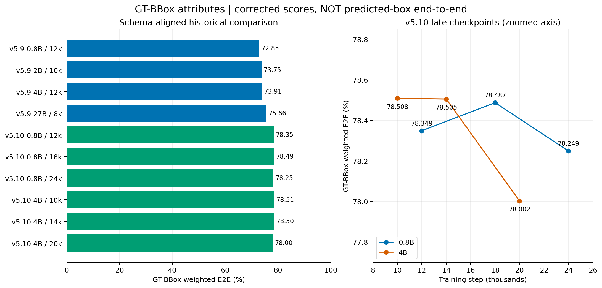
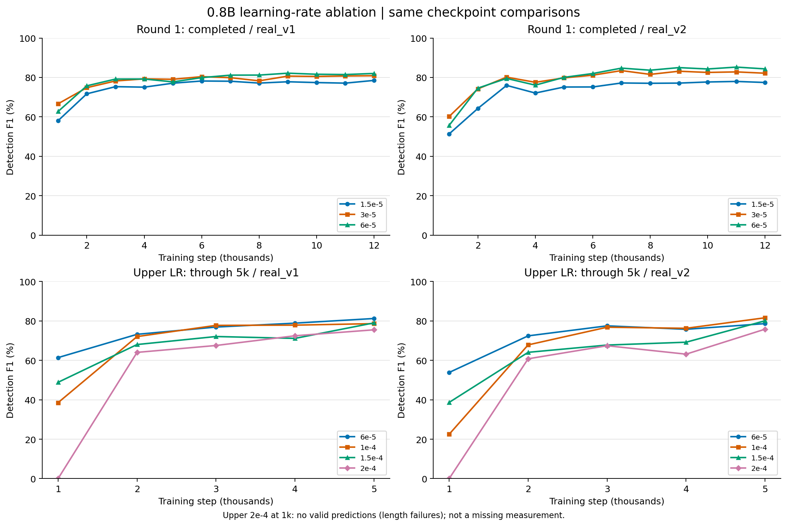
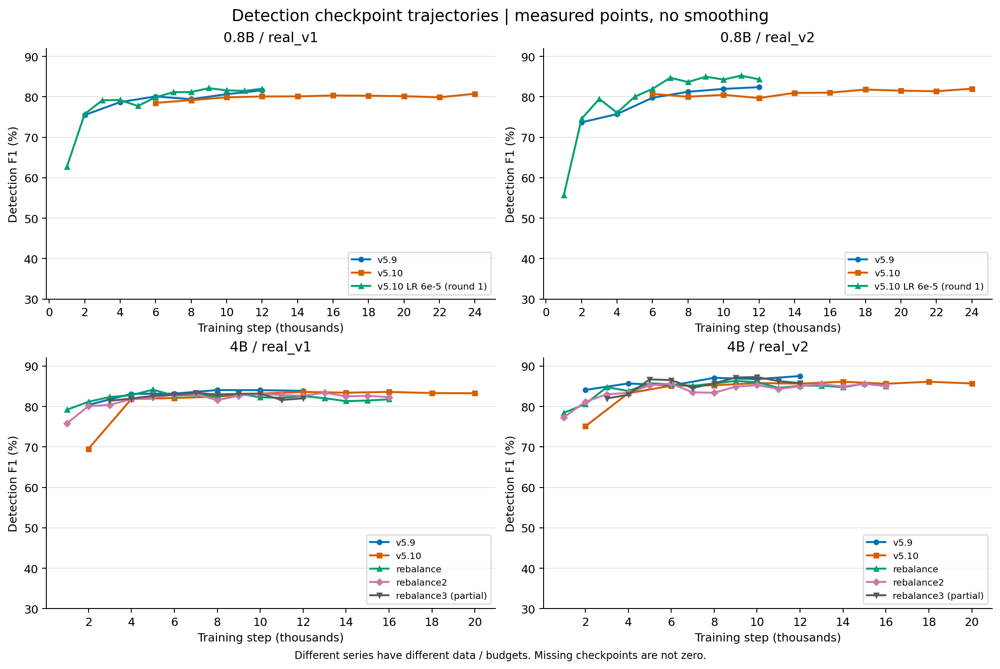

# 关键结果对照

截至2026-09-17 16:08（UTC+8）。均为百分制；差值单位为百分点。先看图与核心结论，完整checkpoint数据放在末尾可展开明细中。图表与数值均在本目录独立保存，不依赖临时评测产物。

## Detection：各版本已测最佳

best＝同checkpoint的real_v1、real_v2 strict F1等权均值，不是HF weighted E2E。历史预测经统一ignore-aware评分；请求一致也不代表所有历史软件环境一致。

| 版本 / 尺寸 | step | real_v1 F1 | real_v2 F1 | 均值 |
| --- | --- | --- | --- | --- |
| v5.8 4B* | 10000 | 85.20 | 87.08 | 86.14 |
| v5.8 27B* | 4000 | 84.03 | 86.58 | 85.31 |
| v5.9 0.8B | 12000 | 81.62 | 82.41 | 82.02 |
| v5.9 2B | 10000 | 82.71 | 87.80 | 85.25 |
| v5.9 4B | 12000 | 83.88 | 87.54 | 85.71 |
| v5.10 0.8B | 24000 | 80.76 | 82.02 | 81.39 |
| v5.10 4B | 14000 | 83.42 | 86.13 | 84.77 |
| v5.10 4B rebalance | 5000 | 84.17 | 85.74 | 84.95 |
| v5.10 4B rebalance2 | 13000 | 83.39 | 85.54 | 84.47 |
| v5.10 4B rebalance3† | 10000 | 83.19 | 87.28 | 85.24 |

* v5.8推理合同记录不完整，只作历史参考。† rebalance3只核验3k–12k，不能称完整16k的best。
原版4B评测覆盖2k–20k；rebalance/rebalance2覆盖1k–16k。未核验到同口径v5.9 27B detection、v5.10 27B结果，缺项不填0。

## GT-BBox子属性：格式统一后的正式对照

左图从零起展示十个模型；右图放大v5.10后期变化，注意纵轴范围。18k是原版0.8B已测属性最优点，后期下降幅度较小，不能仅据此判定过拟合。

GT提供框，模型预测属性；overall按全部适用字段support加权，不是两集均分。v5.9旧平铺字段已无损恢复嵌套后统一重算。

| 版本 / 尺寸 | step | real_v1 | real_v2 | overall |
| --- | --- | --- | --- | --- |
| v5.9 0.8B | 12000 | 74.5233 | 72.4134 | 72.8538 |
| v5.9 2B | 10000 | 75.9130 | 73.1808 | 73.7512 |
| v5.9 4B | 12000 | 75.6752 | 73.4434 | 73.9093 |
| v5.9 27B | 8000 | 78.0896 | 75.0230 | 75.6632 |
| v5.10 0.8B | 12000 | 80.7662 | 77.7108 | 78.3486 |
| v5.10 0.8B | 18000 | 81.2023 | 77.7704 | **78.4869** |
| v5.10 0.8B | 24000 | 80.7485 | 77.5890 | 78.2486 |
| v5.10 4B | 10000 | 79.7121 | 78.1906 | **78.5082** |
| v5.10 4B | 14000 | 79.6557 | 78.2012 | 78.5049 |
| v5.10 4B | 20000 | 79.3445 | 77.6480 | 78.0022 |

v5.10 0.8B18k比旧0.8B12k高5.6331点，比旧27B8k高2.8237点；原版4B10k只比0.8B18k高0.0213点，不作显著性结论。
v5.9旧overall 66.5356 / 67.4497 / 67.5569 / 69.0204均已被上表替代；v5.10六模型分数不变。v5.8同口径GT框结果本次未核验到。
评分器SHA256：f9012d545f64bbee540a29a5e8e5bde2e56e22a2884a9e143a08712bf7103c77。

### Shape改善的代表字段（real_v2）

| 字段 | 0.8B v5.9 12k → v5.10 18k | 4B v5.9 12k → v5.10 14k |
| --- | --- | --- |
| fill.color | 54.27 → 80.97 | 55.76 → 83.41 |
| fill.type | 66.97 → 82.79 | 64.96 → 82.85 |
| border.style | 71.07 → 90.54 | 78.15 → 92.81 |
| shape_type | 85.94 → 89.65 | 86.51 → 90.75 |
| corners.geometry | 95.11 → 97.27 | 94.56 → 97.13 |

这些是字段分数，不是整体指标，也不能全部归因于新增真实数据。

## 0.8B学习率消融：首轮已完成

上排首轮已完成，下排上探尚未完成；都画实测点、不平滑。上探2e-4在1k为全部无效输出的评分零值，不是未测值；两轮相同LR也不拼接为同一条训练曲线。

同数据、同12k预算、seed465、每组4卡、batch64；主LR见表，vision为一半。

| 主LR | 12k v1 F1 | 12k v2 F1 | 本组best step | best两集均值 |
| --- | --- | --- | --- | --- |
| 1.5e-5 | 78.50 | 77.44 | 12000 | 77.97 |
| 3e-5 | 80.87 | 82.14 | 9000 | 81.91 |
| 6e-5 | 82.02 | 84.34 | 9000 | **83.57** |

high9k的两集F1为82.1545/84.9861。其real_v2单集最高在11k，为85.2469，不能拼成一个虚构checkpoint。
首轮预测框E2E旧9k/12k：low55.0804/56.2795、baseline60.8139/59.6921、high62.5343/61.5512。**这些受嵌套字段丢失影响，不是正式横向排名。**

## 上探与像素预算：阶段结论

上探四组已评1k–5k，下面仅记录同步5k detection，不选最终best：

| 主LR | 5k v1 F1 | 5k v2 F1 | 均值 |
| --- | --- | --- | --- |
| 6e-5 | 81.22 | 78.62 | 79.92 |
| 1e-4 | 78.62 | 81.58 | 80.10 |
| 1.5e-4 | 78.99 | 80.05 | 79.52 |
| 2e-4 | 75.48 | 75.80 | 75.64 |

该轮3k预测框E2E（保留嵌套字段）依次59.2687、58.2857、50.9429、51.4158；与GT框不同，也不能直接和首轮旧格式E2E比较。2e-4的1k全部输出失败，已检查v1为长度截断，不能把零分解释为正常有效输出的定位能力。

Rebalance推理上限2M相对4M：12k在v1/v2为-1.1237/+0.4931点，16k为-1.2223/+0.4517点。没有一致改善；不能据单集涨分替换默认4M。

## 各Checkpoint趋势

上排0.8B，下排4B；左右为real_v1/real_v2，均采用同样的30–92纵轴范围。曲线连接实测点，不表示中间未评checkpoint已经测过。不同版本数据与训练长度不同，横向趋势不是单变量消融。

## 完整数值明细

共279份数据集级detection记录，17个系列。以下表格数值为百分制，v1/v2单元格顺序是 Precision / Recall / F1；未评不填0。星号表示至少一集请求合同证据不完整，历史结果仍需参考正文限制。

v5.10 0.8B：10 个checkpoint

| step | v1 P / R / F1 | v2 P / R / F1 | F1均值 |
| --- | --- | --- | --- |
| 6000 | 78.7173 / 78.3174 / 78.5169 | 79.7801 / 81.7249 / 80.7408 | 79.6288 |
| 8000 | 82.4519 / 76.1805 / 79.1922 | 80.9387 / 79.1471 / 80.0329 | 79.6125 |
| 10000 | 83.9394 / 76.2253 / 79.8966 | 82.6554 / 78.4633 / 80.5048 | 80.2007 |
| 12000 | 82.3548 / 77.9737 / 80.1044 | 80.8541 / 78.6203 / 79.7216 | 79.9130 |
| 14000 | 83.6585 / 76.8828 / 80.1277 | 81.9743 / 79.9989 / 80.9745 | 80.5511 |
| 16000 | 84.1348 / 76.8679 / 80.3373 | 82.1653 / 79.9597 / 81.0475 | 80.6924 |
| 18000 | 84.1553 / 76.7484 / 80.2814 | 83.2386 / 80.4304 / 81.8104 | 81.0459 |
| 20000 | 83.6718 / 76.9576 / 80.1744 | 83.2263 / 79.9148 / 81.5370 | 80.8557 |
| 22000 | 83.4771 / 76.6288 / 79.9065 | 83.0427 / 79.8083 / 81.3934 | 80.6500 |
| 24000 | 84.1926 / 77.6001 / 80.7621 | 83.4823 / 80.6097 / 82.0209 | 81.3915 |

v5.10 4B：10 个checkpoint

| step | v1 P / R / F1 | v2 P / R / F1 | F1均值 |
| --- | --- | --- | --- |
| 2000 | 71.4443 / 67.7077 / 69.5259 | 76.2940 / 73.9296 / 75.0932 | 72.3096 |
| 4000 | 86.0818 / 78.0036 / 81.8438 | 84.0662 / 82.4927 / 83.2720 | 82.5579 |
| 6000 | 88.0712 / 76.8978 / 82.1061 | 84.6188 / 85.6478 / 85.1302 | 83.6181 |
| 8000 | 85.4758 / 79.5876 / 82.4267 | 83.2177 / 87.3683 / 85.2425 | 83.8346 |
| 10000 | 86.3366 / 80.2600 / 83.1875 | 84.3513 / 87.3011 / 85.8008 | 84.4942 |
| 12000 | 86.6720 / 80.7531 / 83.6080 | 84.6685 / 86.6566 / 85.6510 | 84.6295 |
| 14000 | 86.0639 / 80.9325 / 83.4193 | 84.1433 / 88.2033 / 86.1255 | 84.7724 |
| 16000 | 86.3651 / 81.0221 / 83.6083 | 83.5117 / 87.8783 / 85.6394 | 84.6239 |
| 18000 | 85.7527 / 81.0371 / 83.3282 | 84.1880 / 88.1417 / 86.1195 | 84.7238 |
| 20000 | 85.4425 / 81.2164 / 83.2759 | 83.8354 / 87.6597 / 85.7049 | 84.4904 |

v5.8 4B：2 个checkpoint

| step | v1 P / R / F1 | v2 P / R / F1 | F1均值 |
| --- | --- | --- | --- |
| 10000 * | 88.3486 / 82.2624 / 85.1969 | 85.2632 / 88.9711 / 87.0777 | 86.1373 |
| 12000 * | 未评 | 84.2338 / 88.5956 / 86.3597 | 未评 |

v5.8 27B：2 个checkpoint

| step | v1 P / R / F1 | v2 P / R / F1 | F1均值 |
| --- | --- | --- | --- |
| 4000 * | 87.0694 / 81.2014 / 84.0331 | 84.2390 / 89.0495 / 86.5775 | 85.3053 |
| 8000 * | 86.3125 / 79.1542 / 82.5785 | 84.6952 / 89.2233 / 86.9003 | 84.7394 |

v5.9 4B：6 个checkpoint

| step | v1 P / R / F1 | v2 P / R / F1 | F1均值 |
| --- | --- | --- | --- |
| 2000 | 84.1006 / 76.9874 / 80.3870 | 83.5899 / 84.6111 / 84.0974 | 82.2422 |
| 4000 | 86.4098 / 80.0956 / 83.1330 | 85.9875 / 85.4237 / 85.7046 | 84.4188 |
| 6000 | 85.5159 / 80.9922 / 83.1926 | 84.7592 / 85.6142 / 85.1846 | 84.1886 |
| 8000 | 86.5233 / 81.7394 / 84.0633 | 85.8387 / 88.3883 / 87.0948 | 85.5790 |
| 10000 | 86.5305 / 81.6946 / 84.0430 | 85.2730 / 88.3266 / 86.7729 | 85.4079 |
| 12000 | 86.7497 / 81.2014 / 83.8839 | 85.5150 / 89.6604 / 87.5386 | 85.7112 |

v5.9 2B：6 个checkpoint

| step | v1 P / R / F1 | v2 P / R / F1 | F1均值 |
| --- | --- | --- | --- |
| 2000 | 80.1725 / 76.3748 / 78.2276 | 82.9010 / 77.5443 / 80.1332 | 79.1804 |
| 4000 | 84.7785 / 80.0658 / 82.3547 | 84.1363 / 85.2443 / 84.6867 | 83.5207 |
| 6000 | 84.5244 / 79.0048 / 81.6714 | 85.4699 / 85.1154 / 85.2923 | 83.4819 |
| 8000 | 84.1866 / 80.1106 / 82.0980 | 85.7003 / 88.2313 / 86.9474 | 84.5227 |
| 10000 | 85.7647 / 79.8565 / 82.7053 | 86.0169 / 89.6660 / 87.8035 | 85.2544 |
| 12000 | 85.6753 / 79.7221 / 82.5915 | 85.5460 / 89.5539 / 87.5041 | 85.0478 |

v5.9 0.8B：6 个checkpoint

| step | v1 P / R / F1 | v2 P / R / F1 | F1均值 |
| --- | --- | --- | --- |
| 2000 | 81.4207 / 70.3975 / 75.5089 | 79.1434 / 68.9644 / 73.7041 | 74.6065 |
| 4000 | 81.5777 / 76.0311 / 78.7068 | 78.4244 / 73.2515 / 75.7498 | 77.2283 |
| 6000 | 86.7422 / 74.4023 / 80.0997 | 85.2312 / 75.0000 / 79.7889 | 79.9443 |
| 8000 | 83.7838 / 75.5081 / 79.4310 | 83.4860 / 79.1583 / 81.2646 | 80.3478 |
| 10000 | 83.2406 / 78.2277 / 80.6563 | 84.2473 / 79.8139 / 81.9707 | 81.3135 |
| 12000 | 84.9047 / 78.5864 / 81.6235 | 84.8285 / 80.1222 / 82.4082 | 82.0159 |

v5.10 4B rebalance：16 个checkpoint

| step | v1 P / R / F1 | v2 P / R / F1 | F1均值 |
| --- | --- | --- | --- |
| 1000 | 84.2203 / 74.7310 / 79.1924 | 80.6559 / 76.3618 / 78.4501 | 78.8212 |
| 2000 | 84.1160 / 78.4220 / 81.1693 | 81.4209 / 79.7691 / 80.5865 | 80.8779 |
| 3000 | 85.5899 / 79.3485 / 82.3511 | 83.5583 / 86.0401 / 84.7810 | 83.5660 |
| 4000 | 84.4230 / 81.2313 / 82.7964 | 84.4096 / 83.2885 / 83.8453 | 83.3209 |
| 5000 | 86.9268 / 81.5750 / 84.1659 | 83.8955 / 87.6709 / 85.7417 | 84.9538 |
| 6000 | 87.0276 / 78.7956 / 82.7072 | 84.5471 / 86.4660 / 85.4958 | 84.1015 |
| 7000 | 85.5687 / 80.2750 / 82.8373 | 84.4237 / 85.8384 / 85.1252 | 83.9813 |
| 8000 | 86.3214 / 79.2140 / 82.6151 | 85.3679 / 86.0233 / 85.6943 | 84.1547 |
| 9000 | 86.2717 / 80.2899 / 83.1734 | 84.7241 / 88.0240 / 86.3425 | 84.7579 |
| 10000 | 84.2468 / 80.3945 / 82.2756 | 85.0389 / 86.9928 / 86.0048 | 84.1402 |
| 11000 | 84.5996 / 79.8715 / 82.1676 | 83.8701 / 85.3788 / 84.6177 | 83.3927 |
| 12000 | 85.3476 / 79.9910 / 82.5825 | 84.6751 / 85.5862 / 85.1282 | 83.8554 |
| 13000 | 84.6410 / 79.6324 / 82.0604 | 83.7258 / 86.6678 / 85.1714 | 83.6159 |
| 14000 | 84.3830 / 78.4818 / 81.3255 | 84.3095 / 85.1883 / 84.7466 | 83.0361 |
| 15000 | 84.2374 / 78.9002 / 81.4815 | 84.4099 / 86.9312 / 85.6520 | 83.5667 |
| 16000 | 84.7189 / 79.0347 / 81.7781 | 84.3938 / 85.7039 / 85.0438 | 83.4109 |

v5.10 4B rebalance2：16 个checkpoint

| step | v1 P / R / F1 | v2 P / R / F1 | F1均值 |
| --- | --- | --- | --- |
| 1000 | 83.9043 / 69.1721 / 75.8293 | 82.8910 / 72.4669 / 77.3293 | 76.5793 |
| 2000 | 83.1804 / 77.2265 / 80.0930 | 82.4847 / 79.8868 / 81.1649 | 80.6290 |
| 3000 | 85.1604 / 76.1506 / 80.4039 | 83.5053 / 82.5319 / 83.0158 | 81.7098 |
| 4000 | 83.9359 / 79.7968 / 81.8140 | 82.9699 / 83.7929 / 83.3793 | 82.5967 |
| 5000 | 87.6947 / 77.4208 / 82.2381 | 85.4976 / 84.9753 / 85.2357 | 83.7369 |
| 6000 | 86.9951 / 79.1692 / 82.8978 | 86.1899 / 85.1659 / 85.6748 | 84.2863 |
| 7000 | 86.5974 / 79.7519 / 83.0338 | 82.4787 / 84.5494 / 83.5012 | 83.2675 |
| 8000 | 86.1799 / 77.4357 / 81.5742 | 83.9290 / 82.9130 / 83.4179 | 82.4960 |
| 9000 | 86.1309 / 79.4381 / 82.6493 | 85.3309 / 84.4654 / 84.8959 | 83.7726 |
| 10000 | 86.9721 / 79.7071 / 83.1813 | 84.5362 / 86.0569 / 85.2898 | 84.2356 |
| 11000 | 86.3747 / 79.5726 / 82.8343 | 84.0898 / 84.6223 / 84.3552 | 83.5948 |
| 12000 | 86.5696 / 79.0795 / 82.6552 | 84.5949 / 85.4293 / 85.0100 | 83.8326 |
| 13000 | 86.5712 / 80.4393 / 83.3927 | 84.5636 / 86.5445 / 85.5426 | 84.4677 |
| 14000 | 86.2732 / 79.0795 / 82.5199 | 84.5206 / 85.3732 / 84.9448 | 83.7323 |
| 15000 | 86.2293 / 79.3485 / 82.6459 | 84.6943 / 86.5501 / 85.6121 | 84.1290 |
| 16000 | 85.3659 / 79.4979 / 82.3275 | 83.9324 / 86.2419 / 85.0715 | 83.6995 |

v5.10 4B rebalance3：10 个checkpoint

| step | v1 P / R / F1 | v2 P / R / F1 | F1均值 |
| --- | --- | --- | --- |
| 3000 | 85.3399 / 77.8542 / 81.4253 | 81.2064 / 82.7673 / 81.9794 | 81.7023 |
| 4000 | 83.2999 / 80.6485 / 81.9528 | 82.9668 / 82.8738 / 82.9203 | 82.4366 |
| 5000 | 84.1095 / 81.2313 / 82.6454 | 85.5189 / 87.9343 / 86.7098 | 84.6776 |
| 6000 | 86.1514 / 79.9462 / 82.9329 | 84.9104 / 88.2033 / 86.5256 | 84.7293 |
| 7000 | 86.8004 / 80.1853 / 83.3618 | 84.2884 / 84.9025 / 84.5943 | 83.9781 |
| 8000 | 84.9671 / 81.0819 / 82.9790 | 84.4506 / 87.0489 / 85.7301 | 84.3546 |
| 9000 | 85.0445 / 81.3210 / 83.1411 | 85.7794 / 88.6348 / 87.1837 | 85.1624 |
| 10000 | 85.2218 / 81.2612 / 83.1944 | 85.5827 / 89.0551 / 87.2844 | 85.2394 |
| 11000 | 83.3593 / 79.9462 / 81.6171 | 84.6183 / 88.0184 / 86.2849 | 83.9510 |
| 12000 | 84.9752 / 79.2738 / 82.0255 | 84.8766 / 86.7126 / 85.7848 | 83.9052 |

v5.10 0.8B LR首轮 high：12 个checkpoint

| step | v1 P / R / F1 | v2 P / R / F1 | F1均值 |
| --- | --- | --- | --- |
| 1000 | 81.1093 / 51.1357 / 62.7257 | 76.7724 / 43.6954 / 55.6929 | 59.2093 |
| 2000 | 82.4108 / 70.0837 / 75.7490 | 81.5251 / 68.7234 / 74.5788 | 75.1639 |
| 3000 | 84.1548 / 74.7609 / 79.1802 | 80.6787 / 78.3457 / 79.4951 | 79.3376 |
| 4000 | 84.1371 / 74.8207 / 79.2059 | 81.6012 / 71.2845 / 76.0948 | 77.6504 |
| 5000 | 81.4979 / 74.3126 / 77.7396 | 81.6012 / 78.5418 / 80.0423 | 78.8909 |
| 6000 | 83.6548 / 76.4794 / 79.9063 | 83.0164 / 80.9740 / 81.9825 | 80.9444 |
| 7000 | 85.6716 / 77.1070 / 81.1640 | 85.2924 / 84.1740 / 84.7295 | 82.9468 |
| 8000 | 84.4305 / 78.1978 / 81.1947 | 84.0976 / 83.2493 / 83.6713 | 82.4330 |
| 9000 | 85.2006 / 79.3186 / 82.1545 | 84.9409 / 85.0314 / 84.9861 | 83.5703 |
| 10000 | 84.0082 / 79.3634 / 81.6198 | 84.4298 / 84.1459 / 84.2876 | 82.9537 |
| 11000 | 84.0942 / 79.0048 / 81.4701 | 85.2159 / 85.2780 / 85.2469 | 83.3585 |
| 12000 | 84.8785 / 79.3485 / 82.0204 | 85.8694 / 82.8570 / 84.3363 | 83.1783 |

v5.10 0.8B LR首轮 baseline：12 个checkpoint

| step | v1 P / R / F1 | v2 P / R / F1 | F1均值 |
| --- | --- | --- | --- |
| 1000 | 78.7329 / 57.7555 / 66.6322 | 76.6869 / 49.5517 / 60.2029 | 63.4175 |
| 2000 | 85.3178 / 66.6019 / 74.8070 | 82.5249 / 67.4064 / 74.2034 | 74.5052 |
| 3000 | 84.2151 / 73.0275 / 78.2233 | 83.3092 / 77.2304 / 80.1547 | 79.1890 |
| 4000 | 84.9360 / 74.3126 / 79.2699 | 80.1256 / 75.1009 / 77.5319 | 78.4009 |
| 5000 | 84.8433 / 74.0287 / 79.0679 | 81.5489 / 78.0711 / 79.7721 | 79.4200 |
| 6000 | 84.6472 / 76.5392 / 80.3892 | 81.8804 / 80.4304 / 81.1489 | 80.7691 |
| 7000 | 85.0988 / 75.2690 / 79.8826 | 84.4724 / 82.4983 / 83.4737 | 81.6782 |
| 8000 | 82.6087 / 74.3873 / 78.2827 | 82.1552 / 80.9628 / 81.5547 | 79.9187 |
| 9000 | 84.6129 / 77.0771 / 80.6694 | 83.2537 / 83.0531 / 83.1533 | 81.9113 |
| 10000 | 84.9138 / 76.5392 / 80.5093 | 83.2877 / 81.8034 / 82.5389 | 81.5241 |
| 11000 | 85.4000 / 76.5690 / 80.7438 | 83.1713 / 82.4535 / 82.8108 | 81.7773 |
| 12000 | 84.4141 / 77.6151 / 80.8719 | 83.2892 / 81.0300 / 82.1441 | 81.5080 |

v5.10 0.8B LR首轮 low：12 个checkpoint

| step | v1 P / R / F1 | v2 P / R / F1 | F1均值 |
| --- | --- | --- | --- |
| 1000 | 67.7696 / 50.8069 / 58.0750 | 68.5471 / 41.0614 / 51.3581 | 54.7165 |
| 2000 | 77.9200 / 66.3927 / 71.6960 | 75.4912 / 55.9796 / 64.2876 | 67.9918 |
| 3000 | 78.8433 / 72.1160 / 75.3297 | 79.2906 / 72.9097 / 75.9664 | 75.6480 |
| 4000 | 82.0227 / 69.2020 / 75.0689 | 78.4720 / 66.6555 / 72.0827 | 73.5758 |
| 5000 | 81.5333 / 73.1022 / 77.0879 | 79.7534 / 71.0379 / 75.1438 | 76.1159 |
| 6000 | 82.4280 / 74.3724 / 78.1932 | 79.1290 / 71.5815 / 75.1662 | 76.6797 |
| 7000 | 81.6610 / 74.7908 / 78.0750 | 80.1206 / 74.4676 / 77.1907 | 77.6328 |
| 8000 | 82.3330 / 72.5643 / 77.1406 | 79.8652 / 74.4004 / 77.0360 | 77.0883 |
| 9000 | 81.8887 / 74.1184 / 77.8100 | 79.9015 / 74.5461 / 77.1309 | 77.4704 |
| 10000 | 82.2323 / 73.1022 / 77.3989 | 79.0704 / 76.3674 / 77.6954 | 77.5472 |
| 11000 | 80.3499 / 74.1184 / 77.1084 | 79.6725 / 76.3506 / 77.9762 | 77.5423 |
| 12000 | 82.6259 / 74.7609 / 78.4969 | 78.5842 / 76.3338 / 77.4426 | 77.9697 |

v5.10 0.8B LR上探 lr1e-4：5 个checkpoint

| step | v1 P / R / F1 | v2 P / R / F1 | F1均值 |
| --- | --- | --- | --- |
| 1000 | 64.8744 / 27.4059 / 38.5335 | 59.6910 / 13.8590 / 22.4951 | 30.5143 |
| 2000 | 80.4608 / 65.2271 / 72.0475 | 76.3752 / 61.0009 / 67.8278 | 69.9377 |
| 3000 | 82.8402 / 73.2218 / 77.7346 | 80.7115 / 73.2347 / 76.7915 | 77.2630 |
| 4000 | 84.4072 / 72.2355 / 77.8485 | 80.2303 / 72.6407 / 76.2471 | 77.0478 |
| 5000 | 83.6621 / 74.1482 / 78.6184 | 83.7216 / 79.5505 / 81.5828 | 80.1006 |

v5.10 0.8B LR上探 lr6e-5：5 个checkpoint

| step | v1 P / R / F1 | v2 P / R / F1 | F1均值 |
| --- | --- | --- | --- |
| 1000 | 73.8701 / 52.5105 / 61.3853 | 70.2398 / 43.6617 / 53.8499 | 57.6176 |
| 2000 | 84.6546 / 64.4650 / 73.1931 | 82.0375 / 64.8061 / 72.4108 | 72.8020 |
| 3000 | 83.3188 / 71.3539 / 76.8735 | 81.5117 / 73.8512 / 77.4926 | 77.1830 |
| 4000 | 82.4662 / 75.5529 / 78.8583 | 78.5422 / 73.1282 / 75.7386 | 77.2985 |
| 5000 | 83.6874 / 78.8852 / 81.2154 | 80.7731 / 76.5860 / 78.6238 | 79.9196 |

v5.10 0.8B LR上探 lr1.5e-4：5 个checkpoint

| step | v1 P / R / F1 | v2 P / R / F1 | F1均值 |
| --- | --- | --- | --- |
| 1000 | 63.8755 / 39.5547 / 48.8557 | 60.3352 / 28.4465 / 38.6640 | 43.7599 |
| 2000 | 78.9879 / 59.7131 / 68.0112 | 74.3867 / 56.2486 / 64.0585 | 66.0349 |
| 3000 | 77.3967 / 67.4387 / 72.0754 | 70.8216 / 64.9238 / 67.7446 | 69.9100 |
| 4000 | 80.6556 / 63.6133 / 71.1278 | 79.2278 / 61.4100 / 69.1902 | 70.1590 |
| 5000 | 82.8548 / 75.4632 / 78.9865 | 80.5999 / 79.5113 / 80.0519 | 79.5192 |

v5.10 0.8B LR上探 lr2e-4：5 个checkpoint

| step | v1 P / R / F1 | v2 P / R / F1 | F1均值 |
| --- | --- | --- | --- |
| 1000 * | 0.0000 / 0.0000 / 0.0000 | 0.0000 / 0.0000 / 0.0000 | 0.0000 |
| 2000 | 80.9176 / 52.9737 / 64.0296 | 74.7119 / 51.2273 / 60.7799 | 62.4047 |
| 3000 | 69.1404 / 65.9892 / 67.5281 | 69.5865 / 65.3553 / 67.4046 | 67.4664 |
| 4000 | 80.4856 / 65.8846 / 72.4569 | 77.3067 / 53.3401 / 63.1251 | 67.7910 |
| 5000 | 79.8765 / 71.5332 / 75.4750 | 78.4716 / 73.3132 / 75.8047 | 75.6398 |

### 预测框E2E记录：分开解释两轮

不是GT框属性表。首轮旧schema有缺陷，只保留事故追踪值，不作正式排名。

首轮：字段缺失，旧值不作正式横向排名

| 组 | step | v1 | v2 | overall |
| --- | --- | --- | --- | --- |
| baseline | 3000 | 62.2253 | 54.6636 | 56.2422 |
| baseline | 6000 | 66.3619 | 57.7215 | 59.5253 |
| baseline | 9000 | 66.8325 | 59.2259 | 60.8139 |
| baseline | 12000 | 67.3648 | 57.6677 | 59.6921 |
| high | 3000 | 64.0442 | 55.2592 | 57.0932 |
| high | 6000 | 65.3546 | 58.1788 | 59.6768 |
| high | 9000 | 68.4378 | 60.9767 | 62.5343 |
| high | 12000 | 68.8043 | 59.6375 | 61.5512 |
| low | 3000 | 61.4287 | 50.8430 | 53.0529 |
| low | 6000 | 63.6339 | 50.7119 | 53.4096 |
| low | 9000 | 62.9535 | 53.0030 | 55.0804 |
| low | 12000 | 63.5051 | 54.3731 | 56.2795 |

上探：保留嵌套字段，阶段快照

| 组 | step | v1 | v2 | overall |
| --- | --- | --- | --- | --- |
| lr1.5e-4 | 3000 | 55.0050 | 49.8712 | 50.9429 |
| lr1e-4 | 3000 | 63.0297 | 57.0340 | 58.2857 |
| lr2e-4 | 3000 | 56.2838 | 50.1314 | 51.4158 |
| lr6e-5 | 3000 | 61.8388 | 58.5906 | 59.2687 |

Rebalance 2M / 4M 推理预算全部已测对照

| step | 数据集 | 2M F1 | 4M F1 | 差值（百分点） |
| --- | --- | --- | --- | --- |
| 5000 | real_v1 | 82.4890 | 84.1659 | -1.6769 |
| 5000 | real_v2 | 85.1263 | 85.7417 | -0.6154 |
| 9000 | real_v1 | 82.0454 | 83.1734 | -1.1280 |
| 9000 | real_v2 | 85.5902 | 86.3425 | -0.7523 |
| 12000 | real_v1 | 81.4588 | 82.5825 | -1.1237 |
| 12000 | real_v2 | 85.6213 | 85.1282 | 0.4931 |
| 14000 | real_v1 | 81.3941 | 81.3255 | 0.0686 |
| 14000 | real_v2 | 85.8572 | 84.7466 | 1.1106 |
| 16000 | real_v1 | 80.5558 | 81.7781 | -1.2223 |
| 16000 | real_v2 | 85.4955 | 85.0438 | 0.4517 |

