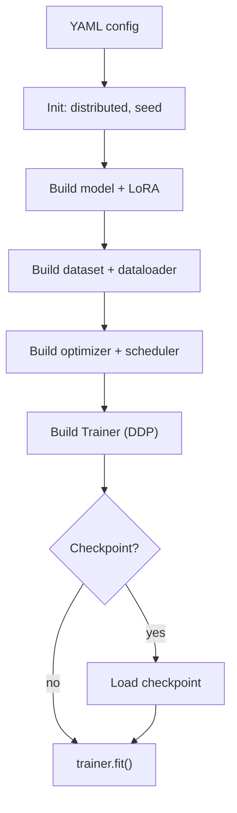
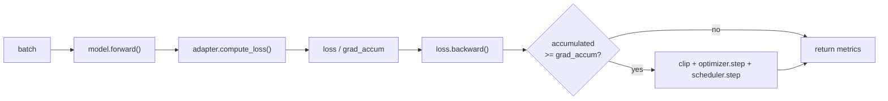
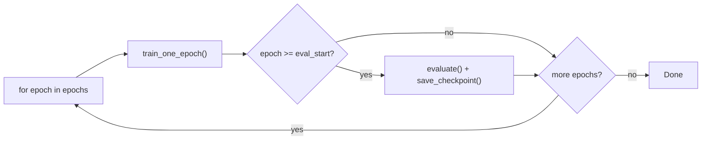

# Training Pipeline

## End-to-End Flow



## Training Step



## Epoch Loop



## Batch Route Validation

`_resolve_batch_adapter()` enforces single-task-per-batch:

1. Extract `task_type` and `domain_type` from batch meta
2. Verify all samples share the same values -- mixed batches raise `ValueError`
3. Look up `task.route_options` from config
4. Call `get_adapter()` to resolve the adapter for loss computation

## DDP Setup

- Model wrapped in `DistributedDataParallel` when `world_size > 1`
- Gradient accumulation works naturally with DDP
- Metrics reduced across ranks via `reduce_numeric_dict()`

## Optimizer Parameter Groups

| Group | LR | Weight Decay | When used |
|---|---|---|---|
| `embed_tokens` | `embed_learning_rate` | Yes | Full-ft or explicit embedding tuning only |
| `lora_params` | `lora_learning_rate` | **No** | LoRA-only / adapter params |
| `other` | `learning_rate` | Yes | Any remaining trainable non-LoRA params |

Default LoRA LR: `learning_rate=5e-5`, `lora_learning_rate=1e-4`.
In the current LoRA-only configs, embedding is frozen, and LoRA is applied only to the main language / vision / projector linear modules.

## Checkpoint Format

Two layouts are supported:

- LoRA mode:

  ```
  checkpoints/
  ├── last/           # Alias → latest
  ├── best/           # Alias → best metric
  ├── step_200/
  │   ├── adapter_config.json
  │   ├── adapter_model.safetensors
  │   ├── tokenizer_config.json
  │   ├── processor_config.json
  │   ├── optimizer.pt
  │   ├── scheduler.pt
  │   ├── rng_state.pt
  │   ├── trainer_state.json
  │   └── meta.json
  ```

### init_from vs resume_from

| Flag | Behavior |
|---|---|
| `init_from` | Loads adapter weights into the configured base model, then keeps adapter trainable. Fresh optimizer/scheduler/RNG. |
| `resume_from` | Full state: adapter, optimizer, scheduler, RNG. Continues training. |

When saving LoRA checkpoints, the adapter weights are written with the standard PEFT `save_pretrained()` layout. The base model is loaded from the configured model source at init time, so the checkpoint stays adapter-only and remains easy to swap at deployment time.

## Evaluation

Runs at epoch end (or every N steps). Flow: `model.generate()` → decode → score → reduce metrics → summarize. See `docs/inference_pipeline.md` for generation details.

## Key Configuration Parameters

| Parameter | Default | Description |
|---|---|---|
| `train.epochs` | 3 | Number of epochs |
| `train.per_device_batch_size` | 1 | Batch size per GPU |
| `train.grad_accum_steps` | 8 | Gradient accumulation |
| `train.learning_rate` | 1e-4 | Base LR |
| `train.warmup_ratio` | 0.03 | Warmup fraction |
| `train.scheduler_type` | cosine | LR scheduler |
| `train.max_grad_norm` | 1.0 | Gradient clipping |
| `train.bf16` | true | Mixed precision |
| `train.eval_strategy` | epoch | When to evaluate |
| `train.keep_last_n_checkpoints` | 3 | Checkpoints to retain |
| `eval.max_new_tokens` | 8192 | Max generation tokens |
| `eval.bbox_iou_threshold` | 0.5 | Bbox matching threshold |
| `eval.monitor_metric` | val/end_to_end_score | Best checkpoint metric |
