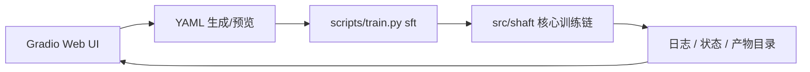
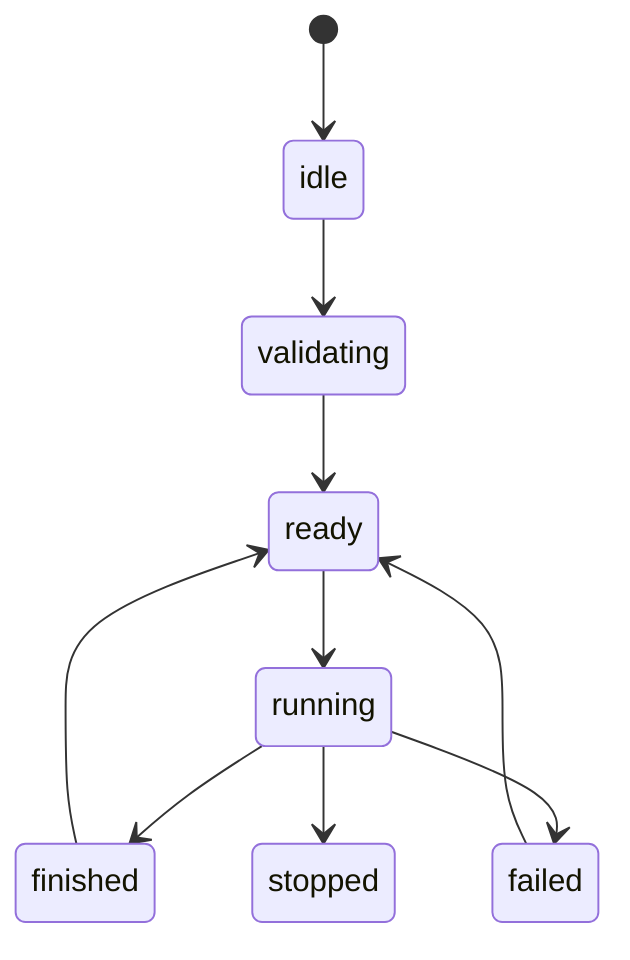

# Shaft Web UI

本文档描述 `Shaft` 的 Web UI 边界、当前实现范围与后续扩展约束。它面向工程师与科研工作者，不面向普通用户，也不作为第二套训练内核。

## 1. 定位

Shaft Web UI 是一个面向工程师与科研人员的便捷可视化控制台，用于把现有 CLI 与 YAML 训练流程做成更容易上手的图形入口。

它的核心价值不是“隐藏复杂度”，而是：

- 让参数编辑更快
- 让 YAML 配置更直观
- 让训练启动、日志查看、状态监控更顺手
- 让工程师和研究人员可以在不离开仓库约定的前提下完成常见操作

## 2. 技术选择

当前实现使用 `Gradio Blocks`。

原因很直接：

- `Python-only`，维护成本低
- 与当前仓库的 `YAML-first` 风格一致
- 不需要引入前后端分离、Node 工具链或额外构建体系
- 足以覆盖“训练控制台”这类内部工具的需求

不建议第一版引入：

- `React / Vite`
- `FastAPI + 独立前端工程`
- 面向普通用户的产品化交互壳

这些方案不是不好，而是对当前目标群体和维护成本来说过重。

## 3. 第一版范围

第一版只做 `SFT` 训练相关能力。

### 3.1 允许做的事

- 编辑 SFT 训练配置
- 生成或预览 YAML
- 选择模型路径、数据集、训练参数
- 配置在线 eval 的基础项
- 启动训练
- 停止训练
- 查看运行状态
- 查看 stdout / stderr 日志
- 打开输出目录与 checkpoint 信息

### 3.2 不做的事

- 不做训练内核重写
- 不做第二套配置语义
- 不把 Web UI 直接接入 `src/shaft` 核心对象作为长期运行态
- 不在第一版做推理、导出、多任务调度
- 不做面向大众用户的复杂引导流程

## 4. 架构原则

Web UI 只是一层可视化外壳，不是新的训练框架。



### 4.1 真源约定

- 配置真源仍然是 `YAML`
- 训练真入口仍然是现有 `scripts/train.py sft`
- Web UI 只是替代“手写 YAML + 手动启动”的操作方式

### 4.2 边界约定

- Web UI 不得绕过 CLI 直接改训练内核语义
- Web UI 不得复制一套新的数据/模型/算法解析逻辑
- Web UI 不得发明新的 checkpoint 格式或任务语义
- Web UI 不得把训练参数解释权从 `src/shaft/config` 中拿走

## 5. 推荐目录规划

当前实现遵循以下目录结构：

```text
scripts/
  web.py

src/shaft/webui/
  __init__.py
  app.py
  theme.py
  state.py
  components/
    sft_form.py
    yaml_preview.py
    run_status.py
    log_viewer.py
  services/
    config_service.py
    train_service.py
    process_service.py
```

### 5.1 文件职责

- `scripts/web.py`
  - 仅做薄包装入口
  - 启动 Web UI

- `src/shaft/webui/app.py`
  - 组装 Gradio 页面
  - 连接表单、预览、日志和状态面板

- `src/shaft/webui/theme.py`
  - 控制整体视觉风格
  - 保持克制、清晰、信息密度高

- `src/shaft/webui/state.py`
  - 管理 UI 运行态
  - 保存当前 run 的基本信息

- `src/shaft/webui/components/*`
  - 分块构建页面
  - 保持组件职责单一

- `src/shaft/webui/services/config_service.py`
  - 表单与 `YAML` 之间转换
  - 配置预览与校验

- `src/shaft/webui/services/train_service.py`
  - 启动与停止训练任务
  - 查询任务状态

- `src/shaft/webui/services/process_service.py`
  - 管理子进程生命周期
  - 处理 stdout / stderr / return code

## 6. 页面设计

当前实现采用单页工作台，布局尽量简洁。

### 6.1 页面区域

- 左侧：SFT 配置表单
- 右侧顶部：运行状态摘要
- 右侧页签：resolved runtime config、command、logs、recent runs
- 顶部：研究工作台标题区、亮暗切换、内联 SVG 装饰

### 6.2 表单分组

- 基础信息
  - `experiment`
  - `run_id`
  - `seed`

- 模型配置
  - `model_name_or_path`
  - `model_type`
  - `finetune mode`
  - `dtype`

- 数据配置
  - `datasets`
  - `catalog_path`
  - `catalog_names`
  - `use_for_eval`
  - `mix_strategy`
  - `pixel budget`

- 训练配置
  - `epochs`
  - `batch size`
  - `lr`
  - `optimizer`
  - `scheduler`
  - `save/eval strategy`

- 在线 eval
  - `enabled`
  - `dataset policies`
- `final_score`

### 6.3 Editable YAML 与 Resolved Runtime Config

- `Editable YAML` 是源配置编辑区。
- Web UI 不会直接覆写用户选中的源 YAML 文件。
- 点击启动训练后，系统会把：
  - 源 YAML
  - Web UI 覆写项
  - 目录展开结果
  - 默认值与规范化结果
  组合成最终的运行时配置，并写入：
  - `.tmp/webui/runs/<run_id>/resolved_config.yaml`
- CLI 实际读取的是这份 run-scoped resolved config。

因此，页面中的 `Resolved Runtime Config` 与用户输入的源 YAML 不完全一致是预期行为。它是“最终执行配置”，不是“原始编辑文本”。

## 7. 状态与日志

### 7.1 状态模型

建议只维护最小必要状态：

- `run_id`
- `config_path`
- `log_path`
- `pid`
- `status`
- `started_at`
- `finished_at`
- `return_code`
- `output_dir`

### 7.2 状态流



### 7.3 日志策略

- 训练日志直接复用现有 stdout / logger 输出
- Web UI 只负责读取与展示
- 第一版可以用轮询刷新，不强制上 WebSocket

## 8. 与 CLI 的关系

Web UI 应该严格依附于 CLI。

原则是：

1. Web UI 生成 YAML
2. Web UI 调用现有 `scripts/train.py sft`
3. CLI 解析并进入现有 `src/shaft` 主链
4. Web UI 读取日志与状态

这意味着：

- CLI 是真入口
- Web UI 是可视化入口
- 两者共享同一套配置语义

## 9. 视觉风格建议

因为目标用户是工程师和科研人员，视觉重点应放在秩序感和信息密度，而不是花哨动效。

建议：

- 以深浅克制的中性色为主
- 避免默认紫色模板感
- 参数分组清晰
- 日志面板使用等宽字体
- YAML 预览区保持可复制、可比对
- 页面布局优先保证桌面端体验

### 9.1 当前主题实现

- 主题由本地 CSS 变量统一控制，不依赖外部网络字体或远程资源。
- 亮暗切换由前端本地状态控制：
  - `localStorage`
  - `data-shaft-theme`
- 所有装饰图形均使用仓库内联 SVG，不依赖网络加载。

## 10. 后续扩展顺序

第一版完成后，再按下面顺序扩展：

1. 推理页面
2. 导出页面
3. 历史 run 列表
4. 多任务管理
5. 更细的状态与产物浏览

其中任何扩展都应遵守同一条原则：

**Web UI 只做可视化与编排，不复制核心能力。**
