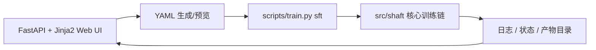
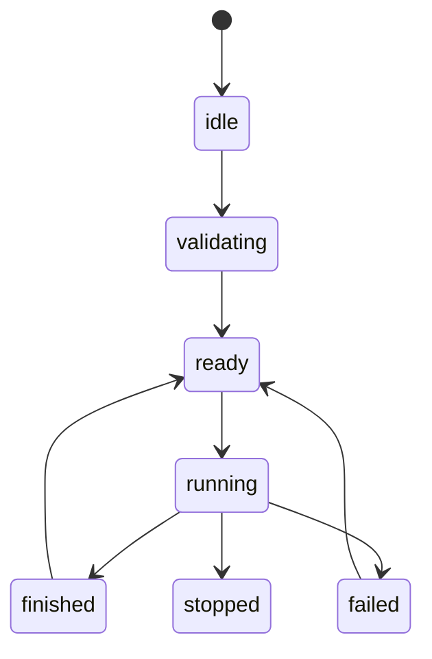

# Shaft Web UI

本文档描述 `Shaft` Web UI 的边界、当前实现范围与后续扩展约束。它面向工程师与科研工作者，不面向普通用户，也不作为第二套训练内核。

## 1. 定位

Shaft Web UI 是一个面向工程师与科研人员的便捷可视化控制台，用于把现有 CLI 与 YAML 训练流程做成更容易上手的图形入口。

它的核心价值不是“隐藏复杂度”，而是：

- 让参数编辑更快
- 让 YAML 配置更直观
- 让训练启动、日志查看、状态监控更顺手
- 让工程师和研究人员可以在不离开仓库约定的前提下完成常见操作

## 2. 技术选择

当前实现使用：

- `FastAPI`
- `Jinja2`
- 原生 `HTML / CSS / JavaScript`

原因很直接：

- 仍然是 Python 主导，维护成本低
- 不需要前后端分离，也不引入 Node 工具链
- 页面结构与样式完全自主可控
- 更适合持续打磨工程控制台型界面

这版实现仍然遵循：

- `YAML-first`
- `CLI-backed`
- 不复制训练内核语义

## 3. 当前范围

当前主功能仍然只覆盖 `SFT`，但导航壳已经为 `RLHF` 预留了独立页面入口。

### 3.1 已覆盖能力

- 编辑 SFT 训练配置
- 生成或预览 YAML
- 配置少量高频 override
- 启动训练
- 停止训练
- 查看运行状态
- 查看 stdout / stderr 日志
- 查看历史 run 的 resolved config 与日志
- 删除本地 Web UI run store 条目
- 通过导航栏切换 `SFT / DPO / PPO / GRPO`

### 3.2 当前不做

- 不做训练内核重写
- 不做第二套配置语义
- 不把 Web UI 直接接入 `src/shaft` 核心对象作为长期运行态
- 不在当前版本完成 `DPO / PPO / GRPO` 的正式配置与启动链
- 不在当前版本做推理、导出、多任务调度
- 不做面向大众用户的复杂引导流程

## 4. 架构原则

Web UI 只是一层可视化外壳，不是新的训练框架。



### 4.1 真源约定

- 配置真源仍然是 `YAML`
- 训练真入口仍然是现有 `scripts/train.py sft`
- Web UI 只是替代“手写 YAML + 手动启动”的操作方式

### 4.2 边界约定

- Web UI 不得绕过 CLI 直接改训练内核语义
- Web UI 不得复制一套新的数据/模型/算法解析逻辑
- Web UI 不得发明新的 checkpoint 格式或任务语义
- Web UI 不得把训练参数解释权从 `src/shaft/config` 中拿走

## 5. 当前目录结构

当前实现遵循以下目录结构：

```text
scripts/
  web.py

src/shaft/webui/
  __init__.py
  app.py
  controller.py
  theme.py
  types.py
  static/
    webui.css
    webui.js
  templates/
    index.html
  services/
    config_service.py
    run_store.py
    train_service.py
```

### 5.1 文件职责

- `scripts/web.py`
  - 仅做薄包装入口
  - 启动 Web UI

- `src/shaft/webui/app.py`
  - 负责 `FastAPI` 路由装配
  - 提供 HTML 页与 JSON API
  - 不承担训练语义或状态推导

- `src/shaft/webui/controller.py`
  - 负责 Web UI 事件处理
  - 统一 `load / validate / start / refresh / stop / load_run`
  - 收口 `status / resolved config / log / recent runs` 的返回协议

- `src/shaft/webui/theme.py`
  - 提供模板目录和静态资源目录入口

- `src/shaft/webui/types.py`
  - 定义 overrides 与 run record 的最小类型

- `src/shaft/webui/templates/index.html`
  - 服务端模板
  - 定义页面骨架与初始状态注入

- `src/shaft/webui/static/webui.css`
  - Web UI 的全部视觉样式
  - 本地亮暗主题变量与版式控制

- `src/shaft/webui/static/webui.js`
  - 前端交互逻辑
  - 调用 JSON API、维护当前 run、亮暗切换、局部刷新

- `src/shaft/webui/services/config_service.py`
  - 表单与 `YAML` 之间转换
  - 配置预览与校验

- `src/shaft/webui/services/run_store.py`
  - 管理 `.tmp/webui/runs/*`
  - 保存 run record、resolved config、日志路径
  - 删除本地 run store 条目

- `src/shaft/webui/services/train_service.py`
  - 管理训练子进程生命周期
  - 提供 run snapshot 读取

## 6. 页面设计

当前实现采用单页工作台，布局尽量简洁。

### 6.1 页面区域

- 顶部：导航栏，负责在 `SFT / DPO / PPO / GRPO` 页面之间切换
- 左侧：基础配置入口、少量高频 overrides、Editable YAML
- 右侧：运行状态摘要、tracked run 选择器、resolved runtime config、logs、recent runs
- 顶部：研究工作台标题区、亮暗切换、内联 SVG 装饰

### 6.2 当前高频 overrides

- `run_id`
- `seed`
- `finetune_mode`
- `epochs`
- `learning_rate`
- `train_batch_size`
- `eval_batch_size`
- `mix_strategy`

说明：
- 这些字段是“最常用、最无歧义”的 launch-time override。
- 其余低频字段统一回到 YAML 编辑区，不继续在 UI 上堆表单。

### 6.3 Editable YAML 与 Resolved Runtime Config

- `Editable YAML` 是源配置编辑区。
- Web UI 不会直接覆写用户选中的源 YAML 文件。
- 点击启动训练后，系统会把：
  - 源 YAML
  - Web UI 覆写项
  - 目录展开结果
  - 默认值与规范化结果
  组合成最终的运行时配置，并写入：
  - `.tmp/webui/runs/<run_id>/resolved_config.yaml`
- CLI 实际读取的是这份 run-scoped resolved config。

因此，页面中的 `Resolved Runtime Config` 与用户输入的源 YAML 不完全一致是预期行为。它是“最终执行配置”，不是“原始编辑文本”。

### 6.4 历史 run 删除语义

- `Recent Runs` 中的删除操作只删除本地 Web UI run store 条目：
  - `.tmp/webui/runs/<run_id>/`
- 不会删除真实训练输出目录，例如 `outputs/...`
- 正在运行的 run 不能直接删除，必须先停止

## 7. 状态与日志

### 7.1 状态模型

当前只维护最小必要状态：

- `run_id`
- `config_path`
- `log_path`
- `pid`
- `status`
- `started_at`
- `finished_at`
- `return_code`
- `output_dir`

### 7.2 状态流



### 7.3 日志策略

- 训练日志直接复用现有 stdout / logger 输出
- Web UI 只负责读取与展示
- 当前实现使用前端轮询刷新，不依赖 WebSocket

## 8. 与 CLI 的关系

Web UI 应该严格依附于 CLI。

原则是：

1. Web UI 生成 YAML
2. Web UI 调用现有 `scripts/train.py sft`
3. CLI 解析并进入现有 `src/shaft` 主链
4. Web UI 读取日志与状态

这意味着：

- CLI 是真入口
- Web UI 是可视化入口
- 两者共享同一套配置语义

## 9. 视觉风格

因为目标用户是工程师和科研人员，视觉重点应放在秩序感和信息密度，而不是花哨动效。

当前实现遵循：

- 本地 CSS 变量统一控制颜色和版式
- 亮暗切换由前端本地状态控制：
  - `localStorage`
  - `data-shaft-theme`
- 所有装饰图形均使用仓库内联 SVG，不依赖网络加载
- 代码区与日志区使用独立浅/深主题变量，不依赖第三方组件主题

## 10. 后续扩展顺序

当前导航壳已经就位，后续按下面顺序扩展：

1. `DPO / PPO / GRPO` 各自独立配置面板与控制器
2. 推理页面
3. 导出页面
4. 历史 run 列表与过滤
5. 多任务管理
6. 更细的状态与产物浏览

其中任何扩展都应遵守同一条原则：

**Web UI 只做可视化与编排，不复制核心能力。**
